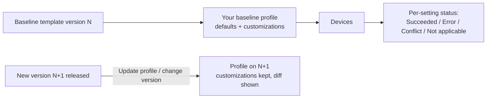

# 3.1.5 Plan and implement security baselines

> **Exam objective:** Plan and implement security baselines by using Microsoft Intune
>
> **Domain:** 3 - Protect devices (15-20%) · **Skill:** 3.1 Configure endpoint security
>
> **Hands-on:** [LAB-3.04 Security baselines](../labs/LAB-3.04-security-baselines.md)

## Concept in plain English

A **security baseline** is a Microsoft-authored, pre-configured group of hundreds of security settings, representing Microsoft's recommended configuration for a product. You deploy it as-is or customize it, instead of hand-building each setting.

| Baseline | Covers |
|---|---|
| **Security Baseline for Windows 10 and later** (versioned, for example *Windows 11 24H2*) | OS hardening: Defender, Firewall, BitLocker, credential protection, SMB, UAC, auditing |
| **Microsoft Defender for Endpoint baseline** | Defender AV, ASR, network protection, SmartScreen |
| **Microsoft Edge baseline** | Browser hardening |
| **Microsoft 365 Apps for enterprise baseline** | Office macro/security settings |
| **Windows 365 Security Baseline** | Cloud PC hardening |
| **HoloLens 2** baselines (standard / advanced) | Mixed reality devices |
| **STIG audit baseline** (Advanced Analytics) | Audit-only check against DoD STIG |

Baselines are **versioned**. When Microsoft publishes a new version, you **create a new profile from it** or **update** the existing profile (settings you customized are preserved and new settings are added).

## How it works

Baselines use the same CSPs as other policies. **Conflicts** with endpoint security policies, the settings catalog or other baselines are common. Plan one owner per setting.

## Licensing requirements

Intune Plan 1. The Defender for Endpoint baseline needs Defender for Endpoint.

## Planning guidance

1. **Start from the latest version** of the Windows baseline and the Defender baseline.
2. Assign to a **pilot group** first. Some settings break legacy apps (NTLM restrictions, SMB signing, credential guard, LSA protection, blocking Office macros from the internet).
3. Decide ownership: security baseline for OS hardening, **endpoint security policies** for AV/firewall/ASR/BitLocker. Customize the baseline to **Not configured** where another policy owns the setting, to avoid conflicts.
4. Document deviations (why a setting differs from Microsoft's recommendation).
5. Review each new baseline version: compare, then update.

## Configuration steps

1. **Endpoint security > Security baselines > Security Baseline for Windows 10 and later > Create profile**.
2. *Basics*: `SB-Windows-Pilot`. *Configuration settings*: review categories. Change settings as needed (for example, set *Device Lock > Min device password length* to Not configured if WHfB owns sign-in).
3. Assign to `SG-Lab-Baseline-Pilot` (device group).
4. Monitor: profile → **Device status** / **Per setting status**. Device → **Device configuration** for conflicts.
5. When a new version arrives: open the profile → **Change version** → review differences → select the new version.

## Comparison: baseline vs settings catalog vs endpoint security

| | Security baseline | Endpoint security policy | Settings catalog |
|---|---|---|---|
| Authored by | Microsoft (recommended values) | You (focused security areas) | You (any setting) |
| Scope | Hundreds of settings | One area (AV, firewall, ASR...) | Any |
| Versioning | Yes | No | No |
| Conflict risk | High (broad) | Medium | Medium |
| Best for | Fast hardening to MS standard | Security team ownership | Everything else |

## Exam tips and common traps

- **"Apply Microsoft's recommended security configuration with the least effort"** → **security baseline**.
- **Updating a baseline version** keeps your customizations and shows the differences. You can't edit a template version itself.
- **Conflicts** show as *Conflict* per setting. Fix them by setting one policy's value to *Not configured*.
- Baselines are **not** compliance policies. They configure settings. Compliance evaluates.
- Multiple instances of the **same baseline type** assigned to one device = conflicts. Avoid overlapping assignments.

## Real-world notes

- Many organizations run the Windows baseline plus separate endpoint security policies and set overlapping baseline settings to *Not configured*. That keeps security ownership clear.
- Keep a spreadsheet diff between baseline versions (Intune shows it, but exporting helps change-approval boards).

## Microsoft Learn references

- [Use security baselines in Intune](https://learn.microsoft.com/intune/device-security/security-baselines/)
- [Manage security baseline profiles](https://learn.microsoft.com/intune/device-security/security-baselines/manage-security-baselines)
- [Windows security baseline settings](https://learn.microsoft.com/intune/device-security/security-baselines/reference-settings-windows)
- [STIG audit baseline](https://learn.microsoft.com/intune/device-security/security-baselines/stig-audit-baseline)
