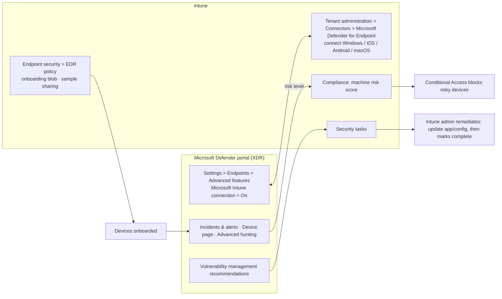

# 3.1.6 Integrate Intune with Microsoft Defender for Endpoint

> **Exam objective:** Integrate Intune with Microsoft Defender for Endpoint, including configuring Endpoint Detection and Response (EDR) policies, investigating endpoint threats, and triaging incidents
>
> **Domain:** 3 - Protect devices (15-20%) · **Skill:** 3.1 Configure endpoint security
>
> **Hands-on:** [LAB-3.05 Defender for Endpoint connector, onboarding, EDR and triage](../labs/LAB-3.05-defender-for-endpoint.md)

## Concept in plain English

**Microsoft Defender for Endpoint (MDE)** is Microsoft's EDR/XDR endpoint product, surfaced in the **Microsoft Defender portal** (security.microsoft.com, part of **Microsoft Defender XDR**). Connecting it to Intune gives you three things:

1. **Onboarding at scale** - Intune deploys the onboarding package with an **EDR policy** (objective 3.1.7).
2. **Risk signal → compliance → Conditional Access** - Intune compliance can require *machine risk score ≤ X*. A compromised device becomes noncompliant and loses access automatically.
3. **Two-way workflow** - Defender's **security recommendations** and **vulnerabilities** can become Intune **security tasks** (remediation requests), and security settings management lets MDE-only devices (including servers) receive Intune endpoint security policies.

## How it works

## EDR policies

**Endpoint security > Endpoint detection and response**:

| Profile | Settings |
|---|---|
| **Endpoint detection and response** (Windows) | *Microsoft Defender for Endpoint client configuration package type*: **Auto from connector** (recommended) or onboard/offboard blob. *Sample sharing* for all files. (Telemetry reporting frequency is legacy) |
| EDR for macOS / Linux | Onboarding and EDR settings for Defender on Mac/Linux |
| *EDR in block mode* | Set in the Defender portal (advanced features) - EDR blocks artifacts even when a third-party AV is primary |

Related Defender features managed from Intune or the Defender portal: **tamper protection**, **attack disruption** (automatic containment), **automated investigation and response (AIR)** levels, device isolation, **live response**.

## Investigating and triaging

| Task | Where | What you do |
|---|---|---|
| **Triage incidents** | Defender portal > **Incidents & alerts > Incidents** | Sort by severity, assign owner, set status/classification (true/false positive), view the **attack story** that correlates alerts across devices, identities, email and apps |
| **Investigate a device** | Device page | Timeline, alerts, exposure level, risk level, software inventory, vulnerabilities, logged-on users |
| **Response actions** | Device page | **Isolate device**, **Restrict app execution**, **Run antivirus scan**, **Collect investigation package**, **Initiate live response**, **Initiate automated investigation** |
| **Hunt** | **Advanced hunting** (KQL) | `DeviceProcessEvents`, `DeviceNetworkEvents`, `DeviceEvents` (ASR hits) |
| **Remediate at scale from Intune** | Intune **Endpoint security > Security tasks** | Accept a Defender recommendation → deploy the fix (update app, change setting) → mark complete |
| **Copilot / agents** | Defender portal Security Copilot; Intune **Vulnerability Remediation Agent** | Summaries, guided response, prioritized CVEs (objective 5.1.2) |

## Licensing requirements

- **Defender for Endpoint Plan 2** (Microsoft 365 E5/E7, or standalone) for EDR, incidents, advanced hunting, AIR, and vulnerability management core. P1 covers AV/ASR/device control only. **Defender for Business** is the SMB equivalent.
- Intune Plan 1 for connector, policies and compliance. Entra ID P1 for Conditional Access.

## Configuration steps

1. **Defender portal > Settings > Endpoints > Advanced features** → **Microsoft Intune connection** = On. Also consider *Enable EDR in block mode*, *Automatically resolve alerts*, *Allow or block file*, *Tamper protection*.
2. **Intune > Tenant administration > Connectors and tokens > Microsoft Defender for Endpoint** → wait for *Connection status: Enabled* → turn on:
   - *Connect Windows devices version 10.0.15063 and above to Microsoft Defender for Endpoint* = On
   - *Connect Android / iOS devices* = On (for mobile risk and app protection signals)
   - *Allow Microsoft Defender for Endpoint to enforce Endpoint Security Configurations* (security settings management) = On
3. **Endpoint security > Endpoint detection and response > Create** → Windows → *Auto from connector* → assign.
4. **Compliance policy** → *Microsoft Defender for Endpoint* → *Require the device to be at or under the machine risk score* = **Low** or **Medium**.
5. **Conditional Access** → require compliant device (objective 1.3.5).
6. Triage: run an **EICAR / Defender test alert** on a pilot device, then work the incident in the Defender portal.

## Comparison: Defender for Endpoint plans

| Capability | P1 | P2 |
|---|---|---|
| Next-gen AV, ASR, device control, web content filtering | ✅ | ✅ |
| Manual response actions | ✅ (limited) | ✅ |
| EDR, incidents, advanced hunting (6 months), AIR | ❌ | ✅ |
| Threat & vulnerability management (core) | ❌ | ✅ |
| Machine risk score for Intune compliance | Limited | ✅ |

## Exam tips and common traps

- **"Block access to Microsoft 365 from devices with high risk in Defender"** → connector + compliance **machine risk score** + Conditional Access **compliant device**.
- The connector must be enabled **on both sides** (Defender *Advanced features* and Intune *Connectors*).
- **EDR policy** with *Auto from connector* is the simplest onboarding (no downloaded blob).
- **Isolate device** keeps the Defender connection but cuts other network traffic.
- **Security tasks** in Intune come from Defender vulnerability management recommendations.
- Mobile devices (iOS/Android) report **device threat level** from the Defender app for compliance (or app protection with MTD).

## Real-world notes

- Use **device groups and tags** in Defender that mirror Intune scope tags so SOC and endpoint teams speak the same language.
- A noncompliant device due to risk score tells users "your device isn't compliant". Brief the help desk so they escalate to the SOC instead of re-enrolling devices.

## Microsoft Learn references

- [Configure Defender for Endpoint in Intune](https://learn.microsoft.com/intune/device-security/mobile-threat-defense/advanced-threat-protection-configure)
- [EDR policy for endpoint security](https://learn.microsoft.com/intune/device-security/endpoint-security/endpoint-detection-response-policy)
- [Enforce compliance for Defender for Endpoint with Conditional Access](https://learn.microsoft.com/intune/device-security/mobile-threat-defense/advanced-threat-protection)
- [Investigate incidents in Microsoft Defender XDR](https://learn.microsoft.com/defender-xdr/investigate-incidents)
- [Take response actions on a device](https://learn.microsoft.com/defender-endpoint/respond-machine-alerts)
- [Security tasks (Intune + Defender vulnerability management)](https://learn.microsoft.com/intune/device-security/endpoint-security/atp-manage-vulnerabilities)
