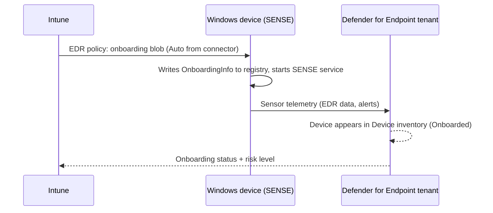

# 3.1.7 Onboard devices into Microsoft Defender for Endpoint

> **Exam objective:** Onboard devices into Microsoft Defender for Endpoint
>
> **Domain:** 3 - Protect devices (15-20%) · **Skill:** 3.1 Configure endpoint security
>
> **Hands-on:** [LAB-3.05 Defender for Endpoint connector, onboarding, EDR and triage](../labs/LAB-3.05-defender-for-endpoint.md)

## Concept in plain English

**Onboarding** makes a device send telemetry to your Defender for Endpoint tenant. The sensor is built into Windows 10/11 (the **SENSE** service). You just give it the tenant's **onboarding configuration**. Other platforms need the Defender app.

| Platform | Onboarding method with Intune | Other methods |
|---|---|---|
| **Windows 10/11** | **EDR policy** (*Auto from connector*) or custom OMA-URI with the onboarding blob | Local script, GPO, Configuration Manager, VDI scripts |
| **Windows Server 2012 R2+** | Defender for Endpoint **security settings management** (MDE-attached, no Intune enrollment) or Defender for Cloud | Local script, GPO |
| **macOS** | Deploy **Defender app** (Microsoft 365 Apps-style built-in app or PKG) + **onboarding profile** (plist from the Defender portal) + PPPC/system extension/network filter payloads | JAMF, manual |
| **iOS/iPadOS** | Deploy **Microsoft Defender** app (App Store/VPP) + app configuration. Onboarding happens when the user signs in (zero-touch/silent onboarding options exist for supervised devices) | - |
| **Android** | **Microsoft Defender** app from Managed Google Play (work profile/fully managed) + app config | - |
| **Linux** | Script/Puppet/Ansible, security settings management for policies | - |

## How it works



## Licensing requirements

Defender for Endpoint P1/P2 (or Defender for Business) per user/device. Intune Plan 1 for delivery. Servers need Defender for Servers (via Defender for Cloud) or the server license.

## Configuration steps (Windows)

1. Connector enabled on both sides (objective [3.1.6](3.1.6-defender-for-endpoint-integration-edr.md)).
2. **Endpoint security > Endpoint detection and response > Create policy** → Windows → **Endpoint detection and response** → *Client configuration package type* = **Auto from connector** → *Sample sharing* = All → assign to devices.
3. Verify on the device:

```powershell
Get-Service Sense | Select-Object Status, StartType   # Running / Automatic
Get-ItemProperty 'HKLM:\SOFTWARE\Microsoft\Windows Advanced Threat Protection\Status' | Select-Object OnboardingState
# OnboardingState = 1 means onboarded
```

4. **Endpoint security > Microsoft Defender for Endpoint** (or the EDR policy report) → **Onboarded** vs **Not onboarded** device counts. The EDR onboarding status report shows per-device state.
5. Defender portal → **Assets > Devices** → device appears with *Onboarding status: Onboarded*.
6. Run a detection test (Microsoft-provided PowerShell test command from the Defender portal onboarding page) → an alert appears within minutes.

### Mobile

- **Android**: Apps > Android > Managed Google Play → **Microsoft Defender: Antivirus** → assign Required to work profile/fully managed. Optional app config: auto-setup VPN, zero-touch onboarding.
- **iOS**: Apps > iOS → App Store app **Microsoft Defender** → Required. App config (supervised) for **zero-touch onboarding** (`issupervised`, VPN profile for the network protection tunnel).

### Offboarding

Use an EDR policy with the **offboard** blob (downloaded from the Defender portal, valid for a limited time), then delete the device from Intune. Offboarded devices stay visible in Defender for the retention period.

## Comparison: onboarding methods (Windows)

| Method | Scale | Management |
|---|---|---|
| **Intune EDR policy** | All Intune devices | Recommended for cloud-managed |
| Group Policy | Domain devices | Hybrid/on-prem |
| Configuration Manager | ConfigMgr clients | Co-managed |
| Local script | Single/test | Pilot, troubleshooting |
| VDI scripts | Non-persistent VDI | Special handling to avoid duplicate device entries |

## Exam tips and common traps

- **"Onboard all Intune-managed Windows devices with the least effort"** → EDR policy with **Auto from connector**.
- Windows has a **built-in sensor**. There's no agent to install - onboarding just configures it (SENSE service).
- **Servers** that aren't Intune-enrolled → **security settings management** (MDE-attached devices appear in Intune).
- iOS/Android onboarding = **deploy the Defender app** + user sign-in (or zero-touch on supervised devices).
- Offboarding blobs **expire** - download a fresh one when needed.

## Real-world notes

- After onboarding, check **Device health > Sensor health** in Defender. "Inactive" or "Misconfigured" usually means a proxy blocking the sensor endpoints.
- Deduplicate: reimaged devices appear twice in Defender. Use device tags and the *exclude devices* feature for stale entries.

## Microsoft Learn references

- [Onboard Windows devices with Intune](https://learn.microsoft.com/defender-endpoint/configure-endpoints-mdm)
- [EDR policy in Intune](https://learn.microsoft.com/intune/device-security/endpoint-security/endpoint-detection-response-policy)
- [Deploy Defender for Endpoint on Android with Intune](https://learn.microsoft.com/defender-endpoint/android-intune)
- [Deploy Defender for Endpoint on iOS with Intune](https://learn.microsoft.com/defender-endpoint/ios-install)
- [Defender for Endpoint security settings management](https://learn.microsoft.com/intune/device-security/endpoint-security/mde-security-integration)
