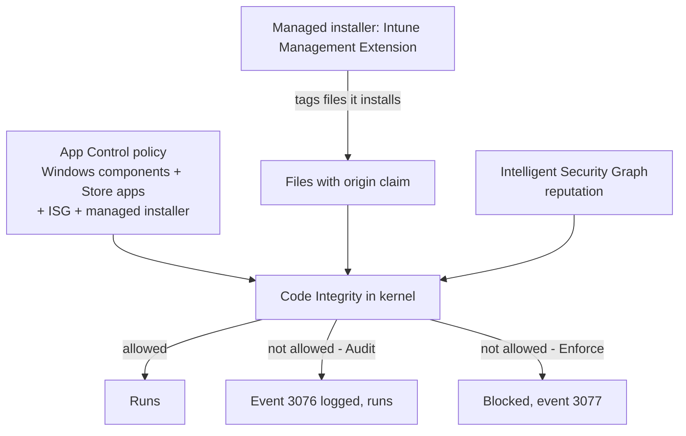

# 3.1.8 Configure App Control for Business policies by using Intune

> **Exam objective:** Configure App Control for Business policies by using Microsoft Intune
>
> **Domain:** 3 - Protect devices (15-20%) · **Skill:** 3.1 Configure endpoint security
>
> **Hands-on:** [LAB-3.06 App Control for Business](../labs/LAB-3.06-app-control-for-business.md)

## Concept in plain English

**App Control for Business** (formerly *Windows Defender Application Control*, WDAC) is Windows' kernel-level **allow-list**: only code your policy trusts is allowed to run. Everything else is blocked (or audited). It's the strongest defence against unknown executables, ransomware droppers and unapproved tools.

In Intune: **Endpoint security > App Control for Business**:

| Configuration format | What you get |
|---|---|
| **Built-in controls** | No XML needed. **Enable trust of Windows components and store apps** (Enforce / **Audit only**) + optional **Trust apps with good reputation** (Microsoft Intelligent Security Graph, ISG) and/or **Trust apps from managed installers** |
| **Enter XML data** | Upload a custom policy built with the **App Control Policy Wizard** or PowerShell (signer/hash/path rules, deny rules, drivers) |
| **Supplemental policies** | XML that **extends a base policy** (references its PolicyID) - for team- or app-specific exceptions |

**Managed installer:** a separate tenant setting (**Endpoint security > App Control for Business > Managed installer**) designates the **Intune Management Extension** as a managed installer via an AppLocker rule collection. Files **written by** Intune app installs get an *origin claim* and are automatically trusted by App Control policies with the managed installer option.

## How it works

**Event logs:** *Applications and Services Logs > Microsoft > Windows > CodeIntegrity > Operational* (3076 audit, 3077 enforced block) and *AppLocker > MSI and Script*. Defender for Endpoint advanced hunting: `DeviceEvents | where ActionType startswith "AppControl"`.

## Licensing requirements

Intune Plan 1. App Control is supported on Windows 10/11 **Pro, Enterprise, Education** (feature availability varies by version). Advanced hunting needs Defender for Endpoint P2.

## Configuration steps

1. **Managed installer:** **Endpoint security > App Control for Business > Managed installer** → **Add** → turn on the *Intune Management Extension as managed installer*. (This affects only apps installed **after** it's enabled. Existing apps aren't tagged.)
2. **Audit policy first:** **App Control for Business > Create policy** → Configuration format **Built-in controls** → *Enable trust of Windows components and store apps* = **Audit only** → *Trust apps with good reputation* ✔, *Trust apps from managed installers* ✔ → assign to pilot devices.
3. Review **CodeIntegrity event 3076** (what *would* be blocked) for 2-4 weeks. Create a **supplemental policy** (XML with signer/hash rules for the gaps) with the App Control Wizard, referencing the base PolicyID.
4. Switch the base policy to **Enforce** (*Enable trust of Windows components and store apps* = Enabled).
5. Keep deploying apps **through Intune** so the managed installer tags them.

## Comparison: App Control vs AppLocker vs ASR

| | App Control for Business | AppLocker | ASR rules |
|---|---|---|---|
| Enforcement level | Kernel (code integrity) | User mode | Behaviour-based |
| Scope | Device-wide, drivers too | Per user/group possible | Specific behaviours |
| Tamper resistance | High | Lower (admins can bypass) | Medium |
| Managed installer / ISG | ✅ | ❌ (AppLocker hosts the MI rule only) | - |
| Recommended for new deployments | **✅** | Legacy / per-user scenarios | ✅ (complementary) |

## Exam tips and common traps

- **"Allow only Windows components, Store apps, and apps deployed by Intune"** → App Control **built-in controls** + **Trust apps from managed installers** + configure the **managed installer**.
- **"Evaluate impact first"** → **Audit only** mode, then review CodeIntegrity event **3076**.
- Apps installed **before** the managed installer was enabled aren't trusted automatically - add rules or reinstall through Intune.
- **Supplemental policies** extend a base policy. They reference the **base PolicyID**.
- Built-in controls can't add explicit allow/deny rules - use **XML** for that.

## Real-world notes

- Start with **ISG + managed installer in audit** on a pilot of IT devices. It gives useful coverage with little effort.
- Self-updating apps (browsers, collaboration tools) that write new binaries at runtime need signer rules, or they break in enforce mode.
- App Control policies without a reboot requirement use the **ApplicationControl CSP** (multiple-policy format). Legacy AppLocker CSP deployments required reboots.

## Microsoft Learn references

- [Manage approved apps with App Control for Business and managed installers](https://learn.microsoft.com/intune/device-configuration/endpoint-security/manage-app-control)
- [App Control for Business overview](https://learn.microsoft.com/windows/security/application-security/application-control/app-control-for-business/appcontrol)
- [Authorize apps deployed with a managed installer](https://learn.microsoft.com/windows/security/application-security/application-control/app-control-for-business/design/configure-authorized-apps-deployed-with-a-managed-installer)
- [Authorize reputable apps with the ISG](https://learn.microsoft.com/windows/security/application-security/application-control/app-control-for-business/design/use-appcontrol-with-intelligent-security-graph)
- [App Control Policy Wizard](https://webapp-wdac-wizard.azurewebsites.net/)
