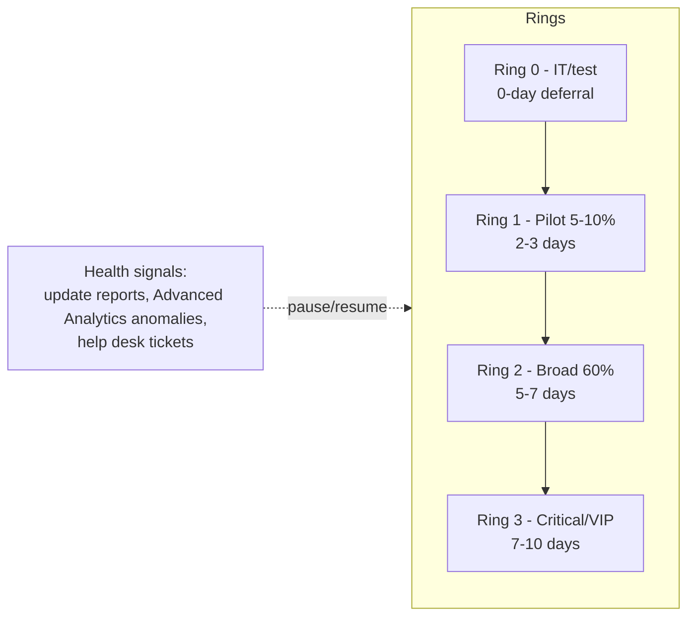

# 3.2.1 Plan for device updates by using Intune

> **Exam objective:** Plan for device updates by using Intune
>
> **Domain:** 3 - Protect devices (15-20%) · **Skill:** 3.2 Manage device updates
>
> **Hands-on:** [LAB-3.07 Update rings, feature, quality, expedited and driver updates](../labs/LAB-3.07-windows-update-rings-feature-quality.md)

## Concept in plain English

Updating is a security control. An update plan answers **what** gets updated, **when**, **for whom** (rings), **how fast** (deadlines), **how you pause/roll back**, and **how you prove it** (reports). Intune has a tool for every platform:

| Platform | Update types | Intune tool |
|---|---|---|
| **Windows** | Quality (monthly security, "B" release), **feature** (annual version), **driver/firmware**, Microsoft 365 Apps, Edge, Teams | **Update rings**, **feature update**, **quality update** (expedite, **Hotpatch**), **driver update** policies, **Windows Autopatch** groups |
| **iOS/iPadOS** | OS updates | **Settings catalog - Declarative Device Management (DDM) software update** (iOS 17+). MDM update policies are deprecated. Restrictions to delay visibility |
| **macOS** | OS updates, app updates | **DDM software update** (macOS 14+), Microsoft AutoUpdate (MAU) for Office |
| **Android** | OS/security patches, firmware | **Device restrictions > System update** (automatic / postponed / maintenance window) for corporate devices. **FOTA** (Samsung E-FOTA, Zebra LifeGuard OTA) |
| Apps | Win32/Store/M365 | Supersedence, Store auto-update, M365 Apps update channels |

## How it works: the ring model

A good plan defines:

1. **Ring membership** (static groups, Autopatch groups, or distribution by percentage).
2. **Deferrals / deadlines / grace periods** per ring (compliance targets, for example 95% within 14 days).
3. **Feature update target** per ring (for example, stay on 24H2 until 25H2 is validated).
4. **Exception process** - pause, uninstall, rollback, and who can approve.
5. **Expedite path** for zero-days (expedited quality updates).
6. **Content delivery** - Delivery Optimization, Connected Cache (objective 3.2.6).
7. **Reporting** - Windows Update reports, Autopatch reports, compliance (*minimum OS version*), CA for outdated OS.

## Licensing requirements

- Update rings: Intune Plan 1 (any Windows Pro/Enterprise/Education).
- Feature/quality/driver update policies, expedite, Autopatch groups, Hotpatch: **Windows Enterprise E3/E5, Education A3/A5, Microsoft 365 Business Premium, Windows 365 Enterprise** (and Microsoft 365 F3 for most features).
- Android FOTA: Intune Plan 2.

## Decision table

| Requirement | Tool |
|---|---|
| Control when monthly updates install and restart behaviour | **Update ring** |
| Stay on a specific Windows version | **Feature update policy** |
| Install an emergency security update now, ignoring deferrals | **Expedited quality update** (quality update policy) |
| Security updates without reboot | **Hotpatch** (quality update policy) |
| Approve/defer drivers and firmware | **Driver update policy** (Autopatch) |
| Let Microsoft orchestrate rings for Windows, M365 Apps, Edge, Teams | **Windows Autopatch groups** |
| Enforce iOS 18.x by a date | **Settings catalog DDM** |
| Block access from outdated OS | **Compliance** minimum OS + Conditional Access |

## Exam tips and common traps

- Rings (**how/when**) and feature update policies (**which version**) work **together**.
- **Expedite** overrides ring deferrals for **quality** updates only.
- Personal devices (BYOD) can't be forced to update at the OS level on iOS/Android. Use **compliance + CA** (minimum OS) instead.
- **WSUS/Configuration Manager** software update workloads conflict with Windows Update client policies. On co-managed devices the **Windows Update policies** workload must point to Intune.

## Real-world notes

- Document a written **update SLA** (for example, critical security within 7 days, feature updates within 6 months of GA) and map rings to it. Auditors ask for this.
- Start with **Windows Autopatch groups** unless you have a reason not to. They create and assign the ring, feature, driver, M365 Apps and Edge policies for you.

## Microsoft Learn references

- [Windows update management overview](https://learn.microsoft.com/intune/device-updates/windows/)
- [Software updates planning guide - macOS](https://learn.microsoft.com/intune/device-updates/apple/planning-guide-macos)
- [Software updates planning guide - iOS/iPadOS](https://learn.microsoft.com/intune/device-updates/apple/planning-guide-ios-ipados)
- [Software updates planning guide - personal devices](https://learn.microsoft.com/intune/device-updates/byod-planning-guide)
- [What is Windows Autopatch?](https://learn.microsoft.com/windows/deployment/windows-autopatch/overview/windows-autopatch-overview)
