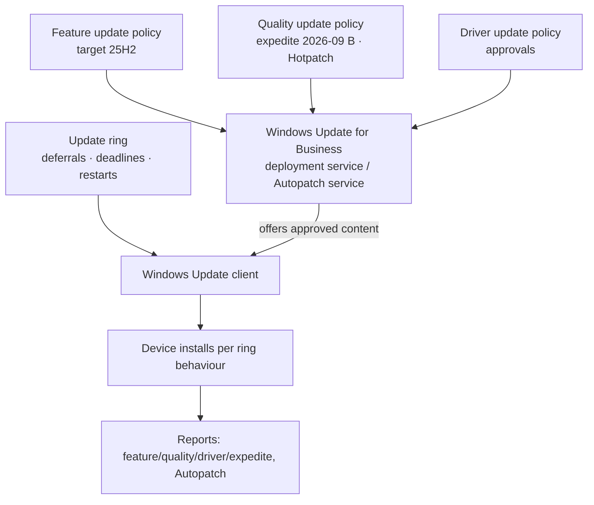

# 3.2.2 Create and manage update rings, feature updates, and quality updates

> **Exam objective:** Create and manage update rings, feature updates, and quality updates for Windows devices by using Intune
>
> **Domain:** 3 - Protect devices (15-20%) · **Skill:** 3.2 Manage device updates
>
> **Hands-on:** [LAB-3.07 Update rings, feature, quality, expedited and driver updates](../labs/LAB-3.07-windows-update-rings-feature-quality.md)

## Concept in plain English

Windows update management in Intune (**Devices > Windows updates**) uses four policy types:

| Policy | Controls | Key settings |
|---|---|---|
| **Update rings for Windows 10 and later** | **Client behaviour** (Windows Update client policies) | Servicing channel, **quality update deferral (0-30 days)**, **feature update deferral (0-365 days)**, Microsoft product updates, drivers (include/exclude), **deadlines** (quality/feature days), **grace period**, auto-restart before deadline, **active hours**, user experience (notifications, pause), *Upgrade Windows 10 to latest Windows 11* |
| **Feature updates for Windows 10 and later** | **Target version** (and hold there) | Version, rollout (ASAP / specific date / **gradual**), Windows 10 fallback |
| **Quality updates for Windows 10 and later** | **Expedite** a specific security update, **Hotpatch** | Minimum quality update level (for example, *09/09/2026 - 2026.09 B*), days until forced restart. Hotpatch toggle (objective [3.2.3](3.2.3-windows-autopatch-hotpatch.md)) |
| **Driver updates for Windows 10 and later** | Approve drivers/firmware from Windows Update | **Automatic** or **manual** approval, deferral per policy, pause/decline specific drivers |

Ring **actions**: **Pause** quality or feature updates (up to 35 days), **Resume**, **Extend** pause, **Uninstall** the latest quality or feature update.

## How it works

- The **ring** decides *when* and *how* installation happens on the device.
- The **cloud policies** (feature/quality/driver) decide *what content* the service offers.
- **Expedite** bypasses the quality deferral and uses a short restart deadline, even for devices behind by months.

## Licensing requirements

Update rings: Intune Plan 1. Feature, quality (expedite/Hotpatch) and driver policies: Windows Enterprise E3/E5, Education A3/A5, Business Premium, or Windows 365 Enterprise (Autopatch entitlement).

## Configuration steps

### Update ring (pilot)

**Devices > Windows updates > Update rings > Create profile** → `UR-Pilot`:

| Setting | Value |
|---|---|
| Microsoft product updates | Allow |
| Windows drivers | Allow (or Block if drivers are managed by driver policies) |
| Quality update deferral | **2** days |
| Feature update deferral | 0 (the feature update policy decides the version) |
| Set feature update uninstall period | 10 days |
| Servicing channel | General Availability channel |
| Automatic update behavior | Reset to default |
| Active hours | 08:00-17:00 |
| **Deadline for quality updates** | **3** days |
| **Deadline for feature updates** | **5** days |
| **Grace period** | **2** days |
| Auto reboot before deadline | Yes |
| Option to pause Windows updates | Disable (users can't pause) |

Assign to `SG-Lab-Update-Pilot`. Create `UR-Broad` (deferral 7, deadlines 7/7) for the rest.

### Feature update

See [2.1.6](../../02-Manage-Maintain-Devices/docs/2.1.6-windows-11-upgrades.md). `FU-Win11-25H2` with gradual rollout.

### Expedite a quality update

**Quality updates > Create profile** → `QU-Expedite-2026-10B` → *Expedite installation of quality updates if device OS version less than* = the target release → *Number of days to wait before restart is enforced* = **1** → assign to all Windows devices.

### Driver updates

**Driver updates > Create profile** → `DRV-Pilot` → **Manually approve and deploy driver updates** (or automatic with deferral) → assign → later open the policy → **Recommended drivers** → **Approve** with an availability date, or **Decline/Pause**.

### Ring actions

**Update rings > UR-Broad > Pause** (Quality) → up to 35 days → **Resume** / **Uninstall** (removes the latest quality update from devices in the ring).

## Comparison: deferral vs deadline vs grace period

| Term | Meaning |
|---|---|
| **Deferral** | Days after Microsoft releases an update before the device is offered it |
| **Deadline** | Days after the device is offered/receives the update before installation (and restart) is forced |
| **Grace period** | Minimum days after the deadline before a forced restart, for devices that were offline |

## Exam tips and common traps

- **"Stay on Windows 11 24H2 for the next year"** → **feature update policy** targeting 24H2 (not a 365-day feature deferral).
- **"Deploy an emergency security patch today to devices that are behind"** → **expedite** in a quality update policy.
- **"Stop the latest cumulative update on the broad ring immediately"** → **Pause** quality updates on that ring (35 days max). **Uninstall** rolls it back.
- **Deadlines** force installation. **Active hours** only avoid restarts during those hours until the deadline.
- If drivers are managed by **driver update policies**, the ring's *Windows drivers* setting should allow drivers, and the driver policy controls approval.

## Real-world notes

- Keep deadlines short (quality 3-7 days). Long deferrals + long deadlines leave you 30+ days behind on security.
- Use **Windows Autopatch groups** if you don't want to maintain 4-5 rings of policies by hand. They generate the same policy types.

## Microsoft Learn references

- [Update rings for Windows](https://learn.microsoft.com/intune/device-updates/windows/update-rings)
- [Feature updates](https://learn.microsoft.com/intune/device-updates/windows/feature-updates)
- [Manage Windows quality updates (expedite)](https://learn.microsoft.com/intune/device-updates/windows/manage-quality-updates)
- [Driver update policies](https://learn.microsoft.com/intune/device-updates/windows/driver-updates-policy)
- [Windows Update settings reference](https://learn.microsoft.com/intune/device-updates/windows/update-rings#windows-update-settings)
