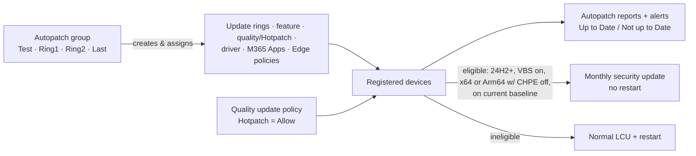

# 3.2.3 Implement Windows Autopatch and configure Hotpatch policies

> **Exam objective:** Implement Windows Autopatch and configure Hotpatch policies
>
> **Domain:** 3 - Protect devices (15-20%) · **Skill:** 3.2 Manage device updates
>
> **Hands-on:** [LAB-3.08 Windows Autopatch and Hotpatch](../labs/LAB-3.08-autopatch-hotpatch.md)

## Concept in plain English

**Windows Autopatch** is a cloud service built into Intune that **automates updates** for Windows (quality, feature, drivers/firmware), **Microsoft 365 Apps**, **Microsoft Edge** and **Microsoft Teams**. It uses **Autopatch groups** and deployment **rings**. Since April 2025 there's **no separate feature activation**. The features are available to Business Premium, A3+, E3+ and F3 licences directly in Intune (**Devices > Windows updates**, **Tenant administration > Windows Autopatch**).

**Hotpatch** installs the monthly **security update without a restart** on eligible Windows 11 Enterprise devices. Devices restart only for quarterly **baseline** cumulative updates (plus occasional non-hotpatchable fixes).

## Autopatch building blocks

| Concept | Meaning |
|---|---|
| **Autopatch group** | A logical container of Entra device groups + the generated update policies (rings, feature, driver, M365 Apps, Edge) |
| **Deployment rings** | *Test* and *Last* by default, up to **15 rings** per group. Devices assigned by group or **dynamic distribution by percentage** |
| **Default Autopatch group** | Pre-configured Test → Ring1 → Ring2 → Ring3 → Last |
| **Releases** | Quality/feature release schedules. Pause/resume per group |
| **Multi-phase feature updates** | Phased feature update rollout across rings |
| **Reports** | Quality and feature update status, *Up to Date / Not up to Date / Not ready*, **device alerts** with remediation guidance, Hotpatch quality update report |
| **Autopatch client broker** | Component installed on registered devices for readiness checks |

## How it works

## Hotpatch requirements

| Requirement | Detail |
|---|---|
| License | Windows 11 Enterprise E3/E5, Microsoft 365 F3, Education A3/A5, Microsoft 365 Business Premium, or Windows 365 Enterprise |
| OS | **Windows 11 24H2 or later** (Enterprise) |
| Baseline | Device on the **current quarterly baseline** (standard LCU released each quarter) |
| Security | **Virtualization-based security (VBS)** running |
| CPU | x64 (AMD/Intel). **Arm64** requires CHPE disabled: `HKLM\SYSTEM\CurrentControlSet\Control\Session Manager\Memory Management\HotPatchRestrictions = 1` |
| Management | Intune **Windows quality update policy** with *When available, apply without restarting the device ("Hotpatch")* = **Allow** |

Ineligible devices simply receive the normal LCU. Existing ring deferrals, deadlines and active hours still apply.

## Licensing requirements

Autopatch: Business Premium, A3+, E3+, F3 (support requests: E3+/F3 only). Not available in GCC High/DoD. Hotpatch: see the table above.

## Configuration steps

### Autopatch group

1. **Devices > Windows updates > Autopatch groups** (or **Tenant administration > Windows Autopatch > Autopatch groups**) → **Create**.
2. *Basics*: `AG-Lab`. *Deployment rings*: Test (group `SG-Lab-Update-Test`), Ring1 (dynamic 20%), Last (dynamic 80%) - device source group `DG-Lab-Windows-Corporate`.
3. *Windows update settings*: per ring - quality deferral, deadline, grace period. Feature update target (for example, Windows 11 25H2).
4. *Policy settings*: include drivers (auto/manual), Microsoft 365 Apps, Edge (Stable), Teams.
5. **Review + create**. Autopatch creates the Entra groups and policies (named `Windows Autopatch - …`).

### Hotpatch

1. Make sure VBS is on (settings catalog: *Device Guard > Enable Virtualization Based Security* = Enabled, or Memory integrity/Credential Guard policies).
2. **Devices > Windows updates > Quality updates > Create** → **Windows quality update policy** → *When available, apply without restarting the device ("Hotpatch")* = **Allow** → assign.
3. Verify on the device: **Settings > Windows Update > Advanced options > Configured update policies** → *Enable hotpatching when available*. System Information → *Virtualization-based security: Running*.
4. Monitor: **Reports > Windows Autopatch > Hotpatch quality updates** report.

## Comparison: manual policies vs Autopatch

| | Manual update policies | Windows Autopatch groups |
|---|---|---|
| Ring creation | You create each ring/policy | Generated from the group definition |
| Scope | Windows | Windows + drivers + M365 Apps + Edge + Teams |
| Device distribution | You manage groups | Groups or dynamic % |
| Reports/alerts | Windows Update reports | Autopatch reports + actionable device alerts |
| Customization | Full | High (rings, cadence) |

## Exam tips and common traps

- **"Automate Windows, Microsoft 365 Apps, Edge and Teams updates with rings and minimal policy management"** → **Windows Autopatch groups**.
- **"Install monthly security updates without restarting"** → **Hotpatch** via a **quality update policy** (Windows 11 24H2+ Enterprise, VBS on).
- Hotpatch devices still **restart for quarterly baselines**.
- Hotpatch **doesn't change** existing ring deferral/deadline/active-hours behaviour.
- **Arm64** devices need **CHPE disabled** for Hotpatch.
- Autopatch isn't available in **GCC High/DoD**.

## Real-world notes

- Turn on **Hotpatch** for executives and frontline devices first. "No reboot this month" is very noticeable to users.
- Watch **Autopatch device alerts** (for example, *Hotpatch - VBS not running*, *Device not ready*). They're the fastest route to update compliance.

## Microsoft Learn references

- [What is Windows Autopatch?](https://learn.microsoft.com/windows/deployment/windows-autopatch/overview/windows-autopatch-overview)
- [Windows Autopatch groups](https://learn.microsoft.com/windows/deployment/windows-autopatch/deploy/windows-autopatch-groups-overview)
- [Windows Autopatch prerequisites](https://learn.microsoft.com/windows/deployment/windows-autopatch/prepare/windows-autopatch-prerequisites)
- [Hotpatch updates](https://learn.microsoft.com/windows/deployment/windows-autopatch/manage/windows-autopatch-hotpatch-updates)
- [Configure Hotpatch in Intune](https://learn.microsoft.com/intune/device-updates/windows/configure-hotpatch)
