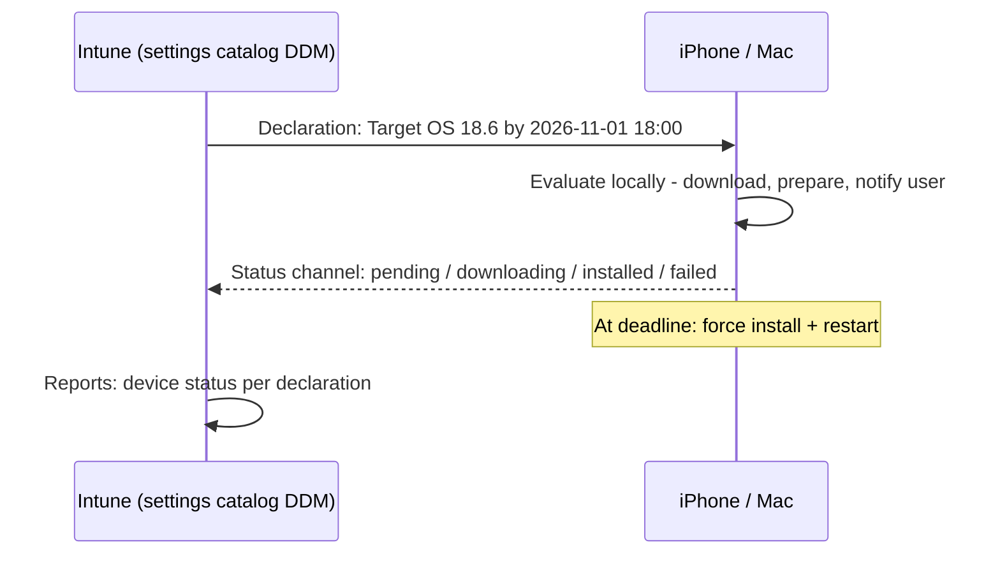

# 3.2.4 Create and manage update policies for iOS/iPadOS and macOS by using the Settings Catalog

> **Exam objective:** Create and manage update policies for iOS/iPadOS and macOS devices by using the Settings Catalog in Microsoft Intune
>
> **Domain:** 3 - Protect devices (15-20%) · **Skill:** 3.2 Manage device updates
>
> **Hands-on:** [LAB-3.09 Apple updates (settings catalog) and Android FOTA](../labs/LAB-3.09-apple-android-updates.md)

## Concept in plain English

Apple has **deprecated MDM-based software update commands**. Intune now manages Apple OS updates with **Declarative Device Management (DDM)** settings in the **settings catalog**. DDM lets the device handle the whole lifecycle itself: notify, download, prepare and install by a **deadline you set**.

| Approach | Platforms | Status |
|---|---|---|
| **Settings catalog > Declarative Device Management > Software Update** | **iOS/iPadOS 17+**, **macOS 14+** (device enrollment and ADE) | ✅ Recommended |
| **Settings catalog > Restrictions**: *Defer software updates*, *Delay default visibility of software updates (0-90 days)*, *Force delayed software updates* | Supervised | Complements DDM (delays what users see) |
| Legacy *Update policies for iOS/iPadOS* and *macOS* (MDM) | iOS ≤18 / macOS ≤15 supervised | ⚠️ Deprecated - Intune is ending support |

### DDM Software Update settings

| Setting | Example |
|---|---|
| **Target OS Version** | `18.6` (iOS) / `15.6` (macOS) |
| **Target Build Version** | Optional, for Rapid Security Responses / betas |
| **Target Local Date Time** | `2026-11-01T18:00:00` - **enforcement deadline** (device local time) |
| **Details URL** | Link shown to users explaining the update |
| Software Update Settings (newer DDM declarations) | Notifications, rapid security response, allow standard users to update (macOS), deferrals, beta program enrollment |

When the deadline arrives, the device installs the update and restarts. Before that, users are nudged with increasingly frequent notifications.

## How it works

**Precedence:** DDM software update settings take precedence over the *Restrictions* deferral settings.

## Licensing requirements

Intune Plan 1 + APNs. DDM needs iOS/iPadOS 17+ or macOS 14+. Supervision isn't required for DDM software updates (device enrollment and ADE supported), but supervised devices give the most control.

## Configuration steps

1. **Devices > Configuration > Create > New policy** → **iOS/iPadOS** → **Settings catalog** → `iOS-DDM-Update-18.6`.
2. **Add settings** → *Declarative Device Management (DDM)* → **Software Update** → configure **Target OS Version** `18.6`, **Target Local Date Time** `2026-11-01T18:00:00`, **Details URL** `https://contoso.com/updates`.
3. Assign to device groups (for example, corporate iPhones). Use filters to exclude kiosks you update separately.
4. macOS: same steps on **macOS > Settings catalog** → Target OS Version `15.6` + deadline.
5. Optionally delay visibility of new releases while you test: *Restrictions > Force Delayed Software Updates* = True, *Enforced Software Update Delay* = 14 days.
6. Monitor: **Devices > [device] > Hardware** (OS version) and the policy's device/setting status. Use **compliance** (minimum OS version) + **Conditional Access** for devices that stall.

## Comparison: Apple update tools

| Need | Tool |
|---|---|
| Enforce a version by a date | **DDM Software Update** |
| Hide new updates for N days | Restrictions: delay visibility |
| Block access for outdated OS | Compliance min OS + CA |
| Update Microsoft Office on Mac | Microsoft AutoUpdate (MAU) settings (settings catalog / preference file) |
| Update apps from App Store | VPP app auto-update / app assignments |

## Exam tips and common traps

- **"Force iPhones to update to iOS X by a specific date"** → **settings catalog DDM Software Update** with **Target OS Version** + **Target Local Date Time**.
- MDM-based Apple *update policies* are **deprecated**. Prefer DDM answers when they're available in the options.
- DDM requires **iOS/iPadOS 17+ / macOS 14+**.
- **Personal (BYOD) devices**: you can't reliably force updates. Use **compliance minimum OS** + CA.
- The deadline uses **device local time** (DDM). Legacy MDM schedules used the service's time zone - a classic confusion.

## Real-world notes

- Give users 7-14 days between the release you target and the deadline, and publish the *Details URL* page. Surprise forced restarts on iPads in shared use cause real disruption.
- For shared/kiosk iPads, time deadlines outside opening hours and remember devices need to be on power and Wi-Fi.

## Microsoft Learn references

- [Configure update policies for Apple devices (DDM)](https://learn.microsoft.com/intune/device-updates/apple/)
- [Software updates planning guide - iOS/iPadOS](https://learn.microsoft.com/intune/device-updates/apple/planning-guide-ios-ipados)
- [Software updates planning guide - macOS](https://learn.microsoft.com/intune/device-updates/apple/planning-guide-macos)
- [Deprecated MDM update policies for iOS](https://learn.microsoft.com/intune/device-updates/apple/deprecated-mdm-policies-ios)
