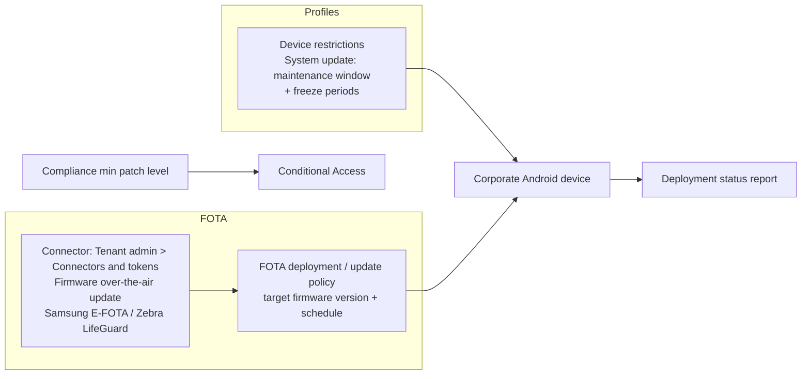

# 3.2.5 Manage Android updates by using configuration profiles or FOTA deployments

> **Exam objective:** Manage Android updates by using configuration profiles or firmware-over-the-air (FOTA) deployments
>
> **Domain:** 3 - Protect devices (15-20%) · **Skill:** 3.2 Manage device updates
>
> **Hands-on:** [LAB-3.09 Apple updates (settings catalog) and Android FOTA](../labs/LAB-3.09-apple-android-updates.md)

## Concept in plain English

Android updates come from the **device manufacturer (OEM)** and sometimes the carrier, not from Google directly. Intune has two levels of control:

| Level | Tool | Devices | What you control |
|---|---|---|---|
| **System update policy** | **Device restrictions** (or settings catalog) → *System update*: **Device default**, **Automatic**, **Postponed** (up to 30 days), **Maintenance window** (start/end time); optional **freeze periods** (up to 90 days/year) | Android Enterprise **corporate**: fully managed, dedicated, COPE | *When* the OEM's available update installs |
| **FOTA** (firmware over the air) | **Samsung Knox E-FOTA** and **Zebra LifeGuard OTA** integrations in Intune | Supported Samsung/Zebra corporate devices | *Which* firmware version each device gets, scheduling, and campaigns |
| Compliance | Minimum OS version / **minimum security patch level** + CA | All, including BYOD work profile | Block access from outdated devices |

**Personally owned work profile** devices can't be forced to update. Only compliance + CA applies.

## How it works

## Licensing requirements

- System update policy: Intune Plan 1.
- **FOTA: Intune Plan 2** (or Intune Suite / Microsoft 365 E3+ since July 2026). Samsung E-FOTA may also need Samsung's Knox licensing depending on the offer. Zebra LifeGuard needs a Zebra OneCare/LifeGuard entitlement.

## Configuration steps

### System update policy

1. **Devices > Configuration > Create > Android Enterprise > Fully managed, dedicated, and corporate-owned work profile > Device restrictions**.
2. **General > System update** = **Maintenance window**, start 01:00, end 05:00.
3. **Freeze periods for system updates**: add 12/15-01/05 (for example, a retail peak).
4. Assign to corporate Android groups.

### FOTA - Zebra LifeGuard OTA

1. **Tenant administration > Connectors and tokens > Firmware over-the-air update** → **Zebra** → connect (sign in to the Zebra portal and consent).
2. **Devices > Android > Android FOTA deployments** (or **Devices > Manage updates > Android FOTA**) → **Create deployment** → select devices/groups → choose the **target OS/LifeGuard update** (latest or specific), **schedule** (install time window, network: Wi-Fi only, battery threshold).
3. Monitor the deployment status (*Scheduled / Downloading / Installed / Failed*) per device.

### FOTA - Samsung Knox E-FOTA

1. **Tenant administration > Connectors and tokens > Firmware over-the-air update** → **Samsung** → **Connect** → sign in to the Samsung Knox E-FOTA portal with a Knox admin account and authorize.
2. From Managed Google Play, assign **Knox E-FOTA** (`com.samsung.android.knox.efota`) and **Knox Service Plugin** (`com.samsung.android.knox.kpu`) as **Required** to the Samsung device group.
3. **OEMConfig** profile (Knox Service Plugin) → *Enable device policy controls* = true, *Enable firmware controls* = true, *Enable E-FOTA client installation & launch* = true → assign to the same group.
4. Connector → **Add groups** → select the Samsung device group → **Register** (devices sync with Samsung).
5. Create an **E-FOTA deployment**: select devices, lock to a firmware/OS version, schedule download and install windows.

## Comparison

| | System update policy | FOTA |
|---|---|---|
| Chooses firmware version | ❌ (installs whatever the OEM offers) | ✅ |
| Scheduling | Maintenance window, postpone, freeze | Campaign schedule, conditions |
| OEM | Any Android Enterprise corporate device | **Samsung** (Knox E-FOTA: COBO/COSU/COPE), **Zebra** (LifeGuard: COBO/COSU) |
| License | Plan 1 | **Plan 2** |

## Exam tips and common traps

- **"Install Android system updates only between 1 and 5 AM"** → **device restrictions > System update > Maintenance window**.
- **"Pin Zebra scanners to a specific firmware version and schedule the rollout"** → **Zebra LifeGuard OTA** FOTA deployment (Intune Plan 2).
- **Freeze periods** block system updates during critical business periods (max 90 days per year, with rules on spacing).
- **BYOD work profile** devices → compliance **minimum security patch level** + CA only.

## Real-world notes

- For rugged fleets, FOTA is the difference between "whatever version the device has" and a **validated firmware baseline** - test with the line-of-business app vendor first.
- Always require **Wi-Fi + charging** conditions for firmware campaigns on handhelds.

## Microsoft Learn references

- [Android Enterprise device restrictions - system updates](https://learn.microsoft.com/intune/device-configuration/templates/ref-device-restrictions-android-enterprise)
- [Manage Firmware Over-the-Air updates on Android](https://learn.microsoft.com/intune/device-updates/android/manage-fota)
- [Zebra LifeGuard Over-the-Air integration](https://learn.microsoft.com/intune/device-updates/android/setup-zebra-lifeguard)
- [Samsung Knox E-FOTA integration](https://learn.microsoft.com/intune/device-updates/android/setup-samsung-knox)
