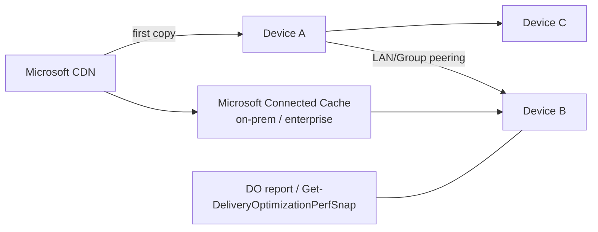

# 3.2.6 Configure Windows client Delivery Optimization by using Intune

> **Exam objective:** Configure Windows client Delivery Optimization by using Intune
>
> **Domain:** 3 - Protect devices (15-20%) · **Skill:** 3.2 Manage device updates
>
> **Hands-on:** [LAB-3.10 Delivery Optimization and update reports](../labs/LAB-3.10-delivery-optimization-update-reports.md)

## Concept in plain English

A Windows 11 feature update is several GB, and a monthly LCU is hundreds of MB. Multiply that by 1,000 devices on one site's internet link. **Delivery Optimization (DO)** is Windows' built-in **peer-to-peer caching** for Windows updates, Store apps, Microsoft 365 Apps, Intune Win32 apps and Edge: devices download pieces from **peers on the LAN** (or a group) and from a **Microsoft Connected Cache** server, instead of all hitting the internet.

### Download modes

| Mode | Value | Peering |
|---|---|---|
| HTTP only | 0 | No peering (still uses Connected Cache if configured) |
| **LAN** (default) | 1 | Peers behind the same **public IP (NAT)** |
| **Group** | 2 | Peers in the same **group** (AD site, Entra tenant ID, DHCP option, DNS suffix, or custom **Group ID**) - can cross NATs |
| Internet | 3 | Internet peers (rarely wanted in enterprise) |
| Simple | 99 | No peering, no DO cloud services |
| Bypass | 100 | Deprecated - don't use |

### Important settings

| Setting | Purpose |
|---|---|
| **Group ID source** | AD site, authenticated domain SID, DHCP option ID, DNS suffix, Entra tenant ID |
| Max upload / download bandwidth (foreground/background %, or absolute), business-hours limits | Protect the WAN |
| **Minimum RAM (GB)** / **minimum disk size (GB)** to use peer caching | Keep weak devices from being peers |
| Max cache age / size | Local cache |
| **Enable peer caching while the device connects via VPN** | Usually **off** (VPN peers are remote) |
| **Microsoft Connected Cache (MCC) server host names** / *Cache server fallback* | Point to your on-prem MCC nodes |
| Restrict peer selection (subnet mask) | Limit peering to the same subnet |

## How it works



## Licensing requirements

Intune Plan 1. DO is built into Windows 10/11. **Microsoft Connected Cache for Enterprise and Education** is available to Intune/Configuration Manager customers.

## Configuration steps

1. **Devices > Configuration > Create > Windows 10 and later > Templates > Delivery Optimization** (or settings catalog *Delivery Optimization*).
2. Settings:
   - *Download mode* = **HTTP blended with peering across private group (2)**
   - *Restrict peer selection* = Subnet mask (optional)
   - *Group ID source* = **AD site** (hybrid) or **Entra tenant ID**, or *Custom* with a GUID per site
   - *Bandwidth*: background download max 50% during business hours 08-17, 90% outside
   - *Minimum RAM* 4 GB, *minimum disk* 32 GB
   - *Enable peer caching while connected via VPN* = **Block**
   - *Cache server host names* = `mcc01.contoso.local` (if MCC deployed)
3. Assign to Windows device groups.
4. Verify:

```powershell
Get-DeliveryOptimizationStatus | Select-Object FileId, Status, BytesFromPeers, BytesFromHttp, DownloadMode
Get-DeliveryOptimizationPerfSnap
```

5. Reports: **Reports > Delivery Optimization** (Windows Update for Business reports in Azure Monitor workbook show bytes from peers vs CDN) and the per-device PowerShell above.

## Comparison: content delivery options

| Option | Infrastructure | Best for |
|---|---|---|
| DO LAN/Group | None | Most offices |
| **Microsoft Connected Cache** | VM/server on site | Branches with thin WAN, many devices |
| BranchCache (legacy) | File servers/ConfigMgr | Legacy ConfigMgr environments |
| WSUS | Servers | Not for cloud-managed devices |

## Exam tips and common traps

- **"Devices in different subnets behind different NATs at one site should share content"** → download mode **Group (2)** with a **Group ID** (for example, AD site).
- **"Disable peering over VPN"** → *Enable peer caching while the device connects via VPN* = Block.
- **LAN (1)** peers only behind the **same public IP**.
- **Simple (99)** disables peering **and** DO cloud services (use for isolated networks).
- DO also serves **Intune Win32 apps**, Store apps, Microsoft 365 Apps and Edge updates, not only Windows updates.

## Real-world notes

- Pair DO with **gradual feature update rollouts** - the first devices seed peers, later rings download mostly from the LAN.
- Measure **% bytes from peers** before and after. It's an easy win to report to management.

## Microsoft Learn references

- [Delivery Optimization settings in Intune](https://learn.microsoft.com/intune/device-configuration/templates/delivery-optimization-windows)
- [Delivery Optimization reference](https://learn.microsoft.com/windows/deployment/do/waas-delivery-optimization-reference)
- [Microsoft Connected Cache for Enterprise and Education](https://learn.microsoft.com/windows/deployment/do/mcc-ent-edu-overview)
