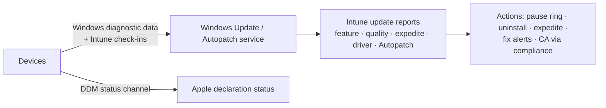

# 3.2.7 Monitor device updates by using Intune

> **Exam objective:** Monitor device updates by using Intune
>
> **Domain:** 3 - Protect devices (15-20%) · **Skill:** 3.2 Manage device updates
>
> **Hands-on:** [LAB-3.10 Delivery Optimization and update reports](../labs/LAB-3.10-delivery-optimization-update-reports.md)

## Concept in plain English

Deploying update policies is half the job. You also have to **prove** devices are patched and **find** the ones that aren't. Intune has update reports per platform and per policy type.

| Report | Where | Shows |
|---|---|---|
| **Update ring device status** | Devices > Windows updates > Update rings > [ring] > Device status | Assignment/policy success per device (not patch level!) |
| **Feature update report** | Reports > Windows updates > Reports > **Windows feature update report** | Per device: *Offering / Installing / Installed / Needs attention / Cancelled / Ineligible*, with alert details (safeguard hold, reboot needed) |
| **Expedited quality update report** | Reports > Windows updates > **Windows expedited update report** | Progress of expedite policies |
| **Driver update report** | Reports > Windows updates > **Windows driver update report** | Approved drivers, install state |
| **Windows Autopatch quality/feature reports** | Reports > Windows Autopatch | *Up to Date / Not up to Date / Not ready / Paused*, **device alerts** with remediation |
| **Hotpatch quality update report** | Reports > Windows Autopatch | Hotpatch status per device/policy |
| **Windows update distribution / summary** | Reports > Windows updates > Summary | Fleet view by quality/feature release |
| **Windows Update for Business reports** (Azure Monitor workbook) | Azure / Log Analytics | Deep historical data, driver/alert details |
| **iOS/iPadOS & macOS update status** | Reports > Device management > iOS update status (and DDM declaration status) | Devices on target version / failed |
| **Android FOTA deployment status** | Devices > Android FOTA deployments | Per-device firmware campaign state |
| **Compliance** (minimum OS version / patch level) | Compliance reports | Devices failing OS floor → blocked by CA |

## How it works

Windows feature/quality/driver reports require the **Windows data** connector and **license verification** (objective [2.1.6](../../02-Manage-Maintain-Devices/docs/2.1.6-windows-11-upgrades.md)) and devices sending **Required** diagnostic data.

## Licensing requirements

Update ring status: Intune Plan 1. Feature/expedite/driver/Autopatch reports: the Autopatch-eligible Windows licences. Windows Update for Business reports need an Azure subscription (Log Analytics).

## Configuration steps

1. Make sure **Tenant administration > Connectors and tokens > Windows data** is On (with license verification).
2. **Reports > Windows updates** → *Summary* tab → review quality and feature distributions.
3. **Reports > Windows updates > Reports** → *Windows feature update report* → select policy → **Generate** → filter *Update state = Needs attention* → read the **alert type** (for example, *Safeguard hold*, *Disk space*, *Restart required*).
4. **Reports > Windows Autopatch > Quality updates** → devices *Not up to Date* → open **Alerts** → follow the remediation text.
5. Apple: **Devices > [device]** OS version, or the DDM policy status.
6. Export to CSV from any report, or query with Graph (`deviceManagement/reports/exportJobs`) for trend dashboards (objective [5.2.1](../../05-Optimize-Endpoint-Operations/docs/5.2.1-reporting-workbooks-export.md)).

## Comparison: "is it assigned?" vs "is it patched?"

| Question | Report |
|---|---|
| Did the ring policy apply? | Update ring device status |
| Is the device on the target Windows version? | Feature update report |
| Did the emergency patch install? | Expedited update report |
| Which devices are not up to date and why? | Autopatch quality report + alerts |
| Are users blocked for old OS? | Compliance reports + CA sign-in logs |

## Exam tips and common traps

- **Update ring device status ≠ patch status.** It shows policy delivery. Use the **feature/expedite/Autopatch** reports for installation state.
- Empty Windows update reports → **Windows data** connector / license verification / diagnostic data.
- **Safeguard holds** appear as alert details in the feature update report.
- For Apple, monitor **DDM declaration status**, and enforce with compliance min OS.

## Real-world notes

- Publish a weekly "patch compliance" KPI (% devices on the current quality update within 14 days) from Autopatch reports. It keeps momentum and gives visibility to leadership.
- Investigate the long tail (devices offline for weeks). They're often lost/unused devices that should be retired (see device clean-up rules and stale device automation, objective [5.1.1](../../05-Optimize-Endpoint-Operations/docs/5.1.1-powershell-graph-automation.md)).

## Microsoft Learn references

- [Windows update reports in Intune](https://learn.microsoft.com/intune/device-updates/windows/reports)
- [Windows Autopatch quality and feature update reports](https://learn.microsoft.com/windows/deployment/windows-autopatch/monitor/windows-autopatch-windows-quality-and-feature-update-reports-overview)
- [Windows Autopatch alerts and remediations](https://learn.microsoft.com/windows/deployment/windows-autopatch/monitor/alerts-remediations)
- [Windows Update for Business reports](https://learn.microsoft.com/windows/deployment/update/wufb-reports-overview)
