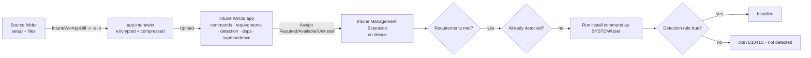

# 4.1.1 Prepare applications for deployment by using Intune

> **Exam objective:** Prepare applications for deployment by using Intune
>
> **Domain:** 4 - Manage and secure applications (15-20%) · **Skill:** 4.1 Deploy and update apps
>
> **Hands-on:** [LAB-4.01 Win32 packaging and troubleshooting](../labs/LAB-4.01-win32-packaging-troubleshooting.md)

## Concept in plain English

"Preparing" an app means choosing the right **app type**, getting the installer into a form Intune accepts, and defining **how Intune installs, detects, and removes it**. For Windows that usually means wrapping the installer as a **`.intunewin`** with the **Microsoft Win32 Content Prep Tool** (`IntuneWinAppUtil.exe`).

### App types by platform

| Platform | App types |
|---|---|
| **Windows** | **Win32** (`.intunewin`), **LOB** (`.msi`, `.msix`/`.appx`), **Microsoft Store app (new)** (WinGet-backed), **Enterprise App Catalog**, **Microsoft 365 Apps**, **Microsoft Edge**, **Web link**, Windows web app |
| **iOS/iPadOS** | **App Store** app, **Apple VPP** app (ABM Apps and Books), **LOB** (`.ipa`), web clip, built-in (Microsoft) apps |
| **macOS** | **PKG** (unmanaged/managed), **DMG**, **LOB** `.pkg`, **Apple VPP**, Microsoft 365 Apps for macOS, Edge, Defender |
| **Android** | **Managed Google Play** (public, private LOB, web apps), **LOB** `.apk` (for DA/AOSP or direct on fully managed/dedicated), built-in |

### Win32 preparation checklist

| Item | Example |
|---|---|
| Source folder with installer + dependencies | `C:\Packages\7zip\` |
| Setup file | `7z2408-x64.msi` or `setup.exe` |
| **Silent install command** | `msiexec /i "7z2408-x64.msi" /qn` |
| **Silent uninstall command** | `msiexec /x "{23170F69-40C1-2702-2408-000001000000}" /qn` |
| Install behavior | **System** or User |
| Device restart behavior | Determine by return codes / Intune will force / Allow / No action |
| **Return codes** | 0 success, 1707 success, 3010 soft reboot, 1641 hard reboot, 1618 retry |
| **Requirements** | OS architecture, minimum OS, disk space, RAM, CPU, custom registry/file/script requirements |
| **Detection rules** | **MSI product code**, **File/folder** (exists, version, date), **Registry** (exists, value), or **custom script** (exit 0 + STDOUT = detected) |
| **Dependencies** | Other Win32 apps installed first (auto-install option) |
| **Supersedence** | Replace/upgrade an older app (optionally uninstall it) |
| Logo, description, publisher, category, featured in Company Portal | End-user experience |

## How it works



## Licensing requirements

Intune Plan 1. Win32 apps require Windows 10 1607+ Pro/Enterprise/Education, enrolled (Entra joined/hybrid/registered), with the IME installed automatically when a Win32 app or script is assigned.

## Configuration steps

### Package with IntuneWinAppUtil

```powershell
# Download from github.com/microsoft/Microsoft-Win32-Content-Prep-Tool
.\IntuneWinAppUtil.exe -c C:\Packages\7zip -s 7z2408-x64.msi -o C:\Packages\Output -q
# -c source folder, -s setup file, -o output folder, -q quiet (overwrite)
```

Output: `7z2408-x64.intunewin` (for MSI sources, the tool captures the product code for detection).

### Test the silent install before uploading

```powershell
# Run as SYSTEM, like the IME does (PsExec from Sysinternals)
psexec.exe -i -s cmd.exe
msiexec /i "C:\Packages\7zip\7z2408-x64.msi" /qn /l*v C:\Temp\7zip-install.log
```

### Detection script example

```powershell
# Detected only if 7-Zip 24.08 or newer is installed
$exe = 'C:\Program Files\7-Zip\7z.exe'
if ((Test-Path $exe) -and ([version](Get-Item $exe).VersionInfo.ProductVersion -ge [version]'24.08')) {
    Write-Output 'Detected'
    exit 0
}
exit 1
```

A reusable packaging helper is in [`08-Scripts/apps/New-IntuneWinAppPackage.ps1`](../../08-Scripts/apps/New-IntuneWinAppPackage.ps1).

## Comparison: Win32 vs LOB MSI vs Store (new)

| | Win32 (.intunewin) | LOB MSI | Microsoft Store (new) |
|---|---|---|---|
| Installer types | Any (EXE/MSI/script) | Single MSI | Store / WinGet catalog |
| Size limit | 30 GB | 8 GB | N/A (Store hosted) |
| Dependencies / supersedence | ✅ | ❌ | ❌ |
| Requirement & custom detection rules | ✅ | ❌ | ❌ |
| Delivery Optimization | ✅ | Limited | ✅ |
| Updates | You repackage (or EAM) | You upload | **Automatic** from Store |
| Safe in Autopilot ESP with other Win32 | ✅ | ⚠️ Mixing causes failures | ✅ |

## Exam tips and common traps

- **"Deploy an EXE with a silent switch and a prerequisite app"** → **Win32** with a **dependency**.
- **"Upgrade version 1 to version 2 and remove v1"** → **supersedence** with *Uninstall previous version* = Yes.
- **"Install only on 64-bit devices with ≥ 8 GB RAM"** → **requirement rules**.
- Detection scripts must **exit 0 AND write to STDOUT** to report detected.
- The IME runs installs in **SYSTEM** context unless *Install behavior = User*. Test as SYSTEM.
- `IntuneWinAppUtil` switches: **-c** source, **-s** setup, **-o** output, **-q** quiet.

## Real-world notes

- Keep a packaging standard: source folder, `install.ps1`/`uninstall.ps1` wrappers with logging to `C:\ProgramData\Contoso\Logs`, and a detection script. PSAppDeployToolkit is a common community framework.
- Always check the **Enterprise App Catalog** and **Microsoft Store (new)** first. Package only when neither covers the app.

## Microsoft Learn references

- [Prepare a Win32 app to be uploaded](https://learn.microsoft.com/intune/app-management/deployment/prepare-win32-app)
- [Add, assign, and monitor a Win32 app](https://learn.microsoft.com/intune/app-management/deployment/add-win32)
- [Win32 app supersedence](https://learn.microsoft.com/intune/app-management/deployment/win32-app-supersedence)
- [App types in Intune](https://learn.microsoft.com/intune/app-management/deployment/)
- [Microsoft Win32 Content Prep Tool (GitHub)](https://github.com/microsoft/Microsoft-Win32-Content-Prep-Tool)
