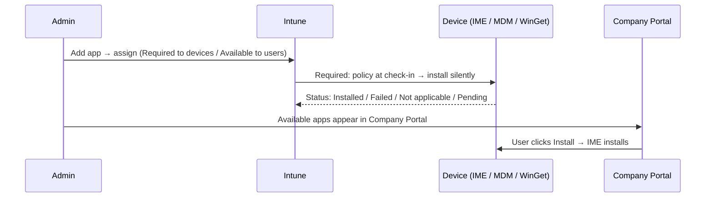

# 4.1.2 Deploy apps by using Intune, including Win32, LOB and Microsoft Store apps

> **Exam objective:** Deploy apps by using Intune, including Win32 apps, line-of-business (LOB) apps, and Microsoft Store apps
>
> **Domain:** 4 - Manage and secure applications (15-20%) · **Skill:** 4.1 Deploy and update apps
>
> **Hands-on:** [LAB-4.01 Win32 packaging](../labs/LAB-4.01-win32-packaging-troubleshooting.md), [LAB-4.02 LOB and Microsoft Store apps](../labs/LAB-4.02-lob-store-apps.md)

## Concept in plain English

Once an app is added, you **assign** it to groups with an **intent**:

| Assignment | Behaviour | Target |
|---|---|---|
| **Required** | Installed automatically (with optional deadline/availability date) | Users or devices |
| **Available for enrolled devices** | User installs from **Company Portal** | **Users** for most app types. Exceptions: **Win32** apps and apps for Android Enterprise **fully managed / COPE** devices can also target **device** groups |
| **Uninstall** | Removed from devices (only apps Intune installed through this app's Required/Available assignment) | Users or devices |
| Available with or without enrollment | MAM scenarios on iOS/Android | Users |

Assignment options per app: **filters**, **end-user notifications** (show all / show restart only / hide all), **availability** and **installation deadline** (Win32), **restart grace period**, **Delivery Optimization priority** (foreground/background), and for iOS **uninstall on device removal**, **install as removable**, **license type** (VPP user/device).

### The three Windows app types in this objective

| | Win32 | LOB | Microsoft Store app (new) |
|---|---|---|---|
| Package | `.intunewin` | `.msi`, `.msix`, `.appx` (+ `.msixbundle`) | Pick from the Store/WinGet catalog in Intune |
| Delivered by | **IME** | MDM (OMA-DM `EnterpriseDesktopAppManagement` / AppX) | IME using **WinGet** |
| Install context | System or user | Per-machine or per-user (MSI dual mode) | System or user |
| Updates | Supersedence | Upload new version | **Auto-update from the Store** |
| Legacy note | - | MSI LOB can't be mixed with Win32 in Autopilot ESP | The **Microsoft Store for Business** is retired - use this |

## How it works

## Licensing requirements

Intune Plan 1. Store apps: the **Microsoft Store** must be reachable (a policy blocking the Store UI doesn't block Intune Store deployments if you only block the *private store* - check settings).

## Configuration steps

### Win32

**Apps > Windows > Create > Windows app (Win32)** → upload `.intunewin` → *Program* (install/uninstall commands, install behavior, restart, return codes) → *Requirements* → *Detection rules* → *Dependencies* → *Supersedence* → *Assignments* (Required: `DG-Lab-Windows-Corporate`, deadline ASAP; Available: `SG-Lab-Users`).

### LOB (MSI / MSIX)

**Apps > Windows > Create > Line-of-business app** → upload `.msi`/`.msix` → app info (publisher required) → *Ignore app version* (for self-updating apps) → *Command-line arguments* (MSI) → assign.

### Microsoft Store app (new)

**Apps > Windows > Create > Microsoft Store app (new)** → **Search the Microsoft Store app (new)** → select (for example, *Company Portal*, *Microsoft To Do*, *PowerToys*) → *Installation behavior* System/User → assign.

### Company Portal branding and experience

Available apps appear in the Company Portal app/website. Use **featured apps**, **categories**, and logos.

## Comparison: assignment intents

| Need | Intent |
|---|---|
| Must be on every corporate device | Required → device group |
| Optional tool users choose | Available → user group |
| Remove a retired app | Uninstall |
| Install for a user wherever they sign in (shared device, user context) | Required → user group, install behavior User |

## Exam tips and common traps

- **Available** assignments target **user** groups for most app types. **Win32** apps (and Android Enterprise fully managed/COPE apps) are the exceptions that also support **device** groups.
- **Microsoft Store for Business/Education is retired** → use **Microsoft Store app (new)** (WinGet).
- Conflicting intents: **Required beats Uninstall**, and **Uninstall beats Available**. Required + Available = *Required and Available*. Don't design conflicts on purpose - exclude the group instead.
- To have an MSI LOB app ignore self-updates (for example, a browser), enable **Ignore app version**.
- **MSIX** requires the app to be signed with a certificate trusted by the device (sideloading enabled by default on Windows 10 2004+).
- A Win32 app's **deadline** in the assignment forces install time. **Availability** delays when it's offered.

## Real-world notes

- Assign core apps **Required to device groups** (they install before sign-in and follow the device), and optional apps **Available to users**.
- Keep the Company Portal curated. Users stop using it if 200 obscure apps are listed.

## Microsoft Learn references

- [Add a Win32 app](https://learn.microsoft.com/intune/app-management/deployment/add-win32)
- [Add Windows LOB apps](https://learn.microsoft.com/intune/app-management/deployment/add-lob-windows)
- [Add Microsoft Store apps](https://learn.microsoft.com/intune/app-management/deployment/add-microsoft-store)
- [Assign apps to groups](https://learn.microsoft.com/intune/app-management/deployment/assign-groups)
- [Intune Management Extension overview](https://learn.microsoft.com/intune/device-management/tools/intune-management-extension)
