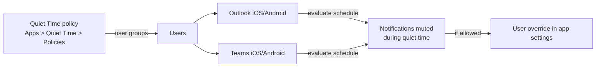

# 4.1.3 Configure Quiet Time policies for Android and iOS apps

> **Exam objective:** Configure Quiet Time policies for Android and iOS apps
>
> **Domain:** 4 - Manage and secure applications (15-20%) · **Skill:** 4.1 Deploy and update apps
>
> **Hands-on:** [LAB-4.06 Quiet Time](../labs/LAB-4.06-quiet-time.md)

## Concept in plain English

Constant work notifications after hours hurt wellbeing, and in some countries "right to disconnect" laws require limits. **Quiet Time policies** automatically **mute Microsoft Outlook email and Teams notifications** on **iOS/iPadOS and Android** outside working hours. They're user-targeted and work on managed and unmanaged (MAM) devices where the apps are signed in with work accounts.

### Policy types

| Type | Behaviour |
|---|---|
| **Date Range** | Mute Outlook + Teams notifications from a start date/time to an end date/time (holidays, shutdown periods) |
| **Days of the week** | **All day** mute on selected days (for example, Saturday, Sunday) and/or **certain hours** daily (for example, 19:00-07:00 Mon-Fri), plus **End user overrides** (*Allow user to change settings*) |
| **Non-working time** | Mute **Teams** notifications when the user is in non-working time according to the **Working Time API** integration (frontline shift scenarios). Only configure if the tenant uses that API |

## How it works

Policy changes can take up to **24 hours** to reach users.

## Licensing requirements

Intune Plan 1 (app management). Not supported in sovereign clouds (GCC, GCC High, DoD, 21Vianet). Requires current Outlook and Teams mobile apps signed in with the work account.

## Configuration steps

1. **Apps > Quiet Time > Policies > Create policy**.
2. **Policy type**: *Days of the week*.
3. *Basics*: `QT-AfterHours-EU` (platform is pre-set to Android; iOS/iPadOS).
4. *Configuration settings*:
   - **Allday**: Mute notifications all day = Require → Days: Saturday, Sunday
   - **Certain Hours**: Mute notifications daily = Require → Start 19:00, End 07:00 → Days: Monday-Friday
   - **End User Overrides**: Allow user to change settings = Yes
5. Scope tags → **Assignments**: user group `SG-Lab-Users` → **Create**.
6. For a holiday shutdown, create a **Date Range** policy (for example, 24 Dec 18:00 - 2 Jan 07:00).

## Comparison: ways to limit after-hours work on mobile

| Tool | Scope |
|---|---|
| **Quiet Time policy** | Mute Outlook/Teams notifications on a schedule |
| App protection *Conditional launch* / Teams **Working Time** access restrictions | Block access to Teams outside shifts (frontline) |
| User's own Focus / Do Not Disturb | Device-wide, user controlled |
| Outlook app settings "Quiet time" | Per-user app setting (the policy centralizes it) |

## Exam tips and common traps

- Quiet Time affects **Outlook and Teams** notifications on **iOS/iPadOS and Android** only.
- It's configured under **Apps > Quiet Time**, not in app protection or device configuration.
- Assign to **user** groups.
- **Non-working time** requires the **Working Time API** integration. Otherwise users might miss Teams notifications.
- Changes can take **24 hours** to apply.

## Real-world notes

- Combine a weekday "certain hours" policy with an override-allowed setting for most staff, and a no-override policy for regions with legal requirements.
- Communicate clearly: "You won't get notifications, but mail still arrives."

## Microsoft Learn references

- [Quiet Time policies for iOS/iPadOS and Android apps](https://learn.microsoft.com/intune/app-management/protection/configure-quiet-time)
- [Limit access to Microsoft Teams when frontline workers are off shift (Working Time)](https://learn.microsoft.com/microsoft-365/frontline/flw-working-time)
