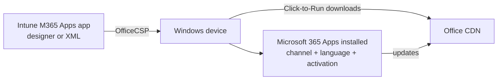

# 4.1.4 Deploy Microsoft 365 Apps by using Intune

> **Exam objective:** Deploy Microsoft 365 Apps by using Intune
>
> **Domain:** 4 - Manage and secure applications (15-20%) · **Skill:** 4.1 Deploy and update apps
>
> **Hands-on:** [LAB-4.03 Microsoft 365 Apps via Intune and ODT during Autopilot](../labs/LAB-4.03-m365-apps-intune-odt-autopilot.md)

## Concept in plain English

Intune has a **built-in app type** for **Microsoft 365 Apps for enterprise** (Word, Excel, PowerPoint, Outlook, OneNote, Teams, Access, Publisher, and optionally Project and Visio). It uses the **Office Deployment Tool (ODT)** engine and the **Office CDN** behind the scenes. You configure it with either:

| Settings format | When |
|---|---|
| **Configuration designer** | Point-and-click: apps, architecture (64-bit recommended), update channel, version, remove MSI Office, shared computer activation, languages, accept EULA |
| **Enter XML data** | Paste an ODT `configuration.xml` (for example, built in the **Office Customization Tool** at config.office.com). Required for Microsoft 365 Apps for **business** |

macOS has a separate **Microsoft 365 Apps (macOS)** app type.

### Update channels

| Channel | Cadence | Use |
|---|---|---|
| **Current Channel** | New features as soon as ready (at least monthly) | Most organizations/Copilot readiness |
| **Monthly Enterprise Channel** | New features once a month on a predictable day | Predictable monthly |
| **Semi-Annual Enterprise Channel** | Features twice a year, security monthly | Change-controlled environments |
| Current Channel (Preview) / Semi-Annual (Preview) | Early validation | Pilot |

## How it works



The built-in app type is delivered by the **Office CSP**, **not the IME**. That matters for Autopilot ESP (objective [4.1.6](4.1.6-m365-apps-autopilot-odt.md)).

## Licensing requirements

A Microsoft 365 Apps license for users (Microsoft 365 E3/E5, Business Standard/Premium, Apps for enterprise/business). **Shared computer activation** needs an eligible enterprise license. Intune Plan 1.

## Configuration steps

1. **Apps > All apps > Create** → **Microsoft 365 Apps** → **Windows 10 and later**.
2. *App suite information*: name `Microsoft 365 Apps - Current Channel x64`.
3. *Configure app suite* → **Configuration designer**:
   - Select Office apps: Excel, OneNote, Outlook, PowerPoint, Teams, Word
   - Architecture: **64-bit**
   - Default file format: Office Open XML
   - Update channel: **Current Channel** (or Monthly Enterprise)
   - **Remove other versions** (MSI Office): Yes
   - Version to install: Latest
   - Use shared computer activation: No (Yes for RDS/shared PCs)
   - Accept EULA: Yes
   - Languages: add as needed (installs match OS languages by default)
4. Assign **Required** to `DG-Lab-Windows-Corporate`.
5. Monitor: **Apps > [app] > Device install status**. On the device, `C:\Windows\Temp` and `%temp%` ODT/C2R logs.

### XML example (from the Office Customization Tool)

```xml
<Configuration>
  <Add OfficeClientEdition="64" Channel="MonthlyEnterprise" MigrateArch="TRUE">
    <Product ID="O365ProPlusRetail">
      <Language ID="MatchOS" />
      <ExcludeApp ID="Groove" />
      <ExcludeApp ID="Lync" />
    </Product>
  </Add>
  <Property Name="SharedComputerLicensing" Value="0" />
  <Property Name="AUTOACTIVATE" Value="1" />
  <Updates Enabled="TRUE" />
  <RemoveMSI />
  <Display Level="None" AcceptEULA="TRUE" />
</Configuration>
```

## Comparison: ways to deploy Microsoft 365 Apps

| Method | Pros | Cons |
|---|---|---|
| **Intune built-in app type** | Easiest, GUI or XML | Not managed by IME - concurrency risk during Autopilot ESP with Win32 apps |
| **Win32 app wrapping ODT** (`setup.exe /configure config.xml`) | Managed by IME, reliable in ESP, custom logic | You maintain the package |
| Autopilot device preparation | M365 Apps selectable as an essential app | Device preparation only |
| Self-install from portal.office.com | No admin effort | No control, users need admin rights (unless blocked) |

## Exam tips and common traps

- **Microsoft 365 Apps for business** can be deployed **only with XML** in Intune.
- **Remove other versions** removes MSI Office (all MSI Office products).
- **Shared computer activation** for RDS/multi-user devices (licensing via token per user).
- The **update channel** in the app and the settings catalog *Update Channel* setting should match, or Office can reinstall/change channels unexpectedly.
- For tracked installs in the **Autopilot ESP**, Microsoft recommends deploying M365 Apps as a **Win32 app** (objective [4.1.6](4.1.6-m365-apps-autopilot-odt.md)).

## Real-world notes

- Standardize on **64-bit + Monthly Enterprise or Current Channel**. Use **cloud update** in the Microsoft 365 Apps admin center to manage rollouts (objective [4.1.7](4.1.7-microsoft-365-apps-admin-center.md)).
- Exclude Groove (legacy OneDrive for Business) and Skype for Business (Lync) in XML unless needed.

## Microsoft Learn references

- [Add Microsoft 365 Apps to Windows devices](https://learn.microsoft.com/intune/app-management/deployment/add-microsoft-365-windows)
- [Add Microsoft 365 Apps to macOS devices](https://learn.microsoft.com/intune/app-management/deployment/add-microsoft-365-macos)
- [Overview of update channels](https://learn.microsoft.com/microsoft-365-apps/updates/overview-update-channels)
- [Office Deployment Tool configuration options](https://learn.microsoft.com/microsoft-365-apps/deploy/office-deployment-tool-configuration-options)
- [Shared computer activation](https://learn.microsoft.com/microsoft-365-apps/licensing-activation/overview-shared-computer-activation)
