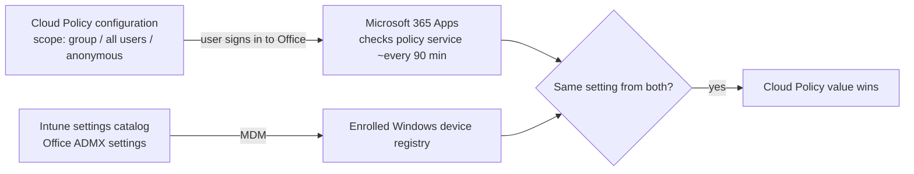

# 4.1.5 Configure policies for Microsoft 365 apps by using Intune or the Microsoft 365 Apps admin center

> **Exam objective:** Configure policies for Microsoft 365 apps by using Microsoft Intune or the Microsoft 365 Apps admin center
>
> **Domain:** 4 - Manage and secure applications (15-20%) · **Skill:** 4.1 Deploy and update apps
>
> **Hands-on:** [LAB-4.04 Cloud Policy and the Microsoft 365 Apps admin center](../labs/LAB-4.04-cloud-policy-m365-apps-admin-center.md)

## Concept in plain English

There are two ways to push **Office policy settings** (macros, trust center, default save location, privacy controls, Outlook settings...):

| | **Cloud Policy service** (Microsoft 365 Apps admin center / Intune *Policies for Microsoft 365 apps*) | **Intune device configuration** (settings catalog / administrative templates) |
|---|---|---|
| Targeting | **Users** (Entra security groups) or anonymous (web) / all users | Devices or users (enrolled Windows) |
| Requires enrollment | **No** - works on unmanaged, BYOD, personal devices signed in with work account | Yes (MDM) |
| Platforms | Windows, Mac, **Office on the web**, iOS/Android (subset) | Windows (and macOS via settings catalog/plist) |
| Precedence | **Cloud Policy wins** over GPO/Intune for the same setting | - |
| Portal | `config.office.com` > Customization > Policy Management, or Intune **Apps > Policies for Microsoft 365 apps** (same service) | Intune > Devices > Configuration |
| Security baseline recommendations | ✅ (flags recommended settings) | Microsoft 365 Apps security baseline |

## How it works

Office retrieves Cloud Policy at app start and roughly every **90 minutes** while signed in (and at 24-hour intervals if no changes).

## Licensing requirements

Microsoft 365 Apps for enterprise (included in M365 E3/E5 etc.). Cloud Policy supports Microsoft 365 Apps for enterprise and some business editions. Role: **Office Apps Administrator** (least privilege), Security Administrator or Global Administrator.

## Configuration steps

### Cloud Policy

1. `https://config.office.com` → **Customization > Policy Management** (or Intune **Apps > Policies for Microsoft 365 apps > Create**).
2. **Create** → name `OFF-Security-AllStaff` → *Scope*: **This policy configuration applies to users in the specified group** → `SG-Lab-Users`.
3. **Policies**: filter by *Recommendation: Security baseline* → configure, for example:
   - *Block macros from running in Office files from the internet* (Word/Excel/PowerPoint) = Enabled
   - *VBA Macro Notification Settings* = Disable all except digitally signed macros
   - *Default location for new files* etc.
4. **Create**. Set **priority** relative to other policy configurations (lower number wins for overlapping users).

### Intune settings catalog (enrolled devices)

**Devices > Configuration > Create > Windows > Settings catalog** → search *Microsoft Word 2016* / *Microsoft Office 2016* categories → configure → assign to device groups. Use this when you need device-scoped settings or settings not in Cloud Policy.

### Microsoft 365 Apps security baseline

**Endpoint security > Security baselines > Microsoft 365 Apps for Enterprise** (where available) - Microsoft's recommended Office hardening via MDM.

## Comparison

| Need | Choose |
|---|---|
| Policy for users on personal Windows/Mac devices | **Cloud Policy** |
| Office on the web policies | **Cloud Policy** |
| Device-targeted Office settings on corporate devices | Settings catalog |
| Recommended hardening quickly | Cloud Policy *security baseline* filter or M365 Apps security baseline |
| Conflict between GPO/Intune and Cloud Policy | Cloud Policy wins |

## Exam tips and common traps

- **"Apply Office macro settings to users on devices that aren't enrolled in Intune"** → **Cloud Policy service** (config.office.com or Intune *Policies for Microsoft 365 apps*).
- Cloud Policy targets **user** groups, not device groups.
- Cloud Policy settings **take precedence** over GPO and MDM for the same setting.
- **Office Apps Administrator** is the least-privilege role for the Microsoft 365 Apps admin center.

## Real-world notes

- Use Cloud Policy for everything Office-user-facing. It follows the user to any device, including Macs and Cloud PCs, with no enrollment dependency.
- Start from the "Security baseline" recommendation filter and document every deviation.

## Microsoft Learn references

- [Overview of Cloud Policy service for Microsoft 365](https://learn.microsoft.com/microsoft-365-apps/admin-center/overview-cloud-policy)
- [Policies for Microsoft 365 Apps in Intune](https://learn.microsoft.com/intune/app-management/configuration/microsoft-365-policies)
- [Microsoft 365 Apps admin center overview](https://learn.microsoft.com/microsoft-365-apps/admin-center/overview)
- [Block macros from the internet](https://learn.microsoft.com/microsoft-365-apps/security/internet-macros-blocked)
