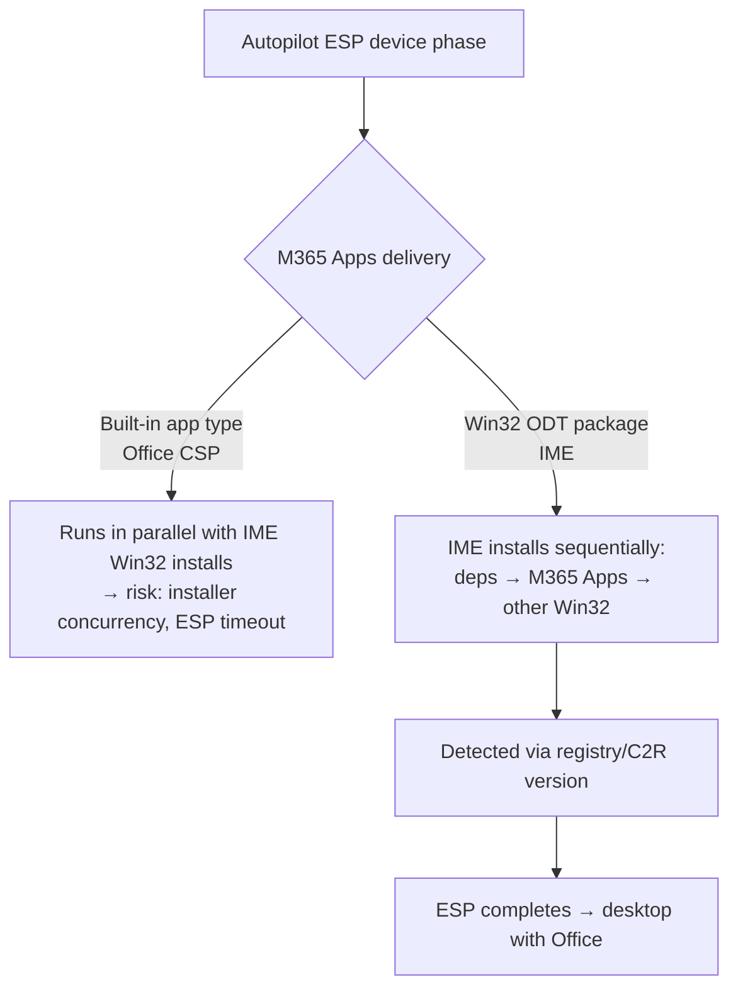

# 4.1.6 Deploy Microsoft 365 Apps as part of a Windows Autopilot deployment

> **Exam objective:** Deploy Microsoft 365 Apps as part of a Windows Autopilot deployment, including using the Office Deployment Tool (ODT) or Microsoft Intune
>
> **Domain:** 4 - Manage and secure applications (15-20%) · **Skill:** 4.1 Deploy and update apps
>
> **Hands-on:** [LAB-4.03 Microsoft 365 Apps via Intune and ODT during Autopilot](../labs/LAB-4.03-m365-apps-intune-odt-autopilot.md)

## Concept in plain English

Users expect Office on the desktop at first sign-in, so Microsoft 365 Apps is almost always a **blocking app** in the Autopilot **Enrollment Status Page** (or an *essential app* in device preparation). There are two ways to deliver it:

| Option | How | Autopilot suitability |
|---|---|---|
| **Intune built-in Microsoft 365 Apps app type** | Office CSP (not IME) | ⚠️ Fine on its own, but **concurrency issues** when the ESP also installs Win32 apps through the IME (both can use the Windows Installer / C2R at once) → ESP failures |
| **Win32 app wrapping the ODT** (`setup.exe` + `configuration.xml`) | IME, sequenced with other Win32 apps | ✅ **Microsoft-recommended** when M365 Apps is tracked in the ESP |
| **Autopilot device preparation** essential app | Built-in Microsoft 365 app type supported | ✅ Device preparation handles sequencing |

## How it works



## Licensing requirements

Microsoft 365 Apps license + Intune Plan 1 + Autopilot prerequisites.

## Configuration steps (Win32 ODT package)

1. Download the **Office Deployment Tool** (`setup.exe`) from the Microsoft Download Center.
2. Build `configuration.xml` in the **Office Customization Tool** (config.office.com → *Customization > Device configuration*), or by hand:

```xml
<Configuration>
  <Add OfficeClientEdition="64" Channel="MonthlyEnterprise">
    <Product ID="O365ProPlusRetail">
      <Language ID="MatchOS" />
      <ExcludeApp ID="Groove" />
      <ExcludeApp ID="Lync" />
    </Product>
  </Add>
  <Updates Enabled="TRUE" />
  <RemoveMSI />
  <Display Level="None" AcceptEULA="TRUE" />
  <Property Name="AUTOACTIVATE" Value="1" />
</Configuration>
```

   The package downloads content from the **Office CDN** at install time, so it stays small. Optionally add `SourcePath` to install from a local cache.

3. Folder `C:\Packages\M365Apps\` with `setup.exe`, `configuration.xml`, and `uninstall.xml` (`<Remove All="TRUE" />`).
4. Package: `IntuneWinAppUtil.exe -c C:\Packages\M365Apps -s setup.exe -o C:\Packages\Output -q`.
5. Win32 app:
   - Install: `setup.exe /configure configuration.xml`
   - Uninstall: `setup.exe /configure uninstall.xml`
   - Install behavior: **System**
   - Detection (registry): `HKLM\SOFTWARE\Microsoft\Office\ClickToRun\Configuration`, value `ProductReleaseIds` **contains** `O365ProPlusRetail` (or `VersionToReport` exists)
6. Assign **Required** to the Autopilot **device** group.
7. ESP profile → **Block device use until required apps are installed** → *Selected* → add the M365 Apps Win32 app.

### Using the built-in app type instead

If you choose the built-in type, avoid other Win32 apps installing at the same moment in the ESP, or don't track M365 Apps in the ESP (let it install after the desktop appears).

### Device preparation

Add **Microsoft 365 Apps** (built-in type) to the **Allowed applications** list of the device preparation policy and assign it to the enrollment time group.

## Comparison: ODT Win32 vs built-in app type

| | Win32 ODT | Built-in |
|---|---|---|
| Delivered by | IME | Office CSP |
| ESP sequencing | ✅ | ⚠️ concurrency |
| Configuration | XML (full ODT) | Designer or XML |
| Custom pre/post logic (remove old Office, add language packs) | ✅ script wrapper | Limited |
| Maintenance | You maintain | Microsoft maintains |

## Exam tips and common traps

- **"Autopilot ESP fails when installing Microsoft 365 Apps alongside Win32 apps"** → deploy M365 Apps as a **Win32 app with the ODT**.
- ODT command: `setup.exe /configure configuration.xml` (`/download` stages files for a local source).
- `<RemoveMSI />` removes MSI-based Office. `MigrateArch="TRUE"` converts 32-bit to 64-bit.
- The **Office Customization Tool** at config.office.com generates the XML.
- Detection for Click-to-Run: registry `HKLM\SOFTWARE\Microsoft\Office\ClickToRun\Configuration`.

## Real-world notes

- Keep one ODT package per channel/architecture, and let **cloud update** (objective 4.1.7) handle version servicing after install.
- If bandwidth at sites is low, consider Delivery Optimization (Office supports it) or a `SourcePath` on a local share for the initial install.

## Microsoft Learn references

- [Add Microsoft 365 Apps to Windows devices - before you start (Autopilot recommendation)](https://learn.microsoft.com/intune/app-management/deployment/add-microsoft-365-windows)
- [Overview of the Office Deployment Tool](https://learn.microsoft.com/microsoft-365-apps/deploy/overview-office-deployment-tool)
- [Office Customization Tool](https://learn.microsoft.com/microsoft-365-apps/admin-center/overview-office-customization-tool)
- [Windows Autopilot ESP - app tracking](https://learn.microsoft.com/intune/device-enrollment/windows/setup-status-page)
