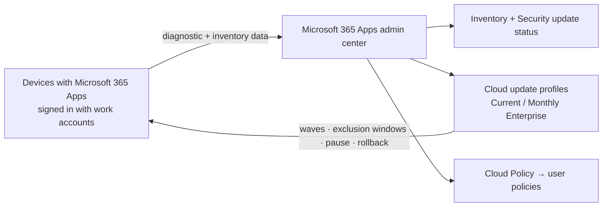

# 4.1.7 Manage Microsoft 365 Apps by using the Microsoft 365 Apps admin center

> **Exam objective:** Manage Microsoft 365 Apps by using the Microsoft 365 Apps admin center
>
> **Domain:** 4 - Manage and secure applications (15-20%) · **Skill:** 4.1 Deploy and update apps
>
> **Hands-on:** [LAB-4.04 Cloud Policy and the Microsoft 365 Apps admin center](../labs/LAB-4.04-cloud-policy-m365-apps-admin-center.md)

## Concept in plain English

The **Microsoft 365 Apps admin center** (`https://config.office.com`) is the dedicated portal for managing **Microsoft 365 Apps after deployment**. It works whether devices are managed by Intune, Configuration Manager, or nothing at all, because it relies on the Office client and the user's work account.

| Feature | What it does |
|---|---|
| **Inventory** | Devices running Microsoft 365 Apps: channel, version/build, architecture, OS, last active user, add-ins |
| **Security update status** | % of devices on the latest Office security update by channel, vulnerabilities, goals |
| **Cloud update** | Automated monthly update management for **Current Channel** and **Monthly Enterprise Channel** devices: profiles, **rollout waves**, **exclusion windows** (dates/times with no updates), **exclude groups**, **pause**, **roll back** (replaced *servicing profiles*) |
| **Apps health** | App crashes and performance by version |
| **Policy Management** (Cloud Policy) | User-based Office policies (objective [4.1.5](4.1.5-microsoft-365-apps-policies.md)) |
| **Office Customization Tool (OCT)** | Build `configuration.xml` for the ODT |
| **Modern App Settings** | App-specific settings such as Outlook/Teams feature toggles |
| **OneDrive sync health** | Sync status, Known Folder Move rollout |
| **Channel change** | Move devices between update channels |

## How it works

## Licensing requirements

Microsoft 365 E3/E5, Office 365 E3/E5, Business Standard/Premium, A3/A5 (feature-dependent). Not supported in GCC/GCC High/DoD/21Vianet. Roles: **Office Apps Administrator** (recommended), Security Administrator, Global Administrator. Global Reader can view but can't use cloud update.

## Configuration steps

1. Sign in to `config.office.com` as **Office Apps Administrator**.
2. **Inventory** → complete onboarding if first use → review devices by channel and version.
3. **Health > Security update status** → set a **goal** (for example, 95% within 7 days) → identify *Not up to date* devices.
4. **Servicing > Cloud update**:
   - Choose the **Monthly Enterprise** (or **Current**) profile → enable.
   - **Rollout waves**: Wave 1 = pilot group, Wave 2 = broad.
   - **Exclusion windows**: for example, month-end close (no updates on days 28-31).
   - **Exclude groups**: VDI non-persistent machines.
   - Use **Pause** or **Roll back** if a build causes issues.
5. **Customization > Policy Management**: Cloud Policy (objective [4.1.5](4.1.5-microsoft-365-apps-policies.md)).
6. **Customization > Device configuration**: Office Customization Tool → export XML for ODT (objective [4.1.6](4.1.6-m365-apps-autopilot-odt.md)).

## Comparison: Office update management options

| Option | Control |
|---|---|
| **Cloud update** (M365 Apps admin center) | Automated, waves, exclusion windows, rollback |
| Intune settings catalog (Update channel, target version, deadline) | Device policy based |
| Windows Autopatch (M365 Apps workload) | Autopatch-managed rings for Monthly Enterprise |
| Configuration Manager | On-prem update distribution |
| Default (no management) | Office updates itself from CDN per channel |

## Exam tips and common traps

- **"See which devices run which Office version and channel, including unmanaged devices"** → **Inventory** in the M365 Apps admin center.
- **"Automatically keep Monthly Enterprise devices updated with the option to roll back"** → **Cloud update**.
- **"Prevent Office updates during month-end close"** → cloud update **exclusion window**.
- Least-privilege role: **Office Apps Administrator**.
- Servicing profiles were replaced by **cloud update**. Don't pick servicing profiles for new designs.

## Real-world notes

- Don't let Intune settings catalog **update channel/version** settings fight cloud update. Pick one owner for Office servicing.
- Inventory is the fastest way to find the forgotten 32-bit or Semi-Annual devices before a Copilot rollout (Copilot needs Current or Monthly Enterprise channel).

## Microsoft Learn references

- [Overview of the Microsoft 365 Apps admin center](https://learn.microsoft.com/microsoft-365-apps/admin-center/overview)
- [Overview of cloud update](https://learn.microsoft.com/microsoft-365-apps/admin-center/cloud-update)
- [Prepare to use cloud update](https://learn.microsoft.com/microsoft-365-apps/admin-center/cloud-update-prepare)
- [Inventory](https://learn.microsoft.com/microsoft-365-apps/admin-center/inventory)
- [Security update status](https://learn.microsoft.com/microsoft-365-apps/admin-center/security-update-status)
