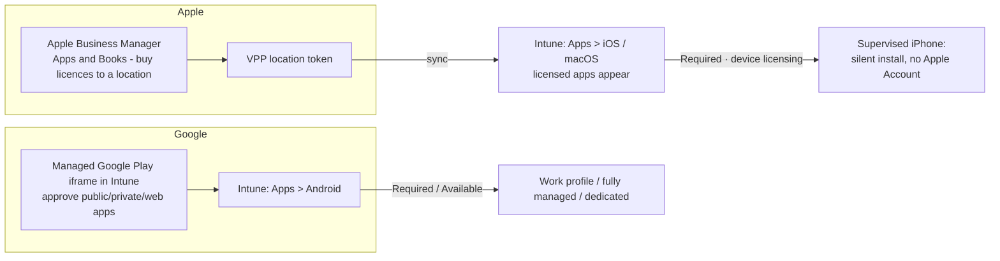

# 4.1.8 Deploy apps from platform-specific app stores by using Intune

> **Exam objective:** Deploy apps from platform-specific app stores by using Intune, including Apple Business Manager and Managed Google Play
>
> **Domain:** 4 - Manage and secure applications (15-20%) · **Skill:** 4.1 Deploy and update apps
>
> **Hands-on:** [LAB-4.05 Apple Business Manager and Managed Google Play apps](../labs/LAB-4.05-abm-vpp-managed-google-play.md)

## Concept in plain English

Mobile and Mac apps come from the vendor stores. Intune connects to the **business editions** of those stores so you can license and push apps silently:

| Store | Intune connection | App types | Licensing |
|---|---|---|---|
| **Apple Business Manager - Apps and Books** (formerly VPP) | **Location token** (`.vpptoken`) under **Tenant administration > Connectors and tokens > Apple VPP tokens** | iOS/iPadOS, macOS App Store apps (free and paid), custom apps, books | **Device licensing** (no Apple Account needed, silent install on supervised devices) or **user licensing** (user invited with Apple Account) |
| **iOS App Store** (no VPP) | None | Public App Store apps | User installs with own Apple Account |
| **Managed Google Play** | Binding under **Devices > Enrollment > Android > Managed Google Play** (objective [1.2.4](../../01-Prepare-Infrastructure/docs/1.2.4-android-enterprise-enrollment-profiles.md)) | **Public** apps, **private** (LOB) apps published to your org, **web apps** | Free. Approved apps are available to work profile / corporate devices |
| **Microsoft Store (new)** | Built in | Windows Store/WinGet apps | Free apps |

## How it works

## Licensing requirements

Intune Plan 1. ABM account with **Content Manager** role for Apps and Books. VPP token renews **annually**. Managed Google Play binding (free).

## Configuration steps

### Apple VPP (Apps and Books)

1. ABM → **Apps and Books** → search the app (for example, *Microsoft Outlook*) → select **location** → **Get** licences (free apps still need licences).
2. ABM → **Preferences > Payments and Billing** (or *Apps and Books*) → download the **server token** for the location.
3. Intune → **Tenant administration > Connectors and tokens > Apple VPP tokens > Create** → upload the token → *Country/region* → **Automatic app updates** = Yes → *I grant Microsoft permission…* → **Take control of token from another MDM** if needed → Create → **Sync**.
4. **Apps > iOS/iPadOS** → the purchased apps appear as *iOS Volume Purchase Program app*. Assign **Required** with **License type: Device** to corporate supervised devices (silent), or **User** licensing where users have Apple Accounts.
5. Company Portal on ADE devices: deploy it as a VPP app (device licensing) so it installs during Setup Assistant with modern authentication.

### Managed Google Play

1. **Apps > Android > Create > Managed Google Play app** → the MGP iframe opens.
2. Search a public app (for example, *Microsoft Teams*) → **Select** → **Approve** → choose how to handle new permissions (keep approved when app requests new permissions / require re-approval) → **Sync**.
3. **Private apps**: *Private apps* tab → upload your `.apk`, title → published only to your organization (can take minutes).
4. **Web apps**: *Web apps* tab → URL + icon → display mode.
5. Assign **Required** (work profile / fully managed) or **Available**. Use **app configuration policies** for settings (objective [4.2.3](4.2.3-app-configuration-policies.md)).
6. Optional: **Managed Google Play app update priority** (high priority updates install immediately even while in use).

## Comparison: VPP device vs user licensing

| | Device licensing | User licensing |
|---|---|---|
| Apple Account needed on device | ❌ | ✅ (user accepts invitation) |
| Silent install | ✅ (supervised) | Prompt |
| Licence follows | Device | User (up to 5-10 devices per Apple Account) |
| Best for | Corporate/shared devices | BYOD / personal Apple Account users |

## Exam tips and common traps

- **"Deploy a paid iOS app silently to 500 supervised iPads without users signing in with an Apple Account"** → ABM Apps and Books + VPP token + **device licensing**.
- **VPP tokens expire yearly** (like APNs and ADE tokens). The Intune token record also needs the **Apple Account/ABM** admin to renew.
- **Managed Google Play**: apps must be **approved** in the iframe and **synced** before assignment.
- **Private LOB** Android apps belong in **Managed Google Play private apps**, not as `.apk` LOB, for Android Enterprise work profile devices.
- A VPP token can only be managed by **one** MDM at a time - *take control of token from another MDM* moves it.

## Real-world notes

- Create separate ABM **locations** per business unit if you need separate VPP tokens (and scope tags) in Intune.
- Turn on **automatic app updates** on the VPP token, or supervised devices keep old versions.

## Microsoft Learn references

- [Manage Apple volume-purchased apps](https://learn.microsoft.com/intune/app-management/deployment/manage-vpp-apple)
- [Add Managed Google Play apps](https://learn.microsoft.com/intune/app-management/deployment/add-managed-google-play)
- [Apple Business Manager - Apps and Books](https://support.apple.com/guide/apple-business-manager/intro-to-apps-and-books-axmb4e1ffb4b/web)
- [Add iOS store apps](https://learn.microsoft.com/intune/app-management/deployment/add-app-store-ios)
