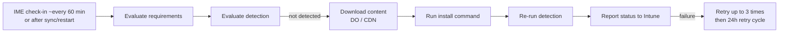

# 4.1.9 Monitor app deployment status and troubleshoot installation failures

> **Exam objective:** Monitor app deployment status and troubleshoot installation failures by using Microsoft Intune
>
> **Domain:** 4 - Manage and secure applications (15-20%) · **Skill:** 4.1 Deploy and update apps
>
> **Hands-on:** [LAB-4.01 Win32 packaging and troubleshooting](../labs/LAB-4.01-win32-packaging-troubleshooting.md)

## Concept in plain English

After assignment you need to answer: *Installed where? Failed where? Why?* Intune shows status per app, per device and per user. Windows (IME) logs give the root cause.

### Where to look

| View | Path | Answers |
|---|---|---|
| App overview | **Apps > All apps > [app] > Overview** | Installed / Failed / Pending / Not applicable counts |
| Device / user install status | [app] > **Device install status** / **User install status** | Per device status + error code |
| App install status report | **Apps > Monitor > App install status** | Tenant-wide summary; export |
| Discovered apps | **Apps > Monitor > Discovered apps** | What's installed (inventory, not assignments) |
| Device → Managed apps | **Devices > [device] > Managed Apps** | Status of every app on one device |
| Troubleshooting blade | **Troubleshooting + support > Troubleshoot** → user → **Apps** | Everything for one user, per device |
| Autopilot / device preparation reports | Devices > Monitor | Apps during OOBE |
| **Win32 app logs** | `C:\ProgramData\Microsoft\IntuneManagementExtension\Logs\IntuneManagementExtension.log`, `AppWorkload.log` (app download/install/detection), `AgentExecutor.log` (scripts/detection scripts) | Download, requirement, detection, exit codes |
| MSI verbose log | `msiexec /l*v` in the install command | Installer-level errors |
| Collect diagnostics | Device remote action | Logs zipped from a remote device |

### Common Win32/IME results and error codes

| Code / result | Meaning | Typical fix |
|---|---|---|
| **0x87D1041C** | App installed but **not detected** by the detection rule | Fix the detection rule/version, or find out why the install silently failed |
| **0x87D1313C** | Network connection lost during content download | Retry. Check proxy/firewall and Delivery Optimization |
| Installer exit code (for example **1603**) | The MSI/EXE returned a failure | Read the installer log. Run the command manually as SYSTEM |
| **1618** | Another installation in progress | Keep 1618 mapped to *Retry* (default return code) |
| **3010** (0x80070BC2) / **1641** | Soft / hard reboot required | Configure return codes and restart behavior |
| *Not applicable* | Requirement rule not met or assignment filter excluded the device | Review requirement rules/filters |
| Download / content errors | Content couldn't be downloaded, decrypted or hash-validated | Re-upload the package. Check disk space and proxy |

Always read the **error description** Intune shows next to the code. It's more specific than any table.

## How it works

The IME retries failed required apps a few times and then follows a **24-hour** retry schedule. Users can also retry from **Company Portal**.

## Licensing requirements

Intune Plan 1.

## Configuration / troubleshooting steps

1. **Apps > [app] > Device install status** → filter *Failed* → note the error code and description.
2. On the device (or via **Collect diagnostics**), open `AppWorkload.log` / `IntuneManagementExtension.log` with **CMTrace** → search for the app ID (GUID from the app URL) → follow *Detection*, *Download*, *Execution*, *Exit code*.
3. Reproduce: run the install command as **SYSTEM** (`psexec -s`) from the IME content cache (`C:\Program Files (x86)\Microsoft Intune Management Extension\Content\Incoming`) or from the source.
4. Fix the package/detection, **upload a new version** (or edit detection), then **Sync** the device or restart the *Microsoft Intune Management Extension* service to trigger re-evaluation.
5. For iOS/Android: check **Managed Apps** on the device, VPP licence count, MGP approval, and **Company Portal / Intune app logs** (Send logs).
6. **Export** status reports to CSV for trend tracking, or query Graph (`deviceManagement/reports/getAppStatusOverviewReport`).

## Exam tips and common traps

- **0x87D1041C** = **detection** failure - the classic answer to "the app installs but Intune shows failed".
- IME logs live in `C:\ProgramData\Microsoft\IntuneManagementExtension\Logs`.
- **Required** apps retry automatically; **Available** apps are retried by the user from Company Portal.
- *Not applicable* usually means a **requirement rule** or **assignment filter** excluded the device.
- **Discovered apps** shows inventory, not deployment status.

## Real-world notes

- Build detection on something the installer *always* writes (MSI product code, a versioned file). Registry keys under HKCU break for SYSTEM installs.
- Keep **CMTrace** on every technician's toolkit, and learn to read `AppWorkload.log` - it resolves most Win32 tickets in minutes.

## Microsoft Learn references

- [Monitor app information and assignments](https://learn.microsoft.com/intune/app-management/deployment/monitor)
- [Troubleshoot Win32 app installations](https://learn.microsoft.com/troubleshoot/mem/intune/app-management/troubleshoot-win32-app-install)
- [Intune Management Extension logs](https://learn.microsoft.com/intune/device-management/tools/intune-management-extension)
- [Intune app installation error codes](https://learn.microsoft.com/troubleshoot/mem/intune/app-management/app-install-error-codes)
