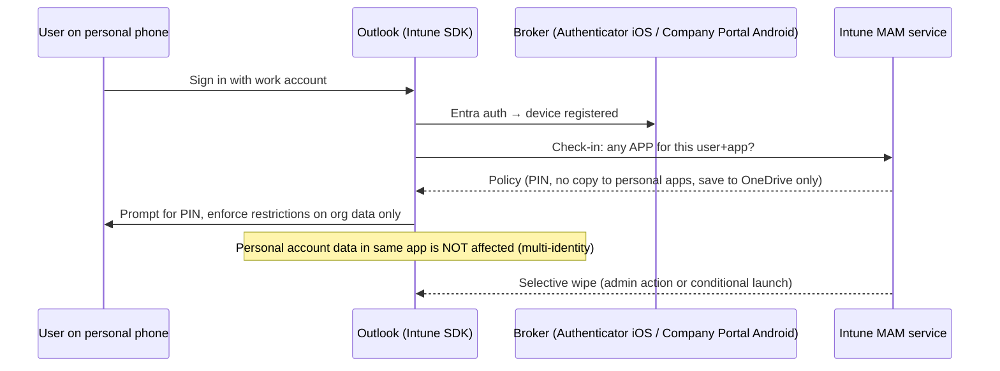

# 4.2.1 Plan and implement app protection policies

> **Exam objective:** Plan and implement app protection policies for managed and unmanaged (BYOD) devices by using Microsoft Intune
>
> **Domain:** 4 - Manage and secure applications (15-20%) · **Skill:** 4.2 Plan and implement app protection and app configuration policies
>
> **Hands-on:** [LAB-4.07 App protection policies (MAM-WE) and Conditional Access](../labs/LAB-4.07-app-protection-conditional-access.md)

## Concept in plain English

**App protection policies (APP)**, also called **MAM**, protect **corporate data inside apps** (Outlook, Teams, Word, Edge, and apps built with the **Intune App SDK** or wrapped). They work **with or without device enrollment**. That makes them the main BYOD tool (MAM without enrollment, *MAM-WE*).

They answer three questions:

| Category | Examples |
|---|---|
| **Data protection** | Block **copy/paste** to unmanaged apps, **Save As** only to OneDrive/SharePoint, restrict **Open-in / share** to policy-managed apps, block screen capture (Android), encrypt org data, **Sync with native contacts**, printing, restrict web content to **Edge**, cut/copy character limit |
| **Access requirements** | **PIN** for access (or biometrics), work account credentials, recheck after N minutes of inactivity |
| **Conditional launch** | Max PIN attempts, **offline grace period** (block/wipe after N days offline), **min OS / app / SDK version**, **jailbroken/rooted** block, **device threat level** (Defender/MTD), **Play Integrity**, disabled account → wipe |

Platforms: **iOS/iPadOS**, **Android**, and **Windows** (Microsoft Edge for Business "MAM for Windows").

### Targeting

| *Target to apps on all device types* | Behaviour |
|---|---|
| **Yes** | Applies on unmanaged + managed devices |
| **No** → *Device types*: **Unmanaged**, **Managed** (Intune MDM / Android Enterprise / Android device administrator) | Different policies for BYOD vs corporate |

## How it works

APP check-in: at app launch and roughly every 30 minutes while in use (policy delivery timing varies).

## Data protection framework (Microsoft recommended levels)

| Level | Name | For |
|---|---|---|
| 1 | **Enterprise basic data protection** | Minimum: PIN, encryption, selective wipe |
| 2 | **Enterprise enhanced data protection** | Most users - adds data transfer restrictions, min OS |
| 3 | **Enterprise high data protection** | High-risk users - stricter transfer, threat level, no printing |

## Licensing requirements

Intune Plan 1 + Entra ID P1 (for the matching Conditional Access policy). MAM for Windows: Edge for Business, Windows 11. Defender for Endpoint mobile for threat-level conditional launch.

## Configuration steps

1. **Apps > Protection > Create policy > iOS/iPadOS** (repeat for Android) → `APP-iOS-Level2-BYOD`.
2. *Apps*: *Target to apps on all device types* = **No** → *Device types* = **Unmanaged** → **Public apps**: select core Microsoft apps (Outlook, Teams, Word, Excel, PowerPoint, OneDrive, SharePoint, Edge, OneNote).
3. *Data protection*:
   - Backup org data to iTunes/iCloud = Block
   - **Send org data to other apps** = Policy managed apps
   - **Receive data from other apps** = Policy managed apps (or all with incoming org data)
   - **Save copies of org data** = Block, *Allow user to save to* OneDrive for Business, SharePoint
   - **Restrict cut, copy, and paste** = Policy managed apps with paste in
   - Restrict web content transfer = Microsoft Edge
   - Encrypt org data = Require
4. *Access requirements*: PIN = Require, type Numeric, length 6, Touch ID/Face ID allowed, recheck after 30 min.
5. *Conditional launch*: Max PIN attempts 5 → Reset PIN. Offline grace period 720 min → Block access, 90 days → **Wipe data**. Jailbroken → Block access. Min OS 17.0 → Warn/Block. Max allowed device threat level = Secured (if Defender is used).
6. Assign to `SG-Lab-Users`.
7. Pair with **Conditional Access** *Require app protection policy* (objective 4.2.2).
8. Monitor: **Apps > Monitor > App protection status**, user report, **selective wipe** (**Apps > App selective wipe > Create wipe request**).

## Comparison: MDM vs MAM for BYOD

| | MDM (enrollment) | MAM without enrollment |
|---|---|---|
| Device inventory | ✅ | ❌ |
| Device settings (Wi-Fi, VPN, passcode) | ✅ | ❌ |
| Protect data in Microsoft apps | ✅ (+APP) | ✅ |
| Wipe | Full/retire | **Selective** (org data only) |
| User privacy | Lower | **Higher** |
| CA grant | Require compliant device | **Require app protection policy** |

## Exam tips and common traps

- **"Protect email on personal phones without enrolling them"** → **APP (MAM-WE)** + CA *Require app protection policy*.
- **"Prevent copying from Outlook to WhatsApp"** → **Send org data to other apps** / **Restrict cut, copy, paste** = Policy managed apps.
- **"Wipe corporate data if the device hasn't connected for 30 days"** → conditional launch **Offline grace period → Wipe data**.
- APP needs a **broker**: **Authenticator** (iOS) or **Company Portal** (Android) must be installed.
- **Selective wipe** removes only org data from managed apps.
- Different policies for BYOD vs corporate: *Target to apps on all device types = No* + device type **Unmanaged** / **Managed**.
- **Windows MAM** protects Microsoft **Edge** (work profile) on unmanaged Windows devices.

## Real-world notes

- Start from Microsoft's **data protection framework** JSON templates (Level 2 for most users). Custom policies from scratch miss settings.
- Test with personal + work accounts in the same Outlook app. Users often complain that "copy paste is broken" when they copy from a work mail into a personal app. That's the policy working as designed.

## Microsoft Learn references

- [App protection policies overview](https://learn.microsoft.com/intune/app-management/protection/overview)
- [Create and assign app protection policies](https://learn.microsoft.com/intune/app-management/protection/create-policy)
- [iOS APP settings](https://learn.microsoft.com/intune/app-management/protection/ref-settings-ios) / [Android APP settings](https://learn.microsoft.com/intune/app-management/protection/ref-settings-android)
- [Data protection framework using app protection policies](https://learn.microsoft.com/intune/app-management/protection/data-protection-framework)
- [App protection policies for Windows (MAM)](https://learn.microsoft.com/intune/app-management/protection/windows-mam)
- [Selective wipe](https://learn.microsoft.com/intune/app-management/protection/selective-wipe)
