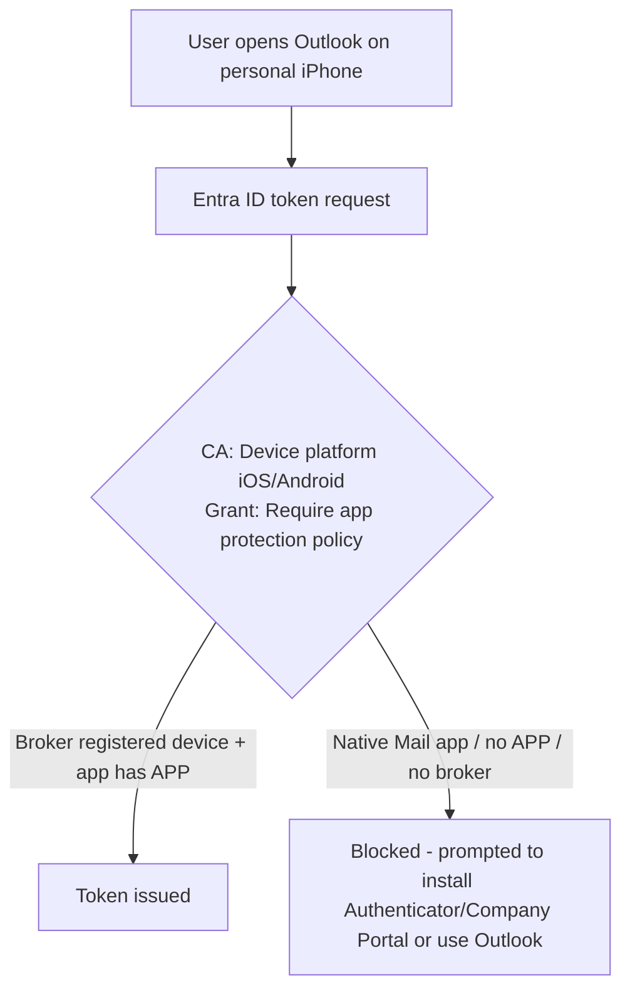

# 4.2.2 Implement Conditional Access policies for app protection policies

> **Exam objective:** Implement Microsoft Entra Conditional Access policies for app protection policies
>
> **Domain:** 4 - Manage and secure applications (15-20%) · **Skill:** 4.2 Plan and implement app protection and app configuration policies
>
> **Hands-on:** [LAB-4.07 App protection policies (MAM-WE) and Conditional Access](../labs/LAB-4.07-app-protection-conditional-access.md)

## Concept in plain English

An app protection policy only protects data **if the user actually uses a protected app**. Without Conditional Access, a user could read mail in the native iOS Mail app instead. The **Require app protection policy** grant control closes that gap. Access is allowed only from apps that **support APP and have a policy applied** for that user.

### Grant controls for mobile app scenarios

| Grant | Status (2026) | Meaning |
|---|---|---|
| **Require app protection policy** | ✅ Use this | Client app must support Intune APP and have an APP targeted to the user |
| ~~Require approved client app~~ | **Read-only since June 30, 2026** | Legacy: app on Microsoft's approved list. Existing policies still enforce. You can't create or edit policies with it |
| Require device to be marked as compliant | ✅ | MDM path (objective 1.3.5) |

**Platforms:** iOS/iPadOS, Android, and **Windows** (for MAM for Windows with Microsoft Edge - a separate CA policy targeting the Windows platform and browser/desktop apps with *Require app protection policy*).

## How it works

The device must be **registered** in Entra ID through the **broker** (Authenticator on iOS, Company Portal or Authenticator on Android).

## Licensing requirements

Entra ID P1 (CA) + Intune Plan 1 (APP).

## Configuration steps

### Mobile policy (recommended pattern)

1. **Entra admin center > Conditional Access > New policy** → `CA020 - Mobile - Office 365 - Require APP`.
2. **Users**: All users (or `SG-Lab-Users`). Exclude break-glass.
3. **Target resources**: **Office 365** (or All resources).
4. **Conditions > Device platforms**: Include **iOS** and **Android**.
5. **Grant**: **Require app protection policy**.
6. **Report-only** → review sign-in logs → **On**.

### Block legacy/unsupported clients

- CA policy: Office 365 Exchange Online → *Client apps* = **Exchange ActiveSync clients** → Grant **Require app protection policy** (effectively blocks native mail clients that can't satisfy it).
- CA policy to **block unknown/unsupported device platforms**.

### Windows (MAM for Windows / Edge)

1. APP for **Windows** targeting **Microsoft Edge** (device type unmanaged).
2. CA: Users → Resources **Office 365** → Conditions: platforms **Windows**, client apps **Browser** → Grant: **Require app protection policy** (or compliant device, with *Require one of*) → so unmanaged Windows users must use Edge with a work profile.

### Verify

Sign in on a phone with the native Mail app → blocked. With Outlook (+ Authenticator installed) → allowed after APP applies (PIN prompt). **Sign-in logs > Conditional Access** tab shows *Require app protection policy: Success*.

## Comparison: common mobile CA designs

| Scenario | Grant |
|---|---|
| BYOD, no enrollment | **Require app protection policy** |
| Corporate enrolled devices | Require compliant device |
| Mixed (either) | Compliant device **OR** app protection policy (*Require one of the selected*) |
| High security | Compliant device **AND** app protection policy |

## Exam tips and common traps

- **"Only allow Outlook with Intune app protection to access Exchange Online on iOS/Android"** → CA **Require app protection policy** + device platforms iOS/Android.
- **Require approved client app** is **read-only** after **June 30, 2026** - don't choose it for new policies.
- A **broker app** is required: **Authenticator** (iOS) / **Company Portal** (Android).
- APP must be **assigned to the user**. Otherwise the grant fails even in Outlook.
- Use **report-only** mode first, then check the sign-in logs.

## Real-world notes

- Pair every mobile CA policy with a "block unsupported platforms" policy, or attackers use an unknown user-agent to slip past platform conditions.
- Explain to users why the native Mail app stops working, and publish a one-page Outlook setup guide.

## Microsoft Learn references

- [Require approved client apps or app protection policy](https://learn.microsoft.com/entra/identity/conditional-access/policy-all-users-approved-app-or-app-protection)
- [Migrate approved client app to app protection policy](https://learn.microsoft.com/entra/identity/conditional-access/migrate-approved-client-app)
- [Conditional Access grant controls - Require app protection policy](https://learn.microsoft.com/entra/identity/conditional-access/concept-conditional-access-grant#require-app-protection-policy)
- [App-based Conditional Access with Intune](https://learn.microsoft.com/intune/device-security/conditional-access-integration/app-based)
- [MAM for Windows with Conditional Access](https://learn.microsoft.com/intune/app-management/protection/windows-mam)
