# 4.2.3 Plan and implement app configuration policies

> **Exam objective:** Plan and implement app configuration policies for managed apps and managed devices
>
> **Domain:** 4 - Manage and secure applications (15-20%) · **Skill:** 4.2 Plan and implement app protection and app configuration policies
>
> **Hands-on:** [LAB-4.08 App configuration policies](../labs/LAB-4.08-app-configuration-policies.md)

## Concept in plain English

**App configuration policies** pre-configure app **settings** (server URLs, account names, feature toggles) so users don't have to. There are two delivery **channels**:

| Channel | Intune name | Delivered through | Works on | Examples |
|---|---|---|---|---|
| **Managed devices** | *App configuration policies > Managed devices* | The **MDM** channel: iOS *AppConfig* (managed app config dictionary), Android Enterprise **managed configurations** (Managed Google Play) | **Enrolled** devices | Outlook **allowed accounts only**, Zoom/Teams settings, VPN app config, Managed Home Screen, Company Portal, Defender |
| **Managed apps** | *App configuration policies > Managed apps* | The **Intune App SDK** (MAM channel) | Enrolled **or** unenrolled (with APP) | Edge homepage/bookmarks/allowed URLs, Outlook signature/notifications, Tunnel for MAM settings, Teams/OneDrive settings |

Both use **key/value pairs** (or a configuration designer for some apps) and support **tokens** such as `{{userprincipalname}}`, `{{mail}}`, `{{deviceid}}`, `{{serialnumber}}` (MDM channel), `{{partialupn}}`.

## How it works

```mermaid
flowchart LR
  subgraph MDM[Managed devices channel]
    ACD[App config - managed devices<br/>iOS AppConfig / Android managed config] -->|MDM| APP1[App on enrolled device]
  end
  subgraph MAM[Managed apps channel]
    ACA[App config - managed apps<br/>key/value via Intune App SDK] -->|MAM service| APP2[SDK app on any device]
  end
  APP1 & APP2 --> CFG[Pre-configured app<br/>account, URLs, features]
```

## Licensing requirements

Intune Plan 1. Apps must support AppConfig (iOS), managed configurations (Android), or the Intune App SDK.

## Configuration steps

### Managed devices: Outlook allowed accounts only (iOS, enrolled)

1. **Apps > Configuration > Create > Managed devices** → Platform **iOS/iPadOS** → Targeted app **Microsoft Outlook**.
2. *Configuration settings format*: **Use configuration designer** → *Configure email account settings* = Yes → Authentication **Modern authentication**, username attribute **User Principal Name**, *Allow only work or school accounts* = **Enabled**.
   - Equivalent keys: `IntuneMAMAllowedAccountsOnly` = `Enabled`, `IntuneMAMUPN` = `{{userprincipalname}}`.
3. Assign to users/devices (enrolled iOS). Outlook must be deployed as a managed app (VPP/App Store via Intune).

### Managed devices: Android Enterprise (Managed Google Play app)

**Create > Managed devices** → Android Enterprise → profile type (work profile / fully managed) → app (for example, **Microsoft Outlook**) → *Configuration designer* shows the app's **managed configuration schema** → set values → assign.

### Managed apps: Microsoft Edge

1. **Create > Managed apps** → *Select public apps*: **Microsoft Edge** (iOS + Android) → optionally *Device management type* (Unmanaged / Managed).
2. Edge configuration settings: *Homepage shortcut URL* `https://contoso.sharepoint.com`, *Managed bookmarks*, *Allowed/Blocked URLs*, *Redirect restricted sites to personal context*.
   - Keys, for example `com.microsoft.intune.mam.managedbrowser.homepage` = `https://contoso.sharepoint.com`.
3. Assign to `SG-Lab-Users`.

### Monitor

App configuration policy → **Device status / User status**. In apps: Outlook **Settings > Help & Feedback** diagnostics. Edge: `about:intunehelp` shows applied app config and APP.

## Comparison: which channel?

| Situation | Channel |
|---|---|
| Device is enrolled and app is MDM-managed | **Managed devices** (and/or managed apps) |
| BYOD without enrollment | **Managed apps** only |
| Setting only exists in the app's managed configuration schema (Android) | Managed devices |
| Edge/Outlook feature settings for MAM users | Managed apps |
| Restrict Outlook to corporate accounts on enrolled iOS | Managed devices (`IntuneMAMAllowedAccountsOnly`) |

## Exam tips and common traps

- **"Pre-populate the user's email address in Outlook on enrolled iPhones and block personal accounts"** → **App configuration - managed devices** with `IntuneMAMAllowedAccountsOnly` + `IntuneMAMUPN = {{userprincipalname}}`.
- **"Set the Edge homepage for users on personal phones (no enrollment)"** → **App configuration - managed apps**.
- Managed-devices policies only apply to apps that Intune **deployed/manages** on enrolled devices.
- Tokens like `{{userprincipalname}}` are case-sensitive and must be typed exactly.
- App configuration **doesn't protect data** - that's app protection. They're usually deployed together.

## Real-world notes

- Keep one app config policy per app per platform per channel. Overlapping app config for the same app gives unpredictable results (especially Defender for Tunnel).
- `about:intunehelp` in Edge is the quickest way to prove what reached the app.

## Microsoft Learn references

- [App configuration policies overview](https://learn.microsoft.com/intune/app-management/configuration/)
- [App configuration for managed iOS/iPadOS devices](https://learn.microsoft.com/intune/app-management/configuration/managed-devices-ios)
- [App configuration for managed Android Enterprise devices](https://learn.microsoft.com/intune/app-management/configuration/managed-devices-android)
- [App configuration for managed apps (MAM)](https://learn.microsoft.com/intune/app-management/configuration/managed-apps)
- [Deploy Outlook for iOS and Android app configuration settings](https://learn.microsoft.com/exchange/clients-and-mobile-in-exchange-online/outlook-for-ios-and-android/outlook-for-ios-and-android-configuration-with-microsoft-intune)
- [Manage Microsoft Edge on iOS and Android with Intune](https://learn.microsoft.com/deployedge/microsoft-edge-mobile-policies)
