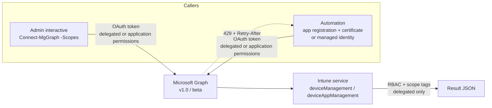

# 5.1.1 Automate Intune management tasks by using PowerShell and Microsoft Graph

> **Exam objective:** Automate Intune management tasks by using PowerShell and Microsoft Graph
>
> **Domain:** 5 - Optimize endpoint operations by using automation, monitoring, and reporting (10-15%) · **Skill:** 5.1 Automate management tasks
>
> **Hands-on:** [LAB-5.01 Graph PowerShell automation](../labs/LAB-5.01-graph-powershell-automation.md)

## Concept in plain English

Everything you click in the Intune admin center is a call to **Microsoft Graph** (`https://graph.microsoft.com`). If you call Graph yourself, you can do in seconds what takes hours in the portal: report on 10,000 devices, sync a whole group, rename devices, copy policies between tenants, or run a nightly clean-up job.

The supported PowerShell tool is the **Microsoft Graph PowerShell SDK** (`Microsoft.Graph` and `Microsoft.Graph.Beta` modules). The old `Microsoft.Graph.Intune` (Intune PowerShell SDK) module is retired - don't use it for new scripts.

## How it works



| Concept | What to know |
|---|---|
| **Endpoints** | `v1.0` is supported for production. `beta` has more Intune resources (for example, settings catalog `configurationPolicies`) but can change |
| **Delegated permissions** | Script acts as the signed-in admin. Effective rights = Graph scope **and** the admin's Intune RBAC role and scope tags |
| **Application permissions** | Unattended (Azure Automation, scheduled tasks). App-only has **no scope tags**, so grant the least permission. Multi admin approval applies to app-only calls for protected resources |
| **Paging** | Results come in pages with `@odata.nextLink`. Use `-All` on SDK cmdlets |
| **Throttling** | HTTP **429** with `Retry-After`. Back off and retry. Use `$batch` (up to **20** requests per batch) and `$select`/`$filter` |

### Common Intune Graph permissions

| Task | Permission (least privilege) |
|---|---|
| Read devices | `DeviceManagementManagedDevices.Read.All` |
| Remote actions (sync, restart, wipe, retire) | `DeviceManagementManagedDevices.PrivilegedOperations.All` |
| Update or delete device records | `DeviceManagementManagedDevices.ReadWrite.All` |
| Read/write configuration and compliance policies | `DeviceManagementConfiguration.Read.All` / `.ReadWrite.All` |
| Apps | `DeviceManagementApps.Read.All` / `.ReadWrite.All` |
| Enrollment, Autopilot, service config | `DeviceManagementServiceConfig.Read.All` / `.ReadWrite.All` |
| RBAC | `DeviceManagementRBAC.Read.All` / `.ReadWrite.All` |
| Groups for targeting | `Group.Read.All`, `GroupMember.Read.All` |

## Licensing requirements

No extra licence: Graph access is included with Intune Plan 1. Azure Automation or Azure Functions for scheduled jobs need an **Azure subscription** (small cost - see [lab environment setup](../../00-Getting-Started/lab-environment-setup.md)).

## Configuration steps

### Interactive (delegated)

```powershell
Install-Module Microsoft.Graph.Authentication, Microsoft.Graph.DeviceManagement -Scope CurrentUser
Connect-MgGraph -Scopes 'DeviceManagementManagedDevices.Read.All' -NoWelcome

# All Windows devices that haven't synced for 30 days
$cutoff = (Get-Date).AddDays(-30)
Get-MgDeviceManagementManagedDevice -All -Filter "operatingSystem eq 'Windows'" `
    -Property deviceName, userPrincipalName, lastSyncDateTime, complianceState |
    Where-Object lastSyncDateTime -lt $cutoff |
    Select-Object deviceName, userPrincipalName, lastSyncDateTime, complianceState
```

### Raw requests (any endpoint, including beta)

```powershell
# Settings catalog policies (beta)
$uri = 'https://graph.microsoft.com/beta/deviceManagement/configurationPolicies?$select=id,name,platforms'
$response = Invoke-MgGraphRequest -Method GET -Uri $uri
$response.value | ForEach-Object { [pscustomobject]@{ Name = $_.name; Platform = $_.platforms } }
```

### Remote action on a device

```powershell
Connect-MgGraph -Scopes 'DeviceManagementManagedDevices.PrivilegedOperations.All'
Sync-MgDeviceManagementManagedDevice -ManagedDeviceId $deviceId
```

### Unattended (application permissions)

1. **Entra admin center > App registrations > New registration** `Intune-Automation-Lab`.
2. **Certificates & secrets** → upload a certificate (avoid client secrets).
3. **API permissions** → Microsoft Graph → **Application** → e.g. `DeviceManagementManagedDevices.Read.All` → **Grant admin consent**.
4. Connect: `Connect-MgGraph -ClientId <appId> -TenantId contoso.onmicrosoft.com -CertificateThumbprint <thumb>`.
5. In Azure Automation, prefer a **system-assigned managed identity** (`Connect-MgGraph -Identity`) and assign Graph app roles to it.

### Discovering the right call

- **Browser developer tools (F12) > Network** while you click in the Intune admin center shows the exact Graph request.
- **Graph Explorer** (`https://developer.microsoft.com/graph/graph-explorer`) to test with your delegated account.
- `Find-MgGraphCommand -Uri '/deviceManagement/managedDevices'` maps a URI to a cmdlet and its permissions.

## Comparison: automation options

| Option | Best for | Notes |
|---|---|---|
| Graph PowerShell SDK | Admin scripts, reporting, bulk actions | Cross-platform PowerShell 7 |
| `Invoke-MgGraphRequest` / REST | Beta-only or new endpoints | Same auth as SDK |
| Azure Automation runbook | Scheduled jobs | Managed identity, no secrets |
| Logic Apps / Power Automate | No-code workflows (for example, Teams post on new noncompliant device) | HTTP with Entra ID connector |
| Intune bulk device actions (portal) | Up to 100 devices ad hoc | No script needed |
| Copilot in Intune | Natural-language queries | Not a scheduler |

## Exam tips and common traps

- Use the **Microsoft Graph PowerShell SDK** (`Connect-MgGraph`), not the retired Intune PowerShell module or AzureAD/MSOnline modules.
- **Delegated** calls respect Intune RBAC and scope tags. **Application** calls don't have scope tags - scope them with the minimum permission.
- Wipe/retire/sync need **PrivilegedOperations** permissions, not just ReadWrite.
- Many Intune features (settings catalog, some reports) are **beta-only**.
- 429 means throttling: honour `Retry-After`, don't hammer.
- Unattended scripts: **certificate or managed identity**, never a stored admin password.

## Real-world notes

- Keep scripts in source control with `-WhatIf` support. See the scripts in [08-Scripts/graph](../../08-Scripts/graph/) (for example, [Invoke-BulkDeviceAction.ps1](../../08-Scripts/graph/Invoke-BulkDeviceAction.ps1) and [Export-IntuneReport.ps1](../../08-Scripts/graph/Export-IntuneReport.ps1)).
- Log every app-only action; Intune **audit logs** show the app as the actor.
- Export policies to JSON regularly as a lightweight backup/configuration-as-code.

## Microsoft Learn references

- [Working with Intune in Microsoft Graph](https://learn.microsoft.com/graph/api/resources/intune-graph-overview)
- [Get started with the Microsoft Graph PowerShell SDK](https://learn.microsoft.com/powershell/microsoftgraph/get-started)
- [Use app-only authentication with the Microsoft Graph PowerShell SDK](https://learn.microsoft.com/powershell/microsoftgraph/app-only)
- [Microsoft Graph throttling guidance](https://learn.microsoft.com/graph/throttling)
- [Combine multiple requests in one HTTP call using JSON batching](https://learn.microsoft.com/graph/json-batching)
