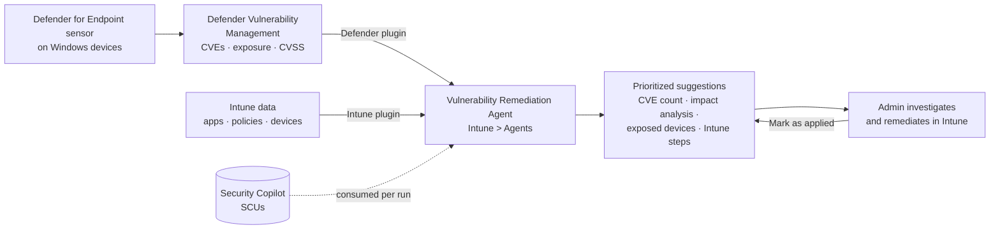

# 5.1.2 Investigate threats identified by Security Copilot agents in Intune

> **Exam objective:** Investigate threats identified by Security Copilot agents in Intune
>
> **Domain:** 5 - Optimize endpoint operations by using automation, monitoring, and reporting (10-15%) · **Skill:** 5.1 Automate management tasks
>
> **Hands-on:** [LAB-5.02 Security Copilot agents in Intune](../labs/LAB-5.02-security-copilot-agents.md)

## Concept in plain English

**Security Copilot agents** are AI assistants that run inside the Intune admin center (**Agents** node). Each agent does one job, runs under its own identity with limited permissions, and gives **suggestions**. You still decide what happens.

For threats, the agent to know is the **Vulnerability Remediation Agent**. It reads **Microsoft Defender Vulnerability Management** data (CVEs found on your Windows devices and apps), ranks them by risk, and tells you **how to fix each one with Intune**, for example: "update app X with a Win32 supersedence", "deploy this quality update", "change this setting".

> **2026 status (verified September 30, 2026):** The **Vulnerability Remediation Agent** (preview) is the only Security Copilot agent still available in the Intune admin center. The Device Offboarding Agent was removed on June 1, 2026. The Policy Configuration Agent and Change Review Agent were removed after August 31, 2026. See objective [5.1.4](5.1.4-security-copilot-agent-recommendations.md) for how the retired agents worked - check Learn before your exam.

## How it works

1. **Data collection** - CVEs from Defender Vulnerability Management across managed Windows client devices (Windows Server editions aren't counted).
2. **Analysis and prioritization** - by CVSS severity (Low/Medium/High/Critical), exposure and device count.
3. **Remediation guidance** - step-by-step instructions using Intune (app updates, update policies, configuration).
4. **Tracking** - you **mark a suggestion as applied**. Later runs may show updated device counts and guidance.

### What a suggestion shows

| Field | Use it to |
|---|---|
| Associated vulnerabilities (CVEs) | See how many CVEs the fix addresses |
| Copilot-assisted impact analysis | Understand the risk in plain language |
| Suggested actions | Decide how to fix |
| Affected systems / exposed devices | Scope the remediation (build a group or filter) |
| Potential impact | Plan change windows and pilot rings |
| Step-by-step Intune guidance | Execute the fix |

### Agent identity

The agent uses a **Microsoft Entra agent identity** (an *agentic user*) created at setup. After setup, you **delegate permissions** to that agentic user (Intune Read Only Operator or equivalent custom role, plus a Defender role equivalent to Security Reader), then use **Run Readiness Check**. Runs stay disabled until the check passes. Older instances that ran as a human admin must switch to an agentic identity.

## Licensing requirements

| Requirement | Detail |
|---|---|
| Microsoft Intune Plan 1 | Base |
| Microsoft Security Copilot | Enough **security compute units (SCUs)**. Microsoft 365 E5/E7 include a monthly SCU allowance (400 SCUs per 1,000 user licences, up to 10,000). Otherwise provisioned or overage SCUs are **billed** |
| Defender Vulnerability Management | From **Defender for Endpoint P2** (Microsoft 365 E5) or Defender Vulnerability Management Standalone |
| Plugins | Microsoft Intune and Microsoft Defender plugins enabled in Security Copilot |
| Cloud | Public cloud only |

**Roles to set up:** Intune **Read Only Operator** (or custom role with Security tasks, Mobile apps, Device configurations and Organization read) plus the Security Copilot **Copilot owner** role.

## Configuration steps

1. Confirm devices are onboarded to Defender for Endpoint and appear in **Defender > Vulnerability management** (objective [3.1.7](../../03-Protect-Devices/docs/3.1.7-onboard-defender-for-endpoint.md)).
2. Confirm the Intune ↔ Defender connector is on (**Endpoint security > Microsoft Defender for Endpoint**).
3. **Intune admin center > Agents > Vulnerability Remediation Agent > Set up Agent** → review requirements → **Start agent**.
4. In the Entra and Defender admin centers, delegate the required permissions to the new agentic user.
5. **Run Readiness Check** → then **Run** (or schedule runs).
6. Open the **Suggestions** tab → select the top suggestion.

### Investigating a suggestion

1. Read the impact analysis and CVE list. Open a CVE in **Defender > Vulnerability management > Weaknesses** for exploitability details (for example, public exploit, exploited in the wild).
2. Review **exposed devices**. Check they're real, active and managed (a stale device list is itself a finding).
3. Cross-check in Intune: **Apps > Monitor > Discovered apps** for the vulnerable version, and **Devices > Windows updates** reports for patch level.
4. Plan the fix using the agent's steps. Pilot → broad deployment through update rings or app supersedence.
5. After deployment, **mark the suggestion as applied**. Re-run the agent later to confirm the exposed device count drops.

### Related Copilot tools for investigation

| Tool | Where | Use |
|---|---|---|
| Copilot in Intune | Intune admin center banner, or **Summarize with Copilot** on a device | Device summary, compare devices, error code analysis |
| Security Copilot (standalone) | securitycopilot.microsoft.com with the Intune + Defender plugins | SOC-style prompts across Defender, Entra ID and Intune |
| Copilot in Defender | Incident page | Incident summary, guided response, script analysis |
| Security recommendations → security tasks | Defender → Intune **Endpoint security > Security tasks** | Classic hand-off from SOC to endpoint admins (objective [3.1.6](../../03-Protect-Devices/docs/3.1.6-defender-for-endpoint-integration-edr.md)) |

## Comparison: Vulnerability Remediation Agent vs security tasks

| | Vulnerability Remediation Agent | Defender security tasks |
|---|---|---|
| Trigger | Admin runs the agent (manual or scheduled) | SOC analyst creates a remediation request in Defender |
| Prioritization | AI-assisted, grouped suggestions | Per recommendation |
| Guidance | Step-by-step Intune instructions | Recommendation text + link |
| Licensing | Security Copilot SCUs + DVM | Defender for Endpoint P2 |
| Output | Suggestions you mark as applied | Tasks you accept/complete |

## Exam tips and common traps

- The agent finds threats from **Defender Vulnerability Management**. No MDE onboarding = no suggestions.
- Agents **suggest**. They don't deploy updates or change policies. You remediate with normal Intune tools.
- The agent needs **SCUs** - agent runs consume capacity and can cost money outside the E5/E7 allowance.
- The agent runs under an **agentic identity** with delegated permissions, not as your admin account. Readiness check must pass before running.
- It covers **Windows** devices and **apps in Intune**, not Windows Server.
- You can open the same agent from **Agents** or **Endpoint security**.
- In preview, it **doesn't support scope tags**: admins who can see the agent may see suggestions outside their scope.

## Real-world notes

- Run the agent weekly after Patch Tuesday and feed the top suggestions into your change process.
- Use the exposed device list to build an assignment filter or group for targeted remediation, not a tenant-wide push.
- Set an SCU budget and monitor consumption in the Security Copilot portal usage monitoring dashboard.

## Microsoft Learn references

- [Security Copilot agents in Intune overview](https://learn.microsoft.com/intune/copilot/agents/)
- [Vulnerability Remediation Agent in Microsoft Intune](https://learn.microsoft.com/intune/copilot/agents/vulnerability-remediation-agent)
- [Use the Vulnerability Remediation Agent](https://learn.microsoft.com/intune/copilot/agents/manage-vulnerability-remediation-agent)
- [Microsoft Defender Vulnerability Management](https://learn.microsoft.com/defender-vulnerability-management/defender-vulnerability-management)
- [Security Copilot in Microsoft Intune](https://learn.microsoft.com/intune/copilot/security-copilot)
