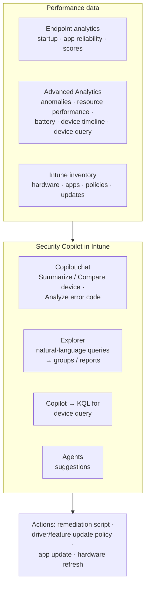

# 5.1.3 Analyze device performance by using Security Copilot agents in Intune

> **Exam objective:** Analyze device performance by using Security Copilot agents in Intune
>
> **Domain:** 5 - Optimize endpoint operations by using automation, monitoring, and reporting (10-15%) · **Skill:** 5.1 Automate management tasks
>
> **Hands-on:** [LAB-5.02 Security Copilot agents in Intune](../labs/LAB-5.02-security-copilot-agents.md)

## Concept in plain English

When a user says "my laptop is slow", you need answers fast: is it this device, this model, a recent update, or a bad app? Security Copilot in Intune helps you **ask those questions in plain language** and turns the answer into data from **Endpoint analytics**, **Advanced Analytics** and device inventory.

> **Verified September 2026:** Microsoft Learn doesn't list a separate "device performance agent". Performance analysis with Security Copilot in Intune uses the **Copilot in Intune** experiences below (Copilot chat, **Explorer**, *Summarize with Copilot*, KQL for **device query**) on top of Endpoint analytics and Advanced Analytics data. Vulnerability Remediation Agent suggestions add security context. If Microsoft releases a dedicated agent before your exam, it appears under **Intune admin center > Agents**.

## How it works



Copilot only sees data the admin is allowed to see (**Intune RBAC and scope tags**).

### Copilot experiences for performance

| Experience | Where | Performance examples |
|---|---|---|
| **Summarize with Copilot** | **Devices > All devices** > device > *Summarize with Copilot* | Hardware, OS build, recent issues, assigned policies and apps |
| **Compare devices** | Copilot chat: "Compare this device with CONTOSO-LAB-02" | Why one device is slow and a similar one isn't (driver, policy, app differences) |
| **Analyze an error code** | Copilot chat | Explain a crash/install error and suggest a fix |
| **Explorer** | **Intune admin center > Explorer** | "Which devices have the lowest startup scores?" → add results to a group or save as a custom report. Covers Advanced Analytics, apps, compliance, configuration, devices, updates and more |
| **Device query (KQL)** | Device > **Monitor > Device query** (single) or **Devices > Device query** (multiple) | "Top 10 processes using the most memory on this device", "last 5 app crash events" - Copilot writes the KQL |
| **Security Copilot portal** | securitycopilot.microsoft.com with the Intune plugin | Cross-service investigations and promptbooks |

## Licensing requirements

| Capability | Requirement |
|---|---|
| Copilot in Intune / agents | Microsoft Security Copilot with **SCUs** (Microsoft 365 E5/E7 include a monthly allowance), Intune Plan 1 |
| Endpoint analytics | Included with Intune for supported Windows devices |
| **Advanced Analytics** (anomalies, resource performance, battery health, device timeline, device query) | **Intune Plan 2** (included in Microsoft 365 E3 since July 2026), Intune Suite, or Advanced Analytics add-on |
| Device query for multiple devices | Advanced Analytics + a **properties catalog** policy |

## Configuration steps

1. Onboard devices to **Endpoint analytics** (objective [5.2.2](5.2.2-endpoint-analytics.md)) and let data build for at least 24 hours after a restart.
2. Confirm Security Copilot is provisioned and the **Microsoft Intune** plugin is enabled.
3. In the Intune admin center, open **Copilot** in the banner.
4. Start broad: *Explorer* → "Show devices with the lowest startup performance score" → review → **Add to group** `DG-Lab-SlowStartup`.
5. Drill in: open a device → **Summarize with Copilot** → ask "Compare this device with a device of the same model with a good startup score".
6. With Advanced Analytics: device → **Monitor > Device query** → ask Copilot "Show the top 10 processes by memory" → run the generated KQL.
7. Correlate: **Reports > Endpoint analytics > Anomalies** (Advanced Analytics) - are crashes tied to a driver, app version or update?
8. Act: remediation script, driver update policy, app supersedence or hardware refresh list. Track the score change against a baseline.

### Example KQL (device query)

```kusto
// Running processes using the most memory on a single device
Process
| project ProcessName, ProcessId, WorkingSetSizeBytes, ThreadCount
| top 10 by WorkingSetSizeBytes desc
```

The `Process` table is available for single-device query only. Verify table and property names with the [Intune data platform schema](https://learn.microsoft.com/intune/advanced-analytics/ref-data-platform-schema) - Copilot generates the query against that schema.

## Comparison: performance tools

| Tool | Question it answers | Data freshness |
|---|---|---|
| Endpoint analytics reports | How is the estate doing vs baseline? | Daily |
| Advanced Analytics anomalies | What changed and what's correlated with it? | Daily |
| Device timeline | What happened on this device and when? | Low latency |
| Device query | What's happening right now on this device? | Near real time |
| Copilot in Intune | Explain, summarize, compare, generate KQL | Uses the above |

## Exam tips and common traps

- Copilot doesn't collect new telemetry. **No Endpoint analytics onboarding = nothing to analyze.**
- **Device query, anomalies, resource performance, battery health and device timeline** need **Advanced Analytics** licensing.
- Copilot respects **RBAC and scope tags** - an admin scoped to one region only sees that region's devices.
- Use **Explorer** to turn a natural-language answer into a **group** or **custom report**.
- The device timeline replaces the per-device application reliability view when Advanced Analytics is enabled.
- Every Copilot prompt and agent run consumes **SCUs**.

## Real-world notes

- Build a "slow device" runbook: Explorer query → group → remediation or driver policy → baseline comparison two weeks later.
- Save good prompts as a promptbook in the Security Copilot portal so the helpdesk asks consistent questions.
- Don't paste user data into prompts unnecessarily. Copilot already has the data it's permitted to see.

## Microsoft Learn references

- [Microsoft Copilot in Intune](https://learn.microsoft.com/intune/copilot/)
- [Use Copilot in Intune to troubleshoot devices](https://learn.microsoft.com/intune/copilot/troubleshoot-devices)
- [Explore Intune data with natural language and take action](https://learn.microsoft.com/intune/copilot/explorer)
- [Advanced Analytics overview](https://learn.microsoft.com/intune/advanced-analytics/)
- [Device query](https://learn.microsoft.com/intune/advanced-analytics/device-query)
- [Security Copilot agents in Intune overview](https://learn.microsoft.com/intune/copilot/agents/)
