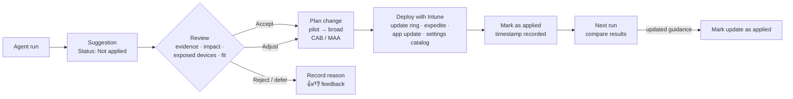

# 5.1.4 Review and respond to Security Copilot agent recommendations to make management decisions

> **Exam objective:** Review and respond to Security Copilot agent recommendations to make management decisions
>
> **Domain:** 5 - Optimize endpoint operations by using automation, monitoring, and reporting (10-15%) · **Skill:** 5.1 Automate management tasks
>
> **Hands-on:** [LAB-5.02 Security Copilot agents in Intune](../labs/LAB-5.02-security-copilot-agents.md)

## Concept in plain English

An agent's output is a **suggestion**, not a change. Your job is to **read it critically, decide, act with normal Intune tools, and record what you did**. Agents keep a human in the loop on purpose: the agent can be wrong, the data can be stale, and you know business context the agent doesn't (a frozen finance period, a VIP pilot, an app that breaks with the new version).

> **Agent status (verified September 30, 2026):** Only the **Vulnerability Remediation Agent** (preview) is still available in the Intune admin center. The Device Offboarding Agent was removed on June 1, 2026, and the Policy Configuration Agent and Change Review Agent after August 31, 2026. The exam outline still says "agents", so the retired ones are summarized at the end in case questions refer to them.

## How it works

### Vulnerability Remediation Agent: reading a suggestion

| Element | What it tells you | Decision it supports |
|---|---|---|
| **Remediation type** | App or operating system | Which Intune tool you'll use |
| **Impact** | Potential impact on the Defender Vulnerability Management **exposure score** | Priority |
| **Exposed devices** | Count of affected devices (Windows client only) | Scope, pilot size |
| **Suggested next steps** | Opens the *Suggested action* pane with CVE details and actions | How to fix |
| **Configurations** | Recommended **settings catalog** settings with CSP references | Attack surface reduction while you patch |
| **"Expedite..." wording** | CVSS **9.0 or higher** → expedite the quality update | Use an expedite policy, not just the normal ring schedule |
| **Status / Last applied** | *Not applied* → *Applied* with timestamp and account | Audit trail |

### Typical responses

| Suggestion | Response in Intune |
|---|---|
| Update vulnerable app (Win32/Store) | New app version with **supersedence** (objective [4.1.2](../../04-Manage-Secure-Applications/docs/4.1.2-deploy-win32-lob-store-apps.md)), or Enterprise App Catalog update |
| Windows quality update | Quality update policy / **expedite** (objective [3.2.2](../../03-Protect-Devices/docs/3.2.2-update-rings-feature-quality-updates.md)) or rely on Autopatch |
| Settings catalog configuration | Create a settings catalog profile from the recommended settings, pilot first |
| Suggestion doesn't fit | Don't mark it applied. Record the risk acceptance. Give 👎 feedback |

## Licensing requirements

Same as objective [5.1.2](5.1.2-security-copilot-agents-threat-investigation.md): Intune Plan 1, Security Copilot SCUs, Defender Vulnerability Management. To **view** results: Intune Read Only Operator (or custom role with Security tasks, Mobile apps, Device configurations and Organization read).

## Configuration steps

1. **Agents > Vulnerability Remediation Agent (preview) > Overview** → review agent status and the **Activity** list (Run in progress / Complete).
2. **Suggestions** tab → sort by **Impact** → open the top suggestion → **Suggested next steps**.
3. Validate the evidence:
   - Open the CVEs in Defender Vulnerability Management (exploit available? internet-facing devices?).
   - Check exposed devices are real and active (stale devices inflate numbers).
   - Check for business conflicts (app compatibility, change freeze).
4. Decide and act:
   - **Accept** → implement with Intune, pilot first. Protected resources may need **multi admin approval** (objective [1.3.3](../../01-Prepare-Infrastructure/docs/1.3.3-multi-admin-approval.md)).
   - **Adjust** → for example, use the recommended settings but a different rollout ring.
   - **Defer/reject** → document why (risk acceptance with an expiry date). Use the like/dislike feedback.
5. After deployment → **Mark as applied**. After a later run shows updated guidance → **Mark update as applied**.
6. Re-run the agent after the next data refresh and compare exposed device counts with the applied baseline.

### Governance checklist

- Agents act only through their **agentic identity** and the permissions you delegated - review those permissions quarterly.
- Agent management actions (create, delete, run, permission failures) are in **Security Copilot audit logs**. Remediation details aren't, so the **Mark as applied** record matters.
- Removing and re-adding the agent **deletes all suggestions**, including the *Applied* history. Export or screenshot evidence first.
- In preview there's **no scope tag support**, so everyone with access sees all suggestions.

## Retired agents (context only)

| Agent | What it did | Status | Replacement process |
|---|---|---|---|
| **Policy Configuration Agent** | Turned documents/benchmarks (for example, STIG, NIST) into settings catalog policy drafts | Removed after Aug 31, 2026 | Security baselines, settings catalog search, Copilot in Intune policy/setting help |
| **Change Review Agent** | Risk recommendations for **multi admin approval** requests for Windows PowerShell scripts | Removed after Aug 31, 2026 | Manual MAA review with Defender/Entra signals |
| **Device Offboarding Agent** | Flagged stale/misaligned devices; after approval, disabled Entra device objects | Removed June 1, 2026 | Device clean-up rules, Graph scripts (objective [5.1.1](5.1.1-powershell-graph-automation.md)) |

All of them followed the same pattern tested by this objective: **agent suggests → admin reviews → admin approves or acts → status tracked**.

## Exam tips and common traps

- **Mark as applied** is a **self-attestation**. It doesn't change devices. The agent takes no action on devices.
- Suggestions are prioritized by **exposure/impact**, and CVSS ≥ 9.0 → **Expedite** guidance.
- Always validate: agents can be wrong. Use **feedback** (like/dislike) to improve results.
- Agents run under a **delegated identity**; runs fail if permissions are missing, SCUs run out, or authorization expires.
- Know which agents are gone: the only Intune agent available after August 31, 2026 is the **Vulnerability Remediation Agent**.

## Real-world notes

- Put agent suggestions on the weekly vulnerability review agenda with an owner and a due date per suggestion.
- Treat "Exposed devices" as a scoping hint: build a dynamic group or filter and deploy to that population first.
- Keep a simple risk register for rejected suggestions so auditors see the decision, not just the absence of action.

## Microsoft Learn references

- [Use the Vulnerability Remediation Agent](https://learn.microsoft.com/intune/copilot/agents/manage-vulnerability-remediation-agent)
- [Vulnerability Remediation Agent in Microsoft Intune](https://learn.microsoft.com/intune/copilot/agents/vulnerability-remediation-agent)
- [Security Copilot agents in Intune overview](https://learn.microsoft.com/intune/copilot/agents/)
- [Exposure score in Defender Vulnerability Management](https://learn.microsoft.com/defender-vulnerability-management/tvm-exposure-score)
- [Access the Security Copilot audit log](https://learn.microsoft.com/copilot/security/audit-log)
