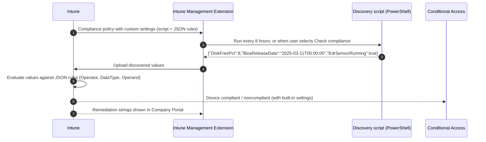

# 5.1.5 Extend device compliance by using PowerShell

> **Exam objective:** Extend device compliance by using PowerShell
>
> **Domain:** 5 - Optimize endpoint operations by using automation, monitoring, and reporting (10-15%) · **Skill:** 5.1 Automate management tasks
>
> **Hands-on:** [LAB-5.03 Custom compliance with PowerShell](../labs/LAB-5.03-custom-compliance.md)

## Concept in plain English

Built-in compliance settings cover the basics (OS version, BitLocker, Defender, password). But your security team may also require "the EDR agent service is running", "the disk is at least 10% free", "a specific app is at version X or later" or "the BIOS is current". **Custom compliance** lets you check **anything a script can read** and use the result in the same compliance state that Conditional Access uses.

It has two parts:

1. **Discovery script** - PowerShell on Windows (shell script on macOS/Linux). It returns the current values as **one line of compressed JSON**.
2. **JSON rules file** - says which value counts as compliant, plus the message users see in Company Portal.

## How it works



- Each compliance policy uses **one** discovery script, and each script can be used by only **one** policy. A script can return **many** settings.
- The JSON can hold up to **100 rules** and **100 KB**.
- The IME checks for new/updated scripts and runs discovery **every 8 hours**. *Check compliance* in Company Portal runs the script (but doesn't download new versions). Push notifications can't trigger it.
- Custom settings form a **compound rule set** with the built-in settings: any failing rule makes the device noncompliant.

### Script requirements (Windows)

| Requirement | Value |
|---|---|
| Output | Compressed single-line JSON, for example ending with `return $hash \| ConvertTo-Json -Compress` |
| Script size | ≤ 1 MB |
| Output size | ≤ 1 MB |
| Run time | ≤ 10 minutes (5 minutes on Linux) |
| Options | Run as logged-on credentials, enforce signature check, run in 64-bit PowerShell |

### JSON rule fields

| Field | Meaning |
|---|---|
| `SettingName` | Key returned by the script (**case-sensitive**) |
| `Operator` | `IsEquals`, `NotEquals`, `GreaterThan`, `GreaterEquals`, `LessThan`, `LessEquals` |
| `DataType` | `Boolean`, `Int64`, `Double`, `String`, `DateTime`, `Version` |
| `Operand` | The compliant value |
| `MoreInfoUrl` | Link for users |
| `RemediationStrings` | Title/description per language; **en_US is required** |

## Licensing requirements

Intune Plan 1. Supported platforms: **Windows** (not Home editions; Entra joined, hybrid joined or Entra registered), **macOS**, and **Linux** (supported Ubuntu Desktop and RHEL versions). On Entra registered (workplace-joined) devices, user-context scripts are ignored - run in system context.

## Configuration steps

### 1. Discovery script

```powershell
# Discover-ContosoCompliance.ps1 (simplified) - returns compressed JSON
$disk = Get-CimInstance -ClassName Win32_LogicalDisk -Filter "DeviceID='C:'"
$edr  = Get-Service -Name 'Sense' -ErrorAction SilentlyContinue

$hash = @{
    DiskFreePct      = [int][math]::Floor(($disk.FreeSpace / $disk.Size) * 100)
    EdrSensorRunning = [bool]($edr -and $edr.Status -eq 'Running')
}
return $hash | ConvertTo-Json -Compress
```

The complete sample (with a `BiosReleaseDate` DateTime rule) is [Discover-ContosoCompliance.ps1](../../08-Scripts/compliance/Discover-ContosoCompliance.ps1) with [contoso-compliance-rules.json](../../08-Scripts/compliance/contoso-compliance-rules.json).

### 2. JSON rules

```json
{
  "Rules": [
    {
      "SettingName": "EdrSensorRunning",
      "Operator": "IsEquals",
      "DataType": "Boolean",
      "Operand": true,
      "MoreInfoUrl": "https://contoso.sharepoint.com/sites/it/edr",
      "RemediationStrings": [
        {
          "Language": "en_US",
          "Title": "Microsoft Defender for Endpoint isn't running.",
          "Description": "Restart the device. If this message remains, contact the IT helpdesk."
        }
      ]
    },
    {
      "SettingName": "DiskFreePct",
      "Operator": "GreaterEquals",
      "DataType": "Int64",
      "Operand": 10,
      "MoreInfoUrl": "https://contoso.sharepoint.com/sites/it/disk",
      "RemediationStrings": [
        {
          "Language": "en_US",
          "Title": "Your system drive is almost full.",
          "Description": "Free up at least 10% of drive C: (empty the Recycle Bin, move files to OneDrive)."
        }
      ]
    }
  ]
}
```

### 3. Upload and create the policy

1. **Devices > Compliance > Scripts > Add > Windows 10 and later** → name `CC-Discovery-Contoso` → paste the script → settings: *Run this script using the logged on credentials* = **No**, *Enforce script signature check* = No (lab), *Run script in 64 bit PowerShell Host* = **Yes** → **Create**.
2. **Devices > Compliance > Create policy > Windows 10 and later** → *Custom Compliance* = **Require** → select the discovery script → upload the JSON → Intune shows the parsed rules.
3. Set **actions for noncompliance** (grace period, email) as with any compliance policy (objective [1.3.4](../../01-Prepare-Infrastructure/docs/1.3.4-compliance-policies.md)).
4. Assign to a pilot device group.

### 4. Verify

- Device: **Company Portal > Check compliance** → the remediation string appears if noncompliant.
- Intune: device → **Device compliance** → policy → per-setting status for each custom rule.
- Client logs: `C:\ProgramData\Microsoft\IntuneManagementExtension\Logs` (start with `IntuneManagementExtension.log`).

## Comparison: custom compliance vs remediations vs built-in

| | Built-in compliance | **Custom compliance** | Remediations |
|---|---|---|---|
| Purpose | Standard security checks | Organization-specific checks that **affect compliance** | Detect **and fix** issues |
| Affects Conditional Access | ✅ | ✅ | ❌ (reporting only) |
| Script output | - | Compressed JSON of values | Exit code (1 = issue) + STDOUT |
| Frequency | Device check-in | Every 8 hours / Check compliance | Once, hourly or daily schedule |
| Licensing | Intune P1 | Intune P1 | Windows Enterprise/Education E3/E5 (or equivalent) |

A common pattern: **remediation** fixes the problem automatically; **custom compliance** blocks access if it's still broken.

## Exam tips and common traps

- The script must output **compressed JSON** (`ConvertTo-Json -Compress`). Multi-line output breaks evaluation.
- The **JSON rules file** (not the script) decides what's compliant.
- `SettingName` is **case-sensitive** and must match the script's key.
- One script per policy, one policy per script. Upload the script **before** creating the policy.
- A script assigned to a policy can't be deleted until you remove it from the policy.
- Runs every **8 hours** via the **Intune Management Extension** (installed automatically).
- Remediation strings need at least **en_US**.
- Windows Home isn't supported.

## Real-world notes

- Keep the script fast and read-only. Don't *fix* things in a discovery script - that's what remediations are for.
- Version your JSON and script together. A renamed key silently turns devices noncompliant.
- Pilot with a report-only style rollout: assign to a small group first and check the per-setting report before enforcing via Conditional Access.

## Microsoft Learn references

- [Custom compliance settings in Microsoft Intune](https://learn.microsoft.com/intune/device-security/compliance/custom-settings)
- [Custom compliance discovery scripts](https://learn.microsoft.com/intune/device-security/compliance/create-custom-script)
- [Custom compliance JSON files](https://learn.microsoft.com/intune/device-security/compliance/create-custom-json)
