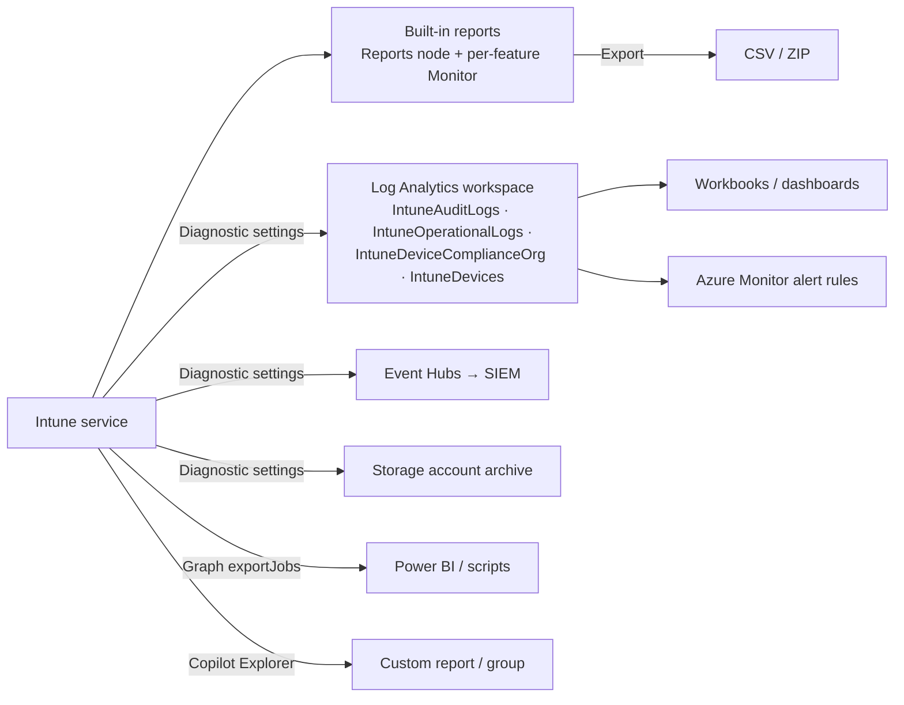

# 5.2.1 Implement reporting and data visibility in Microsoft Intune

> **Exam objective:** Implement reporting and data visibility in Microsoft Intune, including customizing reports and filters, using workbooks and dashboards, and exporting reporting data
>
> **Domain:** 5 - Optimize endpoint operations by using automation, monitoring, and reporting (10-15%) · **Skill:** 5.2 Monitor and optimize health
>
> **Hands-on:** [LAB-5.04 Reports, workbooks and export](../labs/LAB-5.04-reports-workbooks-export.md)

## Concept in plain English

Intune has three layers of reporting:

1. **Built-in reports** in the admin center - filter, sort, choose columns, export to CSV.
2. **Azure Monitor** - send Intune logs to a **Log Analytics** workspace, then query with KQL, build **workbooks** and dashboards, and create **alerts**.
3. **APIs** - export any report with the **Graph `exportJobs` API** and feed it into Power BI, a data lake or an ITSM tool.

Pick the lightest layer that answers the question.

## How it works



### Report categories in the Intune admin center

| Category | Purpose | Examples |
|---|---|---|
| **Operational** | Timely, targeted data to act on now | Noncompliant devices, app install failures, enrollment failures, Autopilot deployments |
| **Organizational** | Broad summary of the whole estate | Device compliance, device configuration, Windows update reports |
| **Historical** | Trends over time | Device compliance trends, Endpoint analytics trends |
| **Specialist** | Your own reports via Azure Monitor | Log Analytics queries, workbooks |

### Diagnostic settings log categories

| Log | Contents | Latency |
|---|---|---|
| **AuditLogs** → `IntuneAuditLogs` | Every admin change (who, what, when) | Near real time |
| **OperationalLogs** → `IntuneOperationalLogs` | Enrollment success/failure, noncompliant device details | Near real time |
| **DeviceComplianceOrg** → `IntuneDeviceComplianceOrg` | Organizational compliance report | Daily export, up to 48 h |
| **IntuneDevices** → `IntuneDevices` | Device inventory and status | Daily export, up to 48 h |

## Licensing requirements

Built-in reports and Graph export: Intune Plan 1. Log Analytics, workbooks and alerts: an **Azure subscription** (pay per GB ingested and retained - see cost notes in [lab environment setup](../../00-Getting-Started/lab-environment-setup.md)). Endpoint analytics / Advanced Analytics reports: see objective [5.2.2](5.2.2-endpoint-analytics.md).

## Configuration steps

### Customize built-in reports

1. **Reports > Device compliance > Reports > Noncompliant devices and settings** (or any report).
2. Use **filters** (OS, ownership, compliance state), **Columns** to add/remove fields, sort, and search.
3. **Generate report** (some reports generate on demand) → **Export** → CSV in a ZIP.
4. Use **scope tags** and **RBAC**: admins see only the devices in their scope.

### Send logs to Log Analytics

1. Azure portal: create a **Log Analytics workspace** `law-intune-lab` (set a short retention and a daily cap for the lab).
2. Intune: **Reports > Diagnostic settings > Add diagnostic setting** → name `Intune-to-LA` → tick **AuditLogs, OperationalLogs, DeviceComplianceOrg, IntuneDevices** → **Send to Log Analytics workspace** → **Save**.
3. **Reports > Log analytics** to run queries.

```kusto
// Who changed what in the last 7 days
IntuneAuditLogs
| where TimeGenerated > ago(7d)
| project TimeGenerated, Identity, OperationName, ResultType
| order by TimeGenerated desc
```

```kusto
// Enrollment failures by reason
IntuneOperationalLogs
| where OperationName == "Enrollment" and Result == "Fail"
| extend p = todynamic(Properties)
| summarize Failures = count() by FailureReason = tostring(p.FailureReason)
| order by Failures desc
```

Check column and property names against the table reference in Log Analytics before building alerts on them.

### Workbooks and dashboards

1. **Reports > Workbooks** (after Log Analytics is connected) → open a built-in Intune workbook (for example, compliance or enrollment activity) or **New** → add KQL query tiles, charts and parameters.
2. **Pin** tiles to an Azure dashboard or share the workbook with the operations team (Azure RBAC on the workspace).

### Export with Microsoft Graph

```http
POST https://graph.microsoft.com/beta/deviceManagement/reports/exportJobs
{
  "reportName": "Devices",
  "format": "csv",
  "localizationType": "LocalizedValuesAsAdditionalColumn",
  "select": ["DeviceName", "UPN", "OS", "OSVersion", "complianceState", "LastContact"]
}
```

Poll `GET .../exportJobs('{id}')` until `status` = `completed`, then download the ZIP from `url`. The script [Export-IntuneReport.ps1](../../08-Scripts/graph/Export-IntuneReport.ps1) automates this.

- Always **select explicit columns** - don't build automation on default columns.
- Throttling: **100 requests per tenant per minute** (8 per user, 48 per app).
- `format` can be `csv` (default) or `json`.

### Other visibility options

- **Copilot in Intune Explorer**: natural-language query → save as a **custom report** or add results to a group (objective [5.1.3](5.1.3-security-copilot-agents-device-performance.md)).
- **Device query for multiple devices** (Advanced Analytics): KQL across the fleet, export up to 50,000 rows.
- **Power BI**: import exported data, query Log Analytics, or use the **Intune Data Warehouse** through the Power BI **Intune connector v2** or OData feed. The Data Warehouse (beta) connector v1 was retired in April 2026.

## Comparison: which reporting tool?

| Need | Tool |
|---|---|
| Quick list of failing devices to fix today | Operational report + filter + export |
| Weekly compliance summary for management | Organizational/historical report, or workbook |
| Correlate audit, enrollment and compliance data; alerting | Log Analytics + workbooks + alert rules |
| SIEM (Sentinel, Splunk, QRadar) | Diagnostic settings → Log Analytics or **Event Hubs** |
| Long-term archive | Diagnostic settings → **Storage account** |
| Automated data feed | Graph `exportJobs` |

## Exam tips and common traps

- **Diagnostic settings** live under **Reports** (or Tenant administration) in Intune and need an **Azure subscription**.
- Audit and operational logs arrive in near real time. Compliance org and device inventory logs are **daily** (up to 48 h).
- **Event Hubs** = stream to SIEM. **Storage account** = archive. **Log Analytics** = query, workbooks, alerts.
- Export API: **`deviceManagement/reports/exportJobs`**, poll until `completed`, download from `url`.
- Report visibility respects **RBAC and scope tags**.

## Real-world notes

- Put a daily cap on the workspace in labs - Intune device inventory logs grow quickly.
- Build one "endpoint health" workbook with tiles for compliance %, enrollment failures, app install failures and update compliance, and review it in the weekly ops meeting.
- Keep KQL queries in source control next to your scripts.

## Microsoft Learn references

- [Intune reports](https://learn.microsoft.com/intune/device-management/reports/overview)
- [Send Intune log data to Azure Storage, Event Hubs, or Log Analytics](https://learn.microsoft.com/intune/governance/integrate-azure-monitor)
- [Export Intune reports using Graph APIs](https://learn.microsoft.com/intune/device-management/reports/export-graph-apis)
- [Intune reports and properties available using Graph API](https://learn.microsoft.com/intune/device-management/reports/ref-graph-available-reports)
- [Azure Monitor workbooks overview](https://learn.microsoft.com/azure/azure-monitor/visualize/workbooks-overview)
