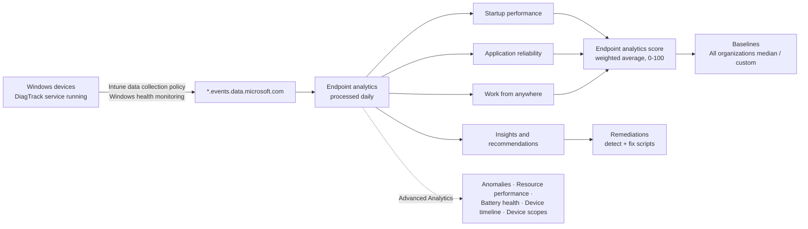

# 5.2.2 Monitor endpoint performance by using Endpoint analytics

> **Exam objective:** Monitor endpoint performance by using Endpoint Analytics, including Remediations, device health scores, and app startup performance
>
> **Domain:** 5 - Optimize endpoint operations by using automation, monitoring, and reporting (10-15%) · **Skill:** 5.2 Monitor and optimize health
>
> **Hands-on:** [LAB-5.05 Endpoint analytics and Remediations](../labs/LAB-5.05-endpoint-analytics-remediations.md)

## Concept in plain English

Compliance tells you if a device is **safe**. **Endpoint analytics** tells you if it's **pleasant to use**: how long it takes to boot and sign in, which apps crash, which processes slow down sign-in, and whether devices are ready for cloud management. It turns that into **scores from 0 to 100**, compares them with a **baseline**, and gives **insights and recommendations**. **Remediations** are the "fix it" part: scripts that detect and repair common problems automatically.

## How it works

### Reports

| Report | What it measures | Typical insights |
|---|---|---|
| **Startup performance** | **Boot score** (power-on → sign-in) + **sign-in score** (credentials → responsive desktop) = startup score. Also **startup processes**, **model performance**, **restart frequency** | HDD → SSD, Group Policy delays, slow startup/login processes |
| **Application reliability** | App crashes, hangs, **mean time to failure**, app usage; OS versions performance | Apps with high crash counts, versions to update |
| **Work from anywhere** | Readiness for cloud management: Windows version, cloud management (Intune), cloud identity (Entra join), cloud provisioning (Autopilot) | Devices still hybrid joined, not Autopilot registered |
| **Remediations** | Script packages and their detection/remediation results | Issues fixed / recurred / failed |
| **Resource performance** *(Advanced Analytics)* | CPU and RAM spikes by device and model | Under-specced models for the refresh plan |
| **Battery health** *(Advanced Analytics)* | Capacity and estimated runtime | Batteries to replace |
| **Anomalies** *(Advanced Analytics)* | Spikes in app crashes, hangs and stop-error restarts correlated with changes | "Driver X on model Y after update Z" |

### App startup performance

"App startup performance" in the objective is about **what delays the user getting to a working desktop and apps**:

- **Startup processes** tab: processes that run during sign-in, with delay impact - candidates to remove or delay.
- **Sign-in score** and **time to responsive desktop**.
- **Application reliability > App performance**: usage and crash data per app, and per app version.

## Licensing requirements

| Feature | Requirement |
|---|---|
| Endpoint analytics | Devices need a valid **Intune** licence. Windows Pro, Pro Education, Enterprise, Education. Entra joined or hybrid joined; Intune-managed, co-managed, or ConfigMgr tenant attach |
| **Remediations** | Windows **Enterprise E3/E5** (Microsoft 365 F3/E3/E5), **Education A3/A5**, or **Windows VDA** per user |
| Advanced Analytics | Advanced Analytics licence (see [licensing guide](../../00-Getting-Started/licensing-guide.md)) |

Roles: configure = custom role with **Endpoint Analytics** permissions (or Intune Administrator); read = Help Desk Operator, Read Only Operator, Endpoint Security Manager, or Entra **Reports Reader**.

## Configuration steps

1. **Reports > Endpoint analytics** → first-time setup → *Collect device data from*: **All cloud-managed devices** (or *Selected devices* for a pilot) → **Start**. Intune creates and assigns the **Intune data collection policy** (a Windows health monitoring profile with scope *Endpoint analytics*).
2. Make sure devices can reach `https://*.events.data.microsoft.com` and the **Connected User Experiences and Telemetry (DiagTrack)** service runs.
3. **Restart** the devices. Data appears up to **24 hours after a restart**. At least **5 devices** are needed for scores (otherwise *Insufficient data*).
4. **Settings > Baseline management** → create a baseline from today's metrics → set the **regression threshold**.
5. Review **Overview → Insights and recommendations**, then each report's **Device performance** and **Model performance** tabs.
6. Use **Remediations** to fix the top issues (objective [5.2.3](5.2.3-remediation-scripts.md)).

## Comparison: Endpoint analytics vs related tools

| Tool | Focus |
|---|---|
| **Endpoint analytics** | User experience scores and trends |
| **Advanced Analytics** | Deeper per-device data, anomalies, device query, battery, resource performance (objective [2.3.6](../../02-Manage-Maintain-Devices/docs/2.3.6-advanced-analytics.md)) |
| Windows update reports | Patch status |
| Compliance reports | Security posture |
| Microsoft Adoption Score (M365 admin center) | Shares Endpoint analytics score with business stakeholders |

## Exam tips and common traps

- The **Endpoint analytics score** = weighted average of **Startup performance, Application reliability and Work from anywhere**.
- Onboarding = **Intune data collection policy**. Data takes up to **24 h after a restart**.
- **Minimum 5 devices** for a score.
- Scores range **0-100**; the built-in baseline is **All organizations (median)**; regressions beyond the threshold show **red**.
- Remediations need **Windows Enterprise/Education E3/E5 or VDA** licensing, not just Intune.
- Windows **Home** isn't supported.
- Boot and sign-in events are kept for **29 days** in startup performance.

## Real-world notes

- Create a baseline **before** a big change (new security agent, feature update) so you can prove whether it hurt the user experience.
- Model performance is gold for hardware refresh decisions - share it with procurement.
- Pair "slow sign-in" insights with the Group Policy analytics migration plan: GPOs are a common cause on hybrid devices.

## Microsoft Learn references

- [Endpoint analytics overview](https://learn.microsoft.com/intune/endpoint-analytics/)
- [Configure endpoint analytics](https://learn.microsoft.com/intune/endpoint-analytics/configure)
- [Scores, baselines, and insights](https://learn.microsoft.com/intune/endpoint-analytics/scores)
- [Startup performance report](https://learn.microsoft.com/intune/endpoint-analytics/startup-performance)
- [Application reliability report](https://learn.microsoft.com/intune/endpoint-analytics/app-reliability)
- [Work from anywhere report](https://learn.microsoft.com/intune/endpoint-analytics/work-from-anywhere)
