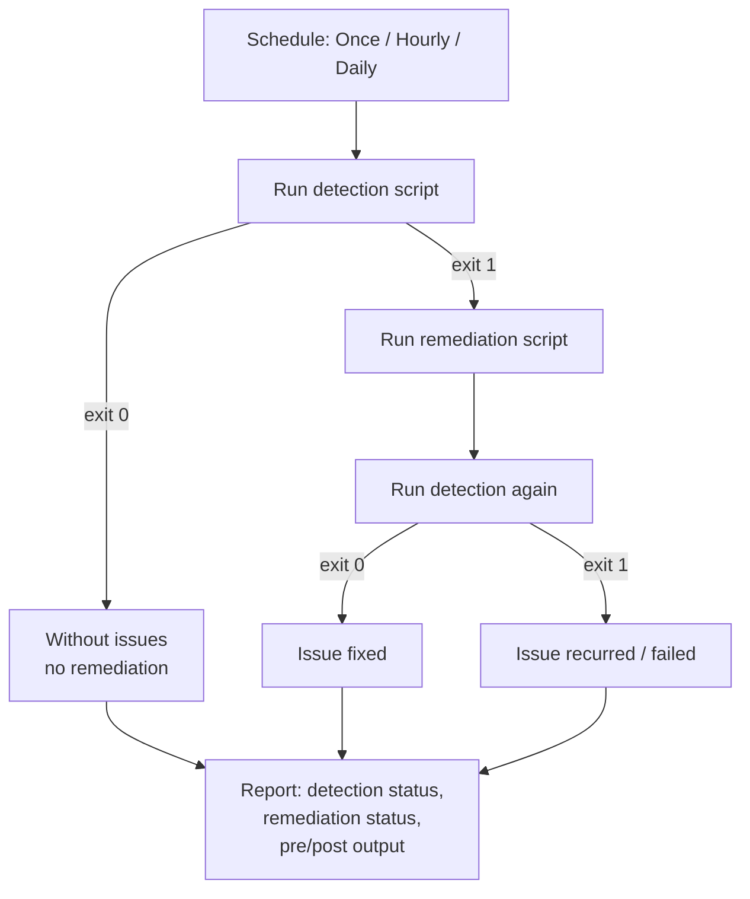

# 5.2.3 Configure and manage remediation scripts

> **Exam objective:** Configure and manage remediation scripts, including detecting and fixing common device issues, and scheduling remediation runs
>
> **Domain:** 5 - Optimize endpoint operations by using automation, monitoring, and reporting (10-15%) · **Skill:** 5.2 Monitor and optimize health
>
> **Hands-on:** [LAB-5.05 Endpoint analytics and Remediations](../labs/LAB-5.05-endpoint-analytics-remediations.md)

## Concept in plain English

A **remediation** is a pair of PowerShell scripts: a **detection** script asks "is the problem here?", and a **remediation** script fixes it only if the answer is yes. Intune runs the pair on a schedule and reports how many devices had the issue, how many were fixed, and how many broke again. It's the helpdesk's "have you tried...?" list, automated before the user even calls.

(Formerly **Proactive Remediations**. Now in **Devices > Manage devices > Scripts and remediations**.)

## How it works



- The **detection script must `exit 1`** when the issue exists. Any other exit code (including an empty output with exit 0) = "no issue", and the remediation doesn't run.
- Output (STDOUT) up to **2,048 characters** is captured and can be shown as columns in the device status report (pre-detection, pre-remediation, post-remediation output).
- The **Intune Management Extension (IME)** runs the scripts. It retrieves policy about every 8 hours, then follows the schedule.

### Requirements

| Item | Requirement |
|---|---|
| Devices | Windows Enterprise, Professional or Education; **Entra joined** or **hybrid joined**; Intune enrolled or co-managed |
| Licensing | Users need **Windows Enterprise E3/E5** (in Microsoft 365 F3/E3/E5), **Windows Education A3/A5** (in Microsoft 365 A3/A5), or **Windows VDA** per user |
| Tenant | **Windows license verification** must be turned on (Tenant administration > Connectors and tokens > Windows data). An Intune Service Administrator confirms licensing the first time |
| Limits | Up to **200** script packages. Output ≤ 2,048 characters |
| Encoding | UTF-8 (**not UTF-8 BOM** if *Enforce script signature check* is on) |
| RBAC | **Device configurations** permissions. **Run remediation** (Remote tasks) for on-demand runs |

### Schedule options

| Option | Behaviour |
|---|---|
| **Once** | Runs one time at the date/time you set |
| **Hourly** | Every *N* hours (1-23) |
| **Daily** | Every *N* days at a set time (the default for new packages is daily) |
| **Use UTC** | Interpret the time as UTC rather than device local time |
| **On demand** | Device action **Run remediation** for a single device (needs WNS connectivity) |

### Settings

| Setting | Recommendation |
|---|---|
| Run this script using the logged-on credentials | **No** (SYSTEM) unless the fix is per-user, such as HKCU or user files |
| Enforce script signature check | Yes in production if you sign scripts |
| Run script in 64-bit PowerShell | **Yes** for most scripts (registry/filesystem redirection otherwise) |

## Licensing requirements

See the table above. Remediations **aren't** covered by Intune Plan 1 alone: the Windows Enterprise/Education E3+ or VDA licence is the gate. Endpoint analytics must be set up.

## Configuration steps

### Deploy a built-in package

**Devices > Manage devices > Scripts and remediations > Remediations** → built-in packages such as *Update stale Group Policies* and *Restart Office Click-to-run service* → **Properties > Assignments** → assign to a group.

### Create a custom package

Full sample scripts: [Detect-WindowsTempSize.ps1](../../08-Scripts/remediations/Detect-WindowsTempSize.ps1) and [Remediate-WindowsTempSize.ps1](../../08-Scripts/remediations/Remediate-WindowsTempSize.ps1).

```powershell
# Detect-WindowsTempSize.ps1 (simplified) - issue = more than 2 GB in C:\Windows\Temp
$sizeGB = (Get-ChildItem -Path "$env:SystemRoot\Temp" -Recurse -File -ErrorAction SilentlyContinue |
    Measure-Object -Property Length -Sum).Sum / 1GB
if ($sizeGB -gt 2) {
    Write-Output ("Temp folder {0:N1} GB" -f $sizeGB)
    exit 1   # issue detected -> run remediation
}
Write-Output ("Temp folder OK {0:N1} GB" -f $sizeGB)
exit 0
```

```powershell
# Remediate-WindowsTempSize.ps1 (simplified) - delete temp files older than 7 days
$cutoff = (Get-Date).AddDays(-7)
Get-ChildItem -Path "$env:SystemRoot\Temp" -Recurse -File -ErrorAction SilentlyContinue |
    Where-Object LastWriteTime -lt $cutoff |
    Remove-Item -Force -ErrorAction SilentlyContinue
Write-Output 'Cleaned Windows\Temp'
exit 0
```

1. **Remediations > Create** → name `RM-Clean-WindowsTemp` → upload detection and remediation scripts.
2. Settings: logged-on credentials **No**, 64-bit **Yes**.
3. Scope tags → **Assignments**: device group → schedule **Daily**, every 1 day at 11:00 (or **Hourly** for fast-moving issues).
4. **Monitor**: open the package → **Overview** (Without issues / With issues / Issue fixed / Issue recurred / Failed) → **Device status** → **Columns** add *Pre-remediation detection output* and *Post-remediation detection output* → **Export**.

### Run on demand

Device → **...** → **Run remediation** → pick the package → **Run remediation**. The package doesn't need to be assigned. Only one on-demand run per device at a time.

### Troubleshoot

- Client logs: `C:\ProgramData\Microsoft\IntuneManagementExtension\Logs\IntuneManagementExtension.log` and `HealthScripts.log`.
- Scripts are cached under `C:\Windows\IMECache\HealthScripts`.
- *Remediations greyed out* → Windows license verification not confirmed.

## Comparison: scripting options in Intune

| | Platform scripts (PowerShell) | **Remediations** | Custom compliance | Win32 app with script |
|---|---|---|---|---|
| Runs | Once (retries on failure, up to 3 times) | On a **schedule** / on demand | Every 8 h | At install (and on detection failure) |
| Detection + fix | ❌ | ✅ | Detection only | Detection rule + installer |
| Reporting | Success/fail | Rich (with output) | Compliance state | Install status |
| Licensing | Intune P1 | Windows E3/E5, A3/A5, VDA | Intune P1 | Intune P1 |
| Use for | One-time config | Recurring fixes | Compliance gating | Software delivery |

## Exam tips and common traps

- **Detection `exit 1` = issue found → remediation runs.** `exit 0` = no issue.
- Remediations require **Windows Enterprise/Education E3+ (or VDA)** licensing and **Windows license verification**.
- Schedules: **Once, Hourly, Daily**. On-demand = **Run remediation** device action.
- Up to **200** packages, output max **2,048** characters.
- Run as **SYSTEM** by default; switch to logged-on credentials only for user-context fixes.
- Enforce signature check → scripts must be **UTF-8 without BOM**.
- Don't mix user and device groups across include/exclude assignments.

## Real-world notes

- Make detection scripts idempotent and fast; heavy scans hourly can hurt performance.
- Start with detection-only packages (no remediation script) to measure how big a problem is before fixing it.
- Use the exported device status as evidence for problem management ("this issue recurred on 42 devices of model X").

## Microsoft Learn references

- [Remediations](https://learn.microsoft.com/intune/device-management/tools/deploy-remediations)
- [Remediation script samples](https://learn.microsoft.com/intune/device-management/tools/ref-remediation-scripts)
- [Device action: run remediation](https://learn.microsoft.com/intune/device-management/actions/run-remediation)
- [Use PowerShell scripts on Windows devices in Intune (platform scripts)](https://learn.microsoft.com/intune/device-management/tools/powershell-scripts)
