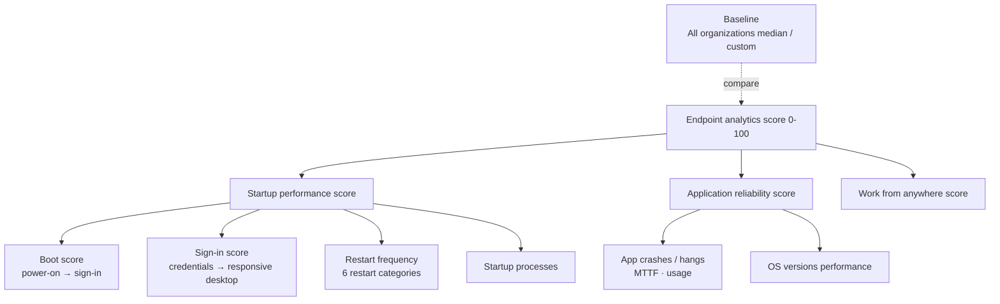

# 5.2.4 Analyze endpoint reliability and user experience scores

> **Exam objective:** Analyze endpoint reliability and user experience scores, including startup performance, restart frequency, and application reliability metrics
>
> **Domain:** 5 - Optimize endpoint operations by using automation, monitoring, and reporting (10-15%) · **Skill:** 5.2 Monitor and optimize health
>
> **Hands-on:** [LAB-5.05 Endpoint analytics and Remediations](../labs/LAB-5.05-endpoint-analytics-remediations.md)

## Concept in plain English

Objective [5.2.2](5.2.2-endpoint-analytics.md) is about **turning on** Endpoint analytics. This objective is about **reading the numbers** and deciding what to do: is a low score caused by old hardware, a bad driver, a slow login script, too many restarts, or one crashing app?

## How it works

### Scores and what drives them

| Score | Measured as | Common causes of a low score |
|---|---|---|
| **Boot score** | Last boot time per device (excluding update phases), 0-100 | Hard disk drives, old firmware, heavy drivers |
| **Sign-in score** | Time from credentials to **responsive desktop** (excluding first sign-in and sign-in after a feature update) | Group Policy processing, login scripts, **startup processes** keeping CPU above 50% |
| **Application reliability** | Crashes and hangs relative to usage | A specific app version, add-ins, driver conflicts |
| **Work from anywhere** | Cloud identity, cloud management, cloud provisioning, Windows version | Hybrid-only devices, no Autopilot, unsupported Windows |

### Restart frequency (Startup performance > Restart frequency)

Aggregated over **30 days**, per category, with devices affected and average restarts per device:

| Type | Category | What good looks like |
|---|---|---|
| Abnormal | **Stop errors** (blue screen) | As close to zero as possible. Drill into the stop code and failure bucket ID |
| Abnormal | **Long power button press** | Near zero. Frequent = frozen devices |
| Abnormal | **Unknown** | Near zero |
| Normal | **Update** | About **one per device per month**. Less = devices not patching. More = too many update restarts |
| Normal | **Shutdown (no update)** | Not a problem (user saving battery) |
| Normal | **Restart (no update)** | Close to zero. High = users restarting to fix problems |

Device drill-in → **OS restart history** (10 most recent restarts in 30 days, low latency) shows the category, stop code and failure bucket ID.

### Application reliability metrics

| Metric | Meaning |
|---|---|
| **App crashes / hangs** | Count over the period |
| **Mean time to failure (MTTF)** | Usage time between crashes - higher is better |
| **Usage** | Active devices and usage time - weights impact |
| **App reliability score** | Per app, compared with your baseline |
| **OS versions performance** | Crashes by Windows build - checks feature update regressions |

With **Advanced Analytics**, the **Anomalies** report correlates spikes (app crashes, hangs, stop-error restarts) with drivers, app versions, OS builds and models in **device correlation groups**, and the **device timeline** shows events per device.

### Baselines and thresholds

- Built-in baseline: **All organizations (median)**.
- **Custom baselines** snapshot your own metrics (for example "Before 24H2 rollout").
- Scores that regress more than the **regression threshold** from the selected baseline show **red**, and the overall score is flagged as needing attention.
- Model and startup process views only show items that affect at least **10 devices** (models) or **10 devices** (processes), to keep averages meaningful.
- Device-level lists respect **scope tags**. Aggregated scores use all devices unless you use **device scopes** (Advanced Analytics).

## Licensing requirements

Endpoint analytics: Intune-licensed devices (see objective 5.2.2). Anomalies, device timeline, resource performance, battery health, device scopes: **Advanced Analytics**.

## Configuration steps (analysis workflow)

1. **Reports > Endpoint analytics > Overview** → select a baseline → note red scores.
2. **Startup performance > Model performance** → sort by boot score, average restarts and stop errors → identify weak models.
3. **Startup performance > Startup processes** → sort by **total delay** → decide remove, delay or update.
4. **Startup performance > Restart frequency** → check stop errors and restart (no update) → drill into the worst devices → **OS restart history** for stop codes.
5. **Application reliability > App performance** → sort by crashes/MTTF → check **App versions** → update or roll back the bad version.
6. **Application reliability > OS versions performance** → compare builds before widening a feature update.
7. **Work from anywhere** → list devices missing Entra join, Intune or Autopilot → feed the modernization backlog.
8. Act (remediation script, driver update policy, app update, hardware refresh), then **create a new baseline** and re-check after 2-4 weeks.

## Comparison: symptom → where to look

| Symptom | Report | Likely action |
|---|---|---|
| "My PC takes ages to start" | Boot score, model performance | SSD upgrade, firmware, fast startup settings |
| "Sign-in is slow" | Sign-in score, startup processes, Group Policy insight | Remove startup items, migrate GPOs to Intune |
| Random blue screens | Restart frequency → stop errors → stop code | Driver update policy / rollback |
| Users restart all the time | Restart (no update) | Find the underlying app/driver issue |
| "App X keeps crashing" | App reliability → app versions, Anomalies | Update/rollback app, remediation script |
| Updates cause many restarts | Update restart category > 1/month | Review update ring deadlines, Hotpatch |

## Exam tips and common traps

- The overall score = **Startup performance + Application reliability + Work from anywhere** (weighted average).
- **Startup score = boot score + sign-in score**.
- **Restart frequency** has **six categories**: stop errors, long power button press, unknown (abnormal); update, shutdown (no update), restart (no update) (normal). About **one update restart per month** is healthy.
- **MTTF** = mean time to failure: higher is better.
- Scores are **0-100**; red = regressed beyond the threshold from the baseline.
- Stop codes and failure bucket IDs are in the device's **OS restart history**.
- Correlation of crashes with drivers/app versions = **Anomalies** (Advanced Analytics).

## Real-world notes

- Present scores by model to procurement and by app to app owners - numbers change behaviour faster than tickets.
- Track restart (no update) as a hidden-problem indicator: users restart instead of raising tickets.
- Recreate your custom baseline after each major change so regressions stay meaningful.

## Microsoft Learn references

- [Scores, baselines, and insights](https://learn.microsoft.com/intune/endpoint-analytics/scores)
- [Startup performance report](https://learn.microsoft.com/intune/endpoint-analytics/startup-performance)
- [Application reliability report](https://learn.microsoft.com/intune/endpoint-analytics/app-reliability)
- [Work from anywhere report](https://learn.microsoft.com/intune/endpoint-analytics/work-from-anywhere)
- [Anomalies report (Advanced Analytics)](https://learn.microsoft.com/intune/advanced-analytics/anomalies)
