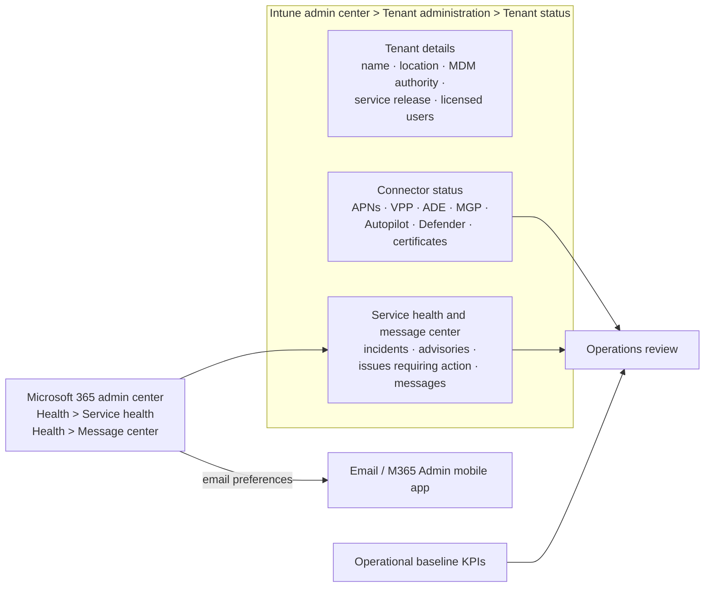

# 5.2.5 Monitor tenant health and Intune service communications

> **Exam objective:** Monitor tenant health and Intune service communications, including reviewing service health dashboards, message center notifications, and establishing operational baselines
>
> **Domain:** 5 - Optimize endpoint operations by using automation, monitoring, and reporting (10-15%) · **Skill:** 5.2 Monitor and optimize health
>
> **Hands-on:** [LAB-5.06 Service health, baselines and alerts](../labs/LAB-5.06-service-health-alerts.md)

## Concept in plain English

When enrollments suddenly fail, is it **your configuration**, an **expired certificate**, or a **Microsoft outage**? Checking tenant health first saves hours. Intune gives you one page for this - **Tenant administration > Tenant status** - plus the Microsoft 365 admin center **Service health** and **Message center** for incidents and planned changes. An **operational baseline** is your "normal" (for example, 97% compliant, 99% enrollment success) so you notice when something drifts.

## How it works

### Tenant status tabs

| Tab | Shows | Permissions |
|---|---|---|
| **Tenant details** | Tenant name and location, MDM authority, **service release** (links to What's new), licensed users, enrolled devices | Intune Read Only Operator (Organization, ManagedDevice, ManagedApp read) |
| **Connector status** | Health of all connectors, unhealthy first | Same |
| **Service health and message center** | Active **incidents/advisories** affecting your tenant, **issues in your environment that require action**, **Intune message center** (10 most recent) | Entra **Service Support Administrator** (message center: also **Message Center Reader**) |

### Connector status rules

| Status | Credential-based (APNs, VPP token, ADE token) | Sync-based (Autopilot, VPP sync, MGP) |
|---|---|---|
| **Unhealthy** | Expired | Last sync **3+ days** ago |
| **Warning** | Expires within **7 days** | Last sync more than **1 day** ago |
| **Healthy** | Not expiring in 7 days | Synced within 1 day |

Connectors reporting *Healthy* can still misbehave - check the connector's own logs when symptoms persist.

### Service communications

| Source | Content | Tips |
|---|---|---|
| **Service health** (Intune tab + M365 admin center) | Incidents (service degradation) and advisories (limited impact) | Past 30 days via **See past incidents/advisories** |
| **Message center** | Planned changes, retirements, new features, required actions | Tag messages, set preferences, weekly digest email, **sync to Microsoft Planner** |
| **What's new in Intune** / **In development** | Monthly service release notes and upcoming features | Link from the service release number |
| **Windows release health** (M365 admin center) | Known issues and safeguard holds for Windows updates | Check before widening an update ring |
| Microsoft 365 Admin mobile app | Push notifications for health and messages | For on-call engineers |

## Licensing requirements

Included with Intune and Microsoft 365. Roles: **Service Support Administrator** (service health, issues requiring action) and **Message Center Reader** (messages) in Entra ID - both least-privilege compared with Global Administrator.

## Configuration steps

1. **Intune admin center > Tenant administration > Tenant status > Tenant details** → note the service release and licence counts.
2. **Connector status** → fix any Unhealthy/Warning item (for example, renew the APNs certificate with the **same Apple Account**, renew the VPP/ADE token).
3. **Service health and message center** → open active incidents → **See past incidents/advisories**.
4. **Microsoft 365 admin center > Health > Service health > Customize > Email** → *Send me email notifications about service health* → choose Intune and related services (Entra ID, Exchange Online).
5. **Health > Message center > Preferences** → *Custom view* (Intune, Windows, Entra) and *Email* weekly digest to the endpoint team DL. Optionally **Planner sync** to turn messages into tasks.
6. Assign the endpoint team **Service Support Administrator** and **Message Center Reader** (via PIM where possible).

### Establishing an operational baseline

1. Choose KPIs and their source:

   | KPI | Source |
   |---|---|
   | % compliant devices | Device compliance report |
   | Enrollment success rate | Enrollment failures report / `IntuneOperationalLogs` |
   | App install success rate | App install status report |
   | Quality update compliance (N or N-1) | Windows update reports / Autopatch reports |
   | Endpoint analytics score | Endpoint analytics baseline |
   | Connector health | Tenant status |
   | Stale devices (no check-in 30+ days) | Devices list / Graph script |

2. Capture a **4-week average** as the baseline. In Endpoint analytics, save it as a **custom baseline**.
3. Define thresholds (for example, alert if compliance drops more than 3 points in a day) and wire them to alerts (objective [5.2.6](5.2.6-alerts-notifications.md)).
4. Review weekly: service health + message center actions + KPI trend. Re-baseline after major changes.

## Comparison: where to check what

| Question | Go to |
|---|---|
| Is Intune down? | Tenant status > Service health / M365 Service health |
| Is Apple enrollment broken because of us? | Tenant status > **Connector status** (APNs, ADE) |
| What's changing next month? | Message center, In development |
| Why did an update not install? | Windows release health (safeguard holds), update reports |
| Is today worse than normal? | Operational baseline dashboard / workbook |

## Exam tips and common traps

- Intune's single health page is **Tenant administration > Tenant status** with three tabs.
- **Service health** needs **Service Support Administrator** - not just Intune roles.
- Email notifications for service health are configured in the **Microsoft 365 admin center** (Health > Service health > Customize), not in Intune.
- Connector **Warning** = expires within **7 days** or no sync for more than a day. **Unhealthy** = expired or no sync for 3+ days.
- An expired **APNs certificate** breaks all Apple device management - renew with the **same Apple Account**.
- Message center posts are targeted and expire - use email digests or Planner sync to keep a record.

## Real-world notes

- Put APNs, VPP and ADE expiry dates in a shared calendar with 30-day reminders - the 7-day warning is too late for some organizations' change processes.
- A 10-minute weekly "tenant health" stand-up (service health, message center actions, KPI trend) prevents most surprise outages.
- Keep a changelog of your own tenant changes next to Microsoft's; most "incidents" are self-inflicted.

## Microsoft Learn references

- [Intune tenant status page](https://learn.microsoft.com/intune/governance/tenant-status)
- [Service information for Intune release updates](https://learn.microsoft.com/intune/fundamentals/servicing-information)
- [How to check Microsoft 365 service health](https://learn.microsoft.com/microsoft-365/enterprise/view-service-health)
- [Message center in the Microsoft 365 admin center](https://learn.microsoft.com/microsoft-365/admin/manage/message-center)
- [Windows release health](https://learn.microsoft.com/windows/deployment/update/windows-release-health)
