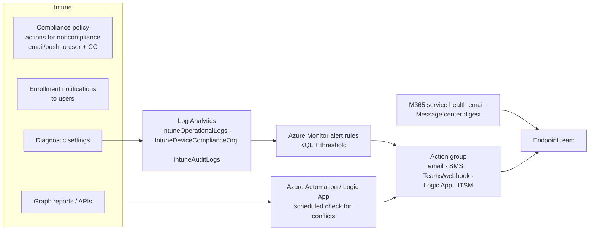

# 5.2.6 Configure alerts and notifications for policy and compliance changes

> **Exam objective:** Configure alerts and notifications for policy and compliance changes, including setting up alert rules for compliance drift, enrollment failures, and configuration conflicts
>
> **Domain:** 5 - Optimize endpoint operations by using automation, monitoring, and reporting (10-15%) · **Skill:** 5.2 Monitor and optimize health
>
> **Hands-on:** [LAB-5.06 Service health, baselines and alerts](../labs/LAB-5.06-service-health-alerts.md)

## Concept in plain English

Reports tell you what happened when you look. **Alerts** tell you when you **aren't** looking. For endpoint operations you want to hear about three things quickly:

1. **Compliance drift** - the compliant percentage drops, or a group of devices suddenly becomes noncompliant.
2. **Enrollment failures** - Autopilot or BYOD enrollments start failing.
3. **Configuration conflicts / risky changes** - two policies fight over a setting, or someone changes or deletes an important policy.

Intune doesn't have one "alert rules" page for all of these (built-in alert rules exist for **Windows 365 Cloud PCs**). You build them from **Intune notifications**, **Azure Monitor alert rules on Intune logs**, and **Graph automation**.

## How it works



### Alerting options by scenario

| Scenario | Option | Notes |
|---|---|---|
| Tell the **user** their device is noncompliant | Compliance **actions for noncompliance** → *Send email to end user* (with **notification message template**) / *Send push notification* | CC additional groups (for example, the helpdesk) |
| Tell **IT** about **compliance drift** | Log Analytics alert on `IntuneDeviceComplianceOrg` (daily) or on noncompliance events in `IntuneOperationalLogs` | Threshold, for example, noncompliant count > baseline + 5% |
| **Enrollment failures** spike | Log Analytics alert on `IntuneOperationalLogs` enrollment failures (near real time) | Group by failure reason / platform |
| Tell **users** about new enrollments (security) | **Enrollment notifications** (Devices > Enrollment > [platform] > Enrollment notifications) | Email or push; not for userless enrollment |
| **Configuration changes** by admins | Log Analytics alert on `IntuneAuditLogs` (for example, delete or assignment change on compliance/configuration policies) | Pair with **multi admin approval** for prevention |
| **Configuration conflicts** | Scheduled **Graph** job reading policy/setting status for `conflict`, then post to Teams/email | Also visible in **Devices > Monitor** configuration reports and per-device *Device configuration* status |
| Microsoft outage / planned change | **Service health** email notifications, **Message center** digest (M365 admin center) | Objective [5.2.5](5.2.5-service-health-message-center.md) |
| Cloud PC problems | **Tenant administration > Cloud PC Alerts > Alert rules** | Built-in rules with severity and email |
| Defender threats | Defender XDR **email notification rules** | SOC side, objective [3.1.6](../../03-Protect-Devices/docs/3.1.6-defender-for-endpoint-integration-edr.md) |

## Licensing requirements

Compliance and enrollment notifications: Intune Plan 1. Azure Monitor alerts: **Azure subscription** (Log Analytics ingestion + alert rule evaluation costs). Graph automation: Azure Automation or Logic Apps (small cost). Cloud PC alerts: Windows 365 Enterprise.

## Configuration steps

### 1. Compliance notifications to users

1. **Devices > Compliance > Notifications > Create notification** → template `NT-Noncompliant-EN` → subject/message → company logo and contact info → **Create**.
2. Open a compliance policy → **Actions for noncompliance** → **Send email to end user** → schedule **0 days** → template `NT-Noncompliant-EN` → *Additional recipients* `SG-Lab-Helpdesk`.
3. Add a second email action at 3 days as a reminder, before **Mark device noncompliant** grace ends.

### 2. Send logs to Log Analytics

Diagnostic settings with **AuditLogs, OperationalLogs, DeviceComplianceOrg** → workspace (objective [5.2.1](5.2.1-reporting-workbooks-export.md)).

### 3. Alert rule: enrollment failures

1. Azure portal → Log Analytics workspace → **Logs** → build the query:

   ```kusto
   IntuneOperationalLogs
   | where TimeGenerated > ago(1h)
   | where OperationName == "Enrollment" and Result == "Fail"
   | summarize Failures = count()
   ```

2. **New alert rule** → condition: *Custom log search*, measure `Failures`, threshold **> 5**, frequency **every 15 minutes**, lookback **1 hour**.
3. **Action group** `AG-Endpoint-Team` → email the team DL, optionally a **webhook** into Teams or a **Logic App** that opens an ITSM ticket.
4. Severity **2 (Warning)**, name `Intune - Enrollment failures spike`.

### 4. Alert rule: compliance drift

```kusto
IntuneDeviceComplianceOrg
| where TimeGenerated > ago(1d)
| summarize Total = dcount(DeviceId), NonCompliant = dcountif(DeviceId, ComplianceState == "Noncompliant")
| extend NonCompliantPct = round(100.0 * NonCompliant / Total, 1)
| where NonCompliantPct > 5
```

Run **daily** (this table is exported once every 24 h). Tune the 5% to your operational baseline.

### 5. Alert rule: risky configuration changes

```kusto
IntuneAuditLogs
| where TimeGenerated > ago(15m)
| where OperationName has_any ("Delete", "Assignment")
| project TimeGenerated, Identity, OperationName, Properties
```

Check exact column names and `OperationName` values in your workspace (**Tables > IntuneAuditLogs**) before relying on the rule.

### 6. Configuration conflicts (Graph)

Schedule a runbook that queries configuration status and posts conflicts, for example with the `exportJobs` report `DeviceConfigurationPolicyStatusesV3` filtered on conflict status, or per-policy device status via Graph. See [Export-IntuneReport.ps1](../../08-Scripts/graph/Export-IntuneReport.ps1).

## Comparison: notification channels

| Channel | Audience | Latency | Setup |
|---|---|---|---|
| Noncompliance email/push | End user (+ CC groups) | At compliance evaluation | Intune only |
| Enrollment notifications | End user | At enrollment | Intune only |
| Azure Monitor alert → action group | IT/ops | Minutes (audit/operational), daily (compliance org) | Azure subscription |
| Graph/Logic App automation | IT/ops | As scheduled | Scripting |
| Service health email | IT/ops | As incidents are posted | M365 admin center |

## Exam tips and common traps

- **Actions for noncompliance** email the **user**, not a global IT alert. Use **CC / additional recipients** for IT.
- The notification **message template** is created first (**Devices > Compliance > Notifications**), then selected in the policy action.
- Azure Monitor alert rules need Intune **diagnostic settings → Log Analytics** first.
- `IntuneOperationalLogs` = enrollment and noncompliance events (**near real time**). `IntuneDeviceComplianceOrg` = daily snapshot (up to 48 h).
- `IntuneAuditLogs` = who changed what: alert on deletions/assignment changes.
- **Action groups** decide who gets notified and how (email, SMS, webhook, Logic App, ITSM).
- Built-in Intune **alert rules** exist for **Windows 365 Cloud PCs** (Tenant administration > Cloud PC Alerts).
- Prevention beats detection for risky changes: **multi admin approval** (objective [1.3.3](../../01-Prepare-Infrastructure/docs/1.3.3-multi-admin-approval.md)).

## Real-world notes

- Alert on **rates**, not single events. One failed enrollment is noise; 20 in an hour is an incident.
- Send alerts to a shared mailbox or Teams channel, not to one person.
- Document each alert (query, threshold, owner, runbook) - alerts without an owner get ignored.

## Microsoft Learn references

- [Configure actions for noncompliant devices](https://learn.microsoft.com/intune/device-security/compliance/configure-noncompliance-actions)
- [Set up enrollment notifications](https://learn.microsoft.com/intune/device-enrollment/setup-notifications)
- [Send Intune log data to Azure Monitor](https://learn.microsoft.com/intune/governance/integrate-azure-monitor)
- [Create a log search alert rule in Azure Monitor](https://learn.microsoft.com/azure/azure-monitor/alerts/alerts-create-log-alert-rule)
- [Alerts in Windows 365](https://learn.microsoft.com/windows-365/enterprise/alerts)
