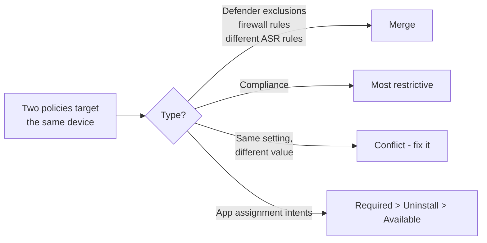

# Cheat sheet: policy precedence, conflicts and "who wins"

| Situation | Who wins | Doc |
|---|---|---|
| Two compliance policies disagree | **Most restrictive** result (any failing setting = noncompliant) | [1.3.4](../01-Prepare-Infrastructure/docs/1.3.4-compliance-policies.md) |
| Two configuration policies set different values | **Conflict** - neither is reliably applied; fix by removing one | [2.2.1](../02-Manage-Maintain-Devices/docs/2.2.1-windows-configuration-profiles.md) |
| Baseline vs endpoint security vs settings catalog on the same setting | **Conflict** - pick one owner per setting | [3.1.5](../03-Protect-Devices/docs/3.1.5-security-baselines.md) |
| Group Policy vs MDM on hybrid devices | GP can win unless **MDMWinsOverGP** (not all areas) | [2.2.1](../02-Manage-Maintain-Devices/docs/2.2.1-windows-configuration-profiles.md) |
| Cloud Policy (Office) vs GPO/MDM | **Cloud Policy** | [4.1.5](../04-Manage-Secure-Applications/docs/4.1.5-microsoft-365-apps-policies.md) |
| Defender exclusion policies from several teams | **Merge** | [3.1.1](../03-Protect-Devices/docs/3.1.1-antivirus-policies.md) |
| Firewall **rules** from several policies | **Merge** (global settings can conflict) | [3.1.3](../03-Protect-Devices/docs/3.1.3-firewall-policies.md) |
| Local admin adds Defender exclusions | Merged unless **Disable Local Admin Merge** | [3.1.1](../03-Protect-Devices/docs/3.1.1-antivirus-policies.md) |
| Local firewall rules | Merged unless *Allow Local Policy Merge* = False | [3.1.3](../03-Protect-Devices/docs/3.1.3-firewall-policies.md) |
| Include group vs exclude group | **Exclude** wins | [2.2.6](../02-Manage-Maintain-Devices/docs/2.2.6-assignment-filters-enrollment-time-grouping.md) |
| Assignment filter | Only **narrows** the included set | [2.2.6](../02-Manage-Maintain-Devices/docs/2.2.6-assignment-filters-enrollment-time-grouping.md) |
| App: Required vs Uninstall | **Required** (Uninstall only beats Available; Required + Available = both) | [4.1.2](../04-Manage-Secure-Applications/docs/4.1.2-deploy-win32-lob-store-apps.md) |
| EPM: Deny vs allow rules | **Deny** | [2.3.1](../02-Manage-Maintain-Devices/docs/2.3.1-endpoint-privilege-management.md) |
| EPM: user-targeted vs device-targeted rule | **User-targeted** | [2.3.1](../02-Manage-Maintain-Devices/docs/2.3.1-endpoint-privilege-management.md) |
| Enrollment restrictions | **Highest priority** policy of each type per user; default *All users* last | [1.2.1](../01-Prepare-Infrastructure/docs/1.2.1-intune-enrollment-settings.md) |
| Feature update policy vs ring feature deferral | **Feature update policy** controls the version offered | [2.1.6](../02-Manage-Maintain-Devices/docs/2.1.6-windows-11-upgrades.md) |
| Expedite vs ring deferral | **Expedite** (quality updates only) | [3.2.1](../03-Protect-Devices/docs/3.2.1-plan-device-updates.md) |
| Individual Autopilot device name vs profile template | **Device record name** | [2.1.3](../02-Manage-Maintain-Devices/docs/2.1.3-autopilot-device-name-template.md) |
| Local group membership: Replace + Update on same group | Unpredictable - avoid mixing | [1.3.8](../01-Prepare-Infrastructure/docs/1.3.8-local-group-membership.md) |
| CA grant controls | *Require all* or **Require one of** the selected controls | [1.3.5](../01-Prepare-Infrastructure/docs/1.3.5-conditional-access-require-compliance.md) |
| Multiple Conditional Access policies | **All** matching policies apply; every one must be satisfied (block wins) | [1.3.5](../01-Prepare-Infrastructure/docs/1.3.5-conditional-access-require-compliance.md) |

## Merge vs conflict at a glance

