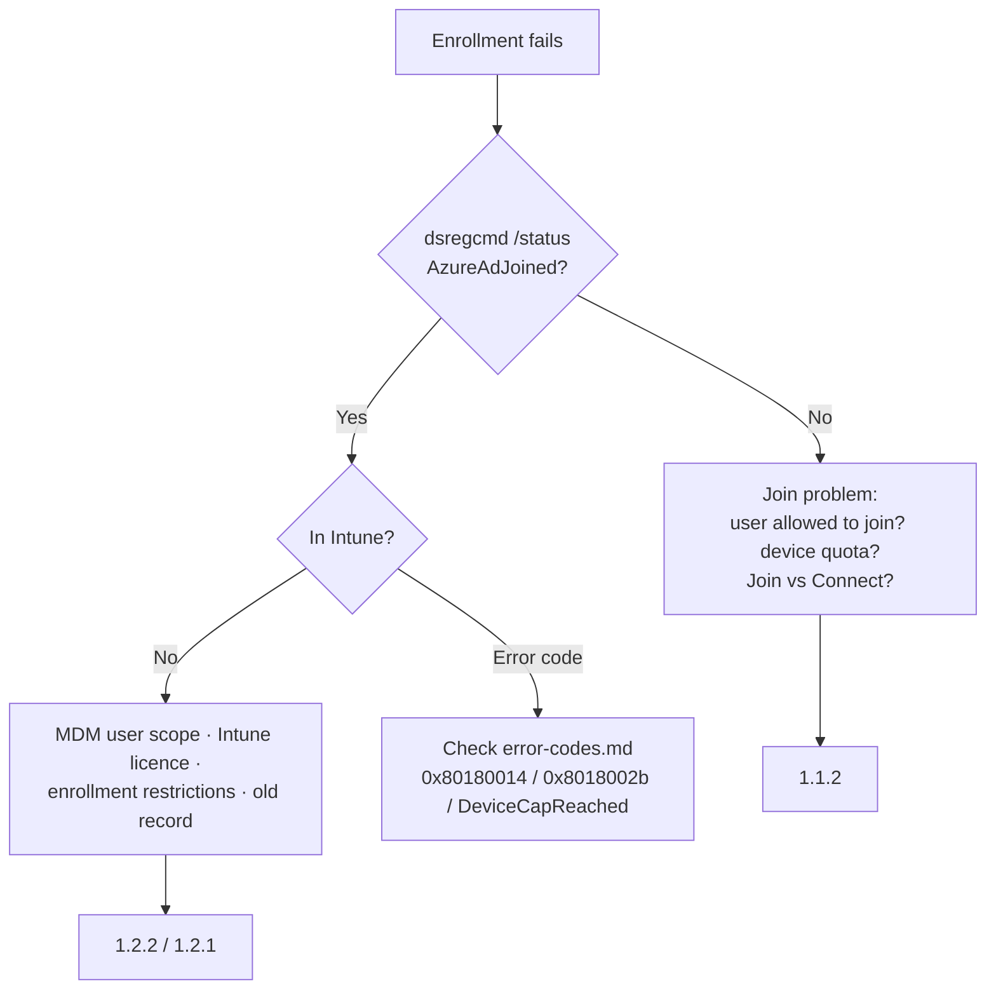
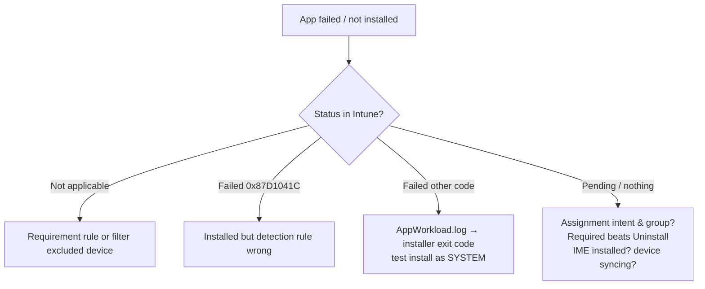

# Troubleshooting flows

Structured first steps for the five most common endpoint tickets. Each flow ends at the doc that goes deeper.

## 1. Windows device won't enroll

Checks: **Devices > Monitor > Enrollment failures**, Troubleshooting blade for the user, `DeviceManagement-Enterprise-Diagnostics-Provider` log. Docs: [1.1.2](../01-Prepare-Infrastructure/docs/1.1.2-join-devices-to-entra-id.md), [1.2.1](../01-Prepare-Infrastructure/docs/1.2.1-intune-enrollment-settings.md), [1.2.2](../01-Prepare-Infrastructure/docs/1.2.2-windows-automatic-enrollment.md).

## 2. Autopilot deployment fails

1. **Profile assigned?** Autopilot devices list shows *Assigned* profile and correct group tag.
2. **Which phase?** Device ESP / account ESP / device preparation page - note the failing item.
3. **ESP timeout?** Which blocking app? Is it a LOB MSI mixed with Win32 apps?
4. **Self-deploying/pre-provisioning?** TPM attestation (VMs often fail).
5. **Hybrid join?** Intune Connector for AD healthy, DC reachable, *Skip AD connectivity check* over VPN.
6. Collect logs from the error page or `mdmdiagnosticstool -area Autopilot`.

Docs: [2.1.2](../02-Manage-Maintain-Devices/docs/2.1.2-autopilot-deployment-modes.md), [2.1.4](../02-Manage-Maintain-Devices/docs/2.1.4-implement-autopilot-deployment.md), [2.1.5](../02-Manage-Maintain-Devices/docs/2.1.5-enrollment-status-page.md), [cheat sheet](../07-Cheat-Sheets/04-autopilot.md).

## 3. App didn't install

Docs: [4.1.1](../04-Manage-Secure-Applications/docs/4.1.1-prepare-apps-for-deployment.md), [4.1.2](../04-Manage-Secure-Applications/docs/4.1.2-deploy-win32-lob-store-apps.md), [4.1.9](../04-Manage-Secure-Applications/docs/4.1.9-monitor-troubleshoot-app-deployment.md).

## 4. User blocked by Conditional Access

1. Entra **Sign-in logs** → failed sign-in → **Conditional Access** tab: which policy and which grant failed?
2. *Require compliant device* failed → Intune device compliance → which setting? Is the device **enrolled** (registered-only devices can't be compliant)?
3. *Require app protection policy* failed → broker installed (Authenticator / Company Portal)? APP **assigned** to the user?
4. Browser on Windows → Edge work profile or Chrome with the **Microsoft Single Sign On** extension.
5. Use **report-only** / What If to test fixes.

Docs: [1.3.4](../01-Prepare-Infrastructure/docs/1.3.4-compliance-policies.md), [1.3.5](../01-Prepare-Infrastructure/docs/1.3.5-conditional-access-require-compliance.md), [4.2.2](../04-Manage-Secure-Applications/docs/4.2.2-conditional-access-app-protection.md).

## 5. Policy not applied / conflict

1. Device → **Device configuration** → policy status: *Succeeded / Error / Conflict / Not applicable / Pending*.
2. **Conflict** → find the other policy setting the same value (settings catalog, baseline, endpoint security). One owner per setting.
3. **Not applicable** → wrong platform/edition, or filter excluded the device.
4. **Pending** → device not checking in: sync, check last check-in, network.
5. Hybrid devices: Group Policy may override MDM.
6. User vs device targeting: device-context settings to user groups apply only after sign-in.

Docs: [2.2.1](../02-Manage-Maintain-Devices/docs/2.2.1-windows-configuration-profiles.md), [2.2.6](../02-Manage-Maintain-Devices/docs/2.2.6-assignment-filters-enrollment-time-grouping.md), [3.1.5](../03-Protect-Devices/docs/3.1.5-security-baselines.md), [cheat sheet](../07-Cheat-Sheets/05-policy-precedence-and-conflicts.md).
