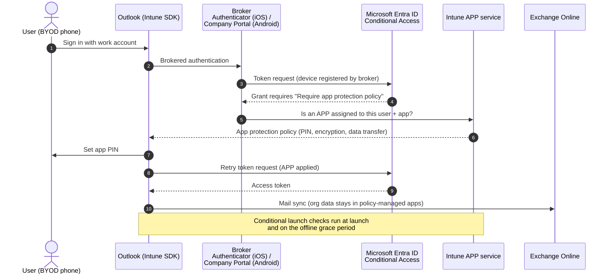
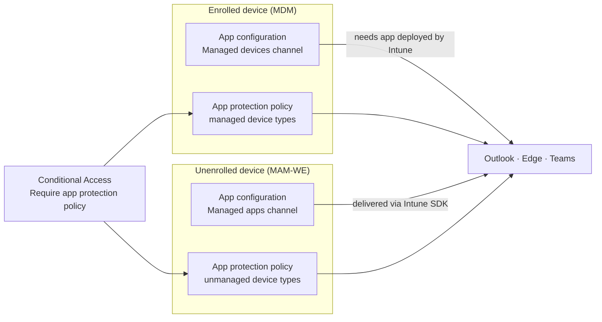

# App protection and Conditional Access flow

What happens when a user on a personal (unenrolled) phone opens Outlook against a tenant that requires app protection (Domain 4, objectives [4.2.1](../../04-Manage-Secure-Applications/docs/4.2.1-app-protection-policies.md) and [4.2.2](../../04-Manage-Secure-Applications/docs/4.2.2-conditional-access-app-protection.md)).

## Channels at a glance

| Control | Needs enrollment | Delivered by |
|---|---|---|
| App protection policy | No | Intune SDK / App Wrapping Tool in the app |
| App configuration - managed apps | No | Intune SDK (with APP) |
| App configuration - managed devices | Yes | MDM channel (iOS app config / Android managed configurations) |
| Selective wipe | No | Intune APP service at next app launch |
