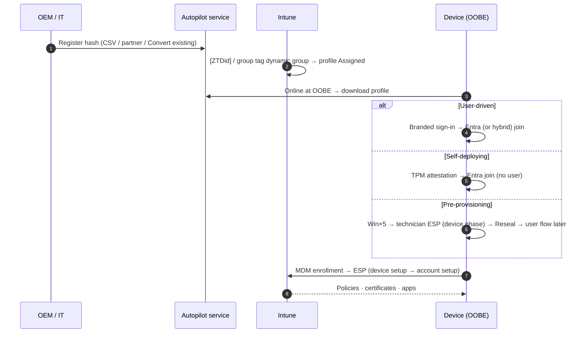
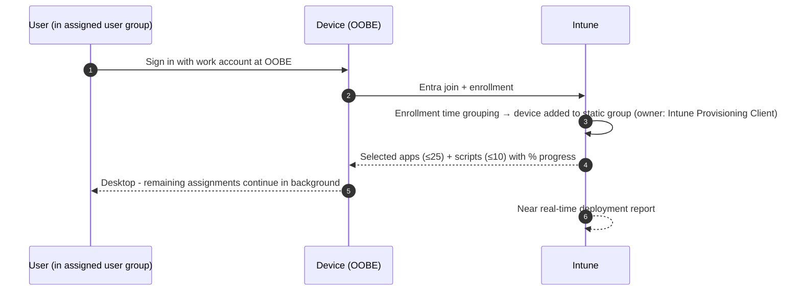
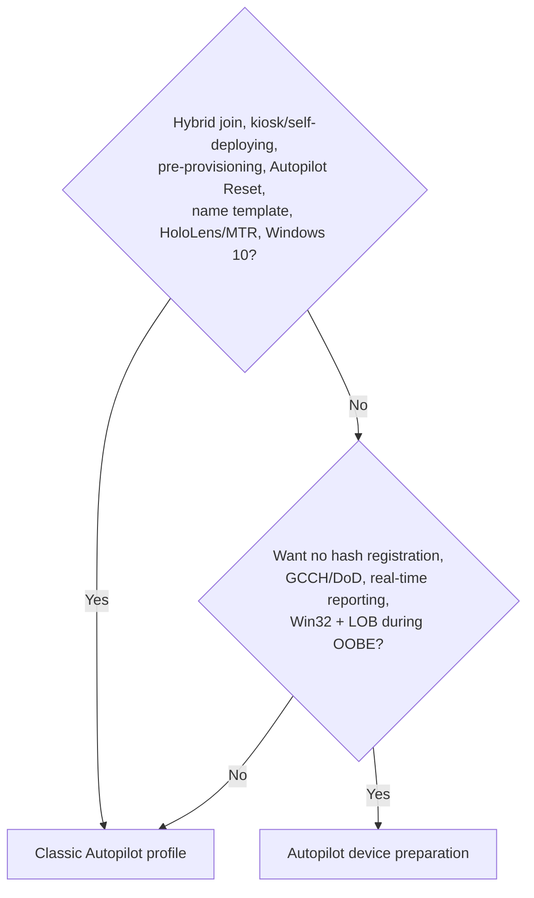

# Windows Autopilot flows

Two Autopilot engines and the classic deployment modes on one page. Used by Domain 2 docs.

## Classic Autopilot (deployment profile)

## Autopilot device preparation

## Decision tree

Related docs: [2.1.1](../../02-Manage-Maintain-Devices/docs/2.1.1-autopilot-profiles-vs-device-preparation.md), [2.1.2](../../02-Manage-Maintain-Devices/docs/2.1.2-autopilot-deployment-modes.md), [2.1.5](../../02-Manage-Maintain-Devices/docs/2.1.5-enrollment-status-page.md).
