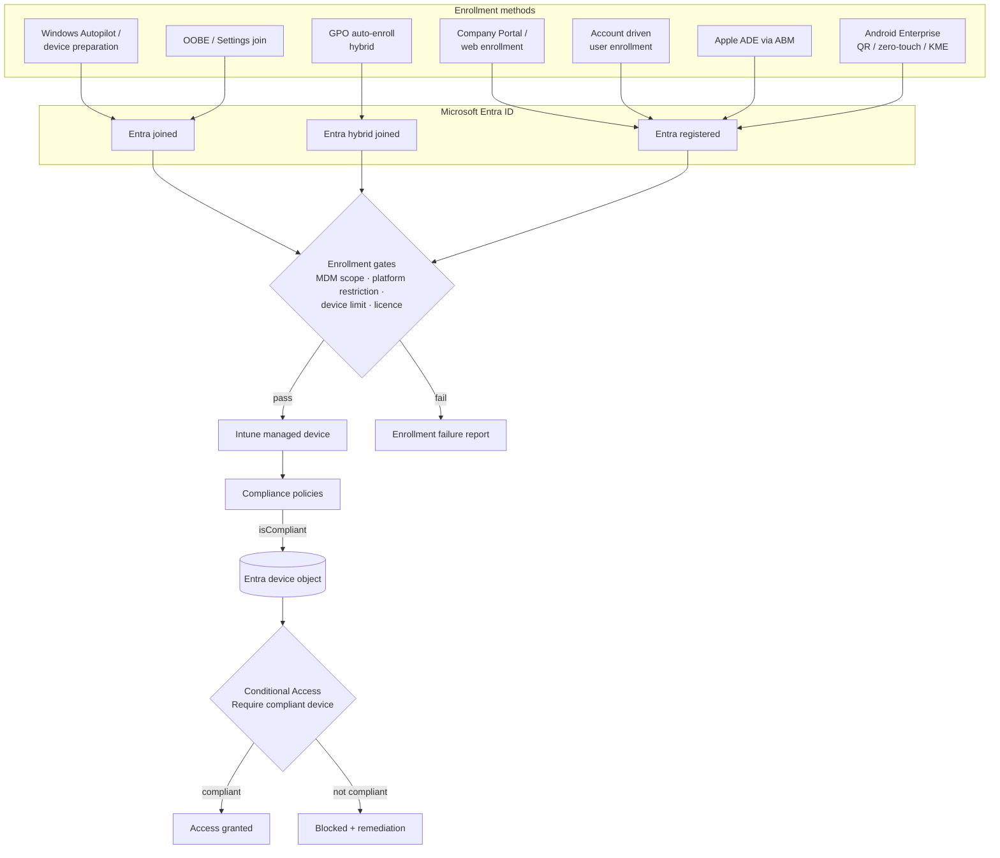

# Device identity and enrollment flow

End-to-end view of how a device gets from "unboxed" to "compliant and allowed by Conditional Access". Used by Domain 1 docs.

## Legend

| Symbol | Meaning |
|---|---|
| Entra joined | Windows owned by the organization, cloud identity |
| Hybrid joined | Windows joined to AD DS **and** registered in Entra |
| Registered | BYOD Windows, all iOS/iPadOS/Android/macOS Intune devices |

Related docs: [1.1.1](../../01-Prepare-Infrastructure/docs/1.1.1-choose-device-join-type.md), [1.2.1](../../01-Prepare-Infrastructure/docs/1.2.1-intune-enrollment-settings.md), [1.3.5](../../01-Prepare-Infrastructure/docs/1.3.5-conditional-access-require-compliance.md).
