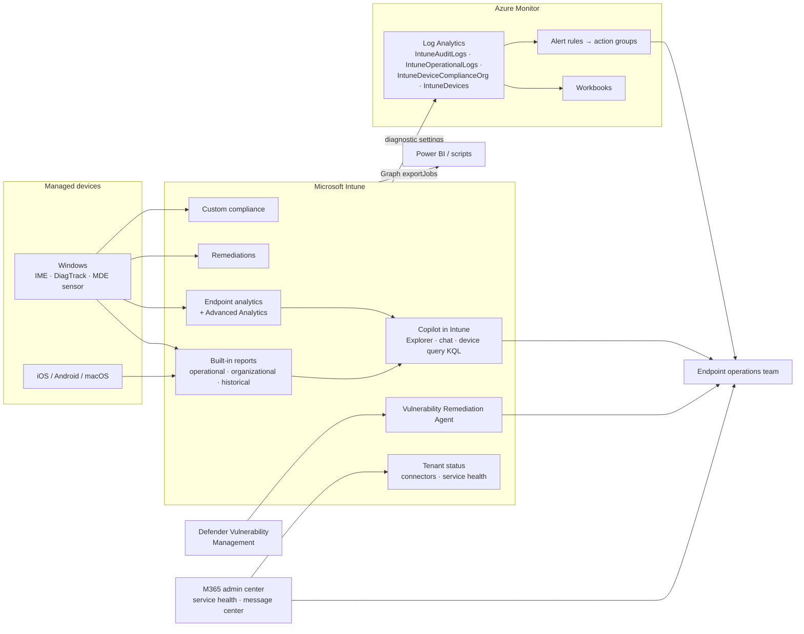

# Endpoint operations monitoring

How data flows from devices into reports, analytics, Copilot and alerts (Domain 5).

## Which tool for which question

| Question | Tool | Objective |
|---|---|---|
| Can I automate this task? | Graph PowerShell / exportJobs | [5.1.1](../../05-Optimize-Endpoint-Operations/docs/5.1.1-powershell-graph-automation.md) |
| Which vulnerabilities should I fix first? | Vulnerability Remediation Agent | [5.1.2](../../05-Optimize-Endpoint-Operations/docs/5.1.2-security-copilot-agents-threat-investigation.md) |
| Why is this device slow? | Copilot in Intune + Endpoint/Advanced Analytics | [5.1.3](../../05-Optimize-Endpoint-Operations/docs/5.1.3-security-copilot-agents-device-performance.md) |
| Is our org-specific rule met? | Custom compliance | [5.1.5](../../05-Optimize-Endpoint-Operations/docs/5.1.5-custom-compliance-powershell.md) |
| What's the state of the estate? | Reports, workbooks | [5.2.1](../../05-Optimize-Endpoint-Operations/docs/5.2.1-reporting-workbooks-export.md) |
| How good is the user experience? | Endpoint analytics scores | [5.2.2](../../05-Optimize-Endpoint-Operations/docs/5.2.2-endpoint-analytics.md), [5.2.4](../../05-Optimize-Endpoint-Operations/docs/5.2.4-reliability-user-experience-scores.md) |
| Can we fix it automatically? | Remediations | [5.2.3](../../05-Optimize-Endpoint-Operations/docs/5.2.3-remediation-scripts.md) |
| Is it us or Microsoft? | Tenant status, service health | [5.2.5](../../05-Optimize-Endpoint-Operations/docs/5.2.5-service-health-message-center.md) |
| Tell me when it breaks | Alerts and notifications | [5.2.6](../../05-Optimize-Endpoint-Operations/docs/5.2.6-alerts-notifications.md) |
