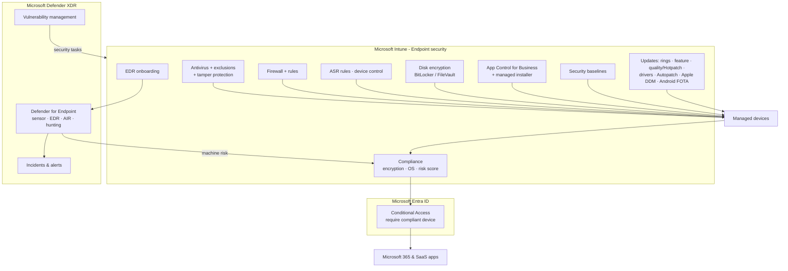

# Endpoint security stack

How Intune endpoint security policies, Defender for Endpoint and Conditional Access fit together (Domain 3).

## Zero Trust mapping

| Principle | Controls in this repo |
|---|---|
| Verify explicitly | Compliance (objective 1.3.4), Conditional Access (objective 1.3.5), machine risk (objective 3.1.6) |
| Least privilege | LAPS (objective 1.3.7), local groups (objective 1.3.8), EPM (objective 2.3.1), App Control (objective 3.1.8) |
| Assume breach | ASR/device control (objective 3.1.4), EDR (objective 3.1.6), encryption (objective 3.1.2), fast patching (objective 3.2.x) |
