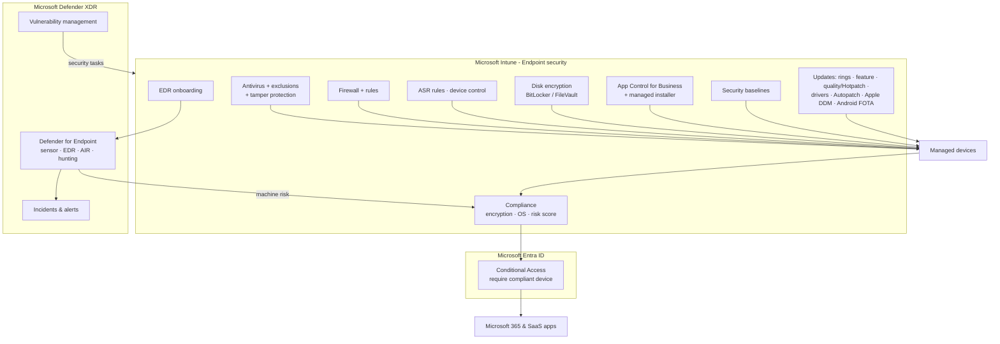

# Endpoint security stack

How Intune endpoint security policies, Defender for Endpoint and Conditional Access fit together (Domain 3).

## Zero Trust mapping

| Principle | Controls in this repo |
|---|---|
| Verify explicitly | Compliance (objective [1.3.4](../../01-Prepare-Infrastructure/docs/1.3.4-compliance-policies.md)), Conditional Access (objective [1.3.5](../../01-Prepare-Infrastructure/docs/1.3.5-conditional-access-require-compliance.md)), machine risk (objective [3.1.6](../../03-Protect-Devices/docs/3.1.6-defender-for-endpoint-integration-edr.md)) |
| Least privilege | LAPS (objective [1.3.7](../../01-Prepare-Infrastructure/docs/1.3.7-windows-laps.md)), local groups (objective [1.3.8](../../01-Prepare-Infrastructure/docs/1.3.8-local-group-membership.md)), EPM (objective [2.3.1](../../02-Manage-Maintain-Devices/docs/2.3.1-endpoint-privilege-management.md)), App Control (objective [3.1.8](../../03-Protect-Devices/docs/3.1.8-app-control-for-business.md)) |
| Assume breach | ASR/device control (objective [3.1.4](../../03-Protect-Devices/docs/3.1.4-attack-surface-reduction-zero-trust.md)), EDR (objective [3.1.6](../../03-Protect-Devices/docs/3.1.6-defender-for-endpoint-integration-edr.md)), encryption (objective [3.1.2](../../03-Protect-Devices/docs/3.1.2-disk-encryption-bitlocker-filevault.md)), fast patching (objective 3.2.x) |
